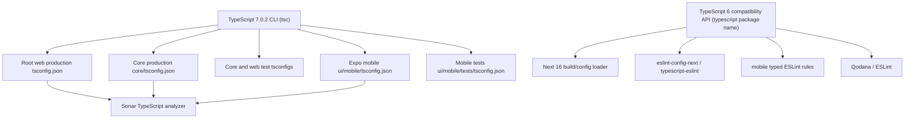

# TypeScript 7.0.2 upgrade feasibility

Date: 2026-07-31  
Status: research complete; no implementation performed  
Scope: root web/shared/core projects and `ui/mobile`  
Out of scope: Supabase Edge Functions, which use Deno rather than the npm TypeScript toolchain

## Executive conclusion

Upgrading EverFreeNote so that TypeScript 7.0.2 performs the root and mobile CLI type-checks is feasible now, but a direct replacement of every TypeScript 5.x/6.x installation with TypeScript 7 is not yet a supported configuration.

TypeScript 7.0 does not expose the legacy JavaScript compiler API. The current and latest `typescript-eslint` packages still require that API and declare `typescript >=4.8.4 <6.1.0`. EverFreeNote uses `typescript-eslint` in both applications:

- web linting receives it through `eslint-config-next`;
- mobile linting imports `@typescript-eslint/parser` and `@typescript-eslint/eslint-plugin` directly;
- typed mobile ESLint rules use parser services and therefore cannot be reduced to syntax-only parsing without changing lint semantics.

The recommended migration is therefore a transitional dual-toolchain:

- TypeScript 7.0.2 is installed under the `@typescript/native` npm alias and supplies the `tsc` CLI used by project type-check scripts;
- `@typescript/typescript6` 6.0.2 is installed under the `typescript` name and supplies the TypeScript 6 API plus the separate `tsc6` executable for API consumers;
- both root and mobile manifests use the same arrangement;
- the arrangement is removed after the relevant tools support the new TypeScript API.

This is the side-by-side model recommended by the TypeScript team for TypeScript 7.0. It is a transition architecture, not the final desired dependency graph.

A strict direct dependency on `"typescript": "7.0.2"` is technically usable by the current Next.js CLI path and by Expo's TypeScript-aware package, but is not recommended for this repository until `typescript-eslint` supports TypeScript 7.

## Current verified state

The following values were read from the working checkout and installed dependency trees on 2026-07-31.

| Area | Current declaration | Installed/relevant version | Notes |
| --- | --- | --- | --- |
| Root compiler | `typescript: 5.9.3` | 5.9.3 | Exact version |
| Mobile compiler | `typescript: ~5.9.2` | 5.9.3 | Separate mobile lockfile |
| Next.js | `next: ^16.2.12` | 16.2.12 | Current npm `latest`; contains the TypeScript CLI integration |
| Next ESLint config | `eslint-config-next: ^16.2.12` | 16.2.12 | Pulls `typescript-eslint` 8.48.1 in the current lock |
| Root nested `typescript-eslint` | transitive | 8.48.1 and 8.60.1 | Peer ranges end below TypeScript 6.0/6.1 |
| Mobile TypeScript ESLint | `^8.0.0` | 8.50.0 | Direct dependencies; peer range `>=4.8.4 <6.0.0` |
| Latest TypeScript ESLint checked | not installed | 8.65.0 | Still declares `typescript >=4.8.4 <6.1.0` |
| Expo | `^57.0.7` | 57.0.7 | SDK 57 |
| Expo TypeScript consumer | transitive | `@expo/require-utils` 57.0.4 | Its optional peer explicitly allows TypeScript 5, 6, or 7 |
| React Native | 0.86.0 | 0.86.0 | Not directly constrained by TypeScript 7 |
| CI Node.js | workflow setting | 24 | Satisfies TypeScript 7, Next 16, and React Native requirements |

Current TypeScript 5.9 validation passed:

```text
npm run type-check
  root/web/core/test projects: passed
  mobile production and tests: passed
```

The repository already had unrelated local changes in `package.json` and `ui/mobile/package-lock.json` before this investigation. They were not changed by this work.

## Compiler/config topology



The important boundary is that application type correctness is gated by TypeScript 7, while tools that still import the legacy compiler API temporarily resolve TypeScript 6.

## Direct TypeScript 7 probe

TypeScript 7.0.2 was executed ephemerally against every canonical project config without changing dependencies.

| Config | Result with TypeScript 7.0.2 |
| --- | --- |
| `tsconfig.json` | Passed |
| `core/tsconfig.json` | Stopped on removed `baseUrl` |
| `core/tests/tsconfig.json` | Stopped on removed `baseUrl` |
| `ui/web/tests/tsconfig.json` | Stopped on removed `baseUrl` |
| `ui/mobile/tsconfig.json` | Stopped on removed `baseUrl` |
| `ui/mobile/tests/tsconfig.json` | Stopped on removed `baseUrl` |

The exact diagnostic was:

```text
TS5102: Option 'baseUrl' has been removed. Please remove it from your configuration.
Use '"paths": {"*": ["./*"]}' instead.
```

The root config passed because it already has no `baseUrl`.

The probe establishes the first mandatory config migration. It does not prove that there will be no further source diagnostics: the five affected project checks stop at config validation. The implementation must rerun all six checks after removing `baseUrl` and treat any subsequent diagnostics as part of the upgrade, not suppress them.

Static searches found none of the other explicitly removed TypeScript 7 constructs in project TypeScript sources:

- no `module` keyword used for namespace declarations;
- no obsolete `asserts` import attributes;
- no `/// <reference no-default-lib />`;
- no removed module or module-resolution modes;
- no `target: es5`;
- no `esModuleInterop: false` or `allowSyntheticDefaultImports: false`.

Project configs already use `target: ESNext`, `module: esnext`/`preserve`, and `moduleResolution: bundler`.

## Required package changes

### Recommended transitional arrangement

Apply this arrangement in both `package.json` and `ui/mobile/package.json`:

```json
{
  "devDependencies": {
    "@typescript/native": "npm:typescript@7.0.2",
    "typescript": "npm:@typescript/typescript6@6.0.2"
  }
}
```

Also declare `@types/node` 24.x directly in both dev-dependency sets. Core production code and mobile tests use Node globals, CI runs Node 24, and those projects must not rely on a transitive Jest/AI-tool dependency to provide ambient declarations.

Effects:

- `tsc` is TypeScript 7.0.2;
- `tsc6` is available for explicit compatibility diagnostics; the currently resolved compiler is TypeScript 6.0.3 because compatibility package 6.0.2 depends on `typescript@^6`;
- `require("typescript")` resolves the TypeScript 6 API expected by `typescript-eslint`, Next's API mode, and other legacy API consumers;
- the root and mobile lockfiles gain the platform-specific native TypeScript 7 package selected by npm.

Use exact versions during the migration. A caret would permit a compiler change without a deliberate compatibility review.

After installation, CI must assert the binaries rather than infer them from manifest text:

```text
npx tsc --version   -> Version 7.0.2
npx tsc6 --version  -> Version 6.0.3 with the registry state checked on 2026-07-31
```

Pin and review the resolved TypeScript 6 version through each lockfile. The compatibility wrapper version and the `tsc6` compiler version are not necessarily identical.

### Packages that do not need a TypeScript-driven upgrade

| Package/group | Required action for TS7 | Reason |
| --- | --- | --- |
| `next`, `eslint-config-next`, `@next/eslint-plugin-next` | None; retain aligned 16.2.12 versions | 16.2.12 is current and contains CLI support, but web ESLint still needs the TS6 API |
| `expo` | No SDK major upgrade required | SDK 57's `@expo/require-utils` explicitly accepts TypeScript 7 |
| React and React Native | No TS7-driven major upgrade | Their runtime/transformation path is Babel/Metro, not the TypeScript compiler API |
| Jest and Babel-Jest | No TS7-driven upgrade | Tests transform TypeScript with Babel rather than `ts-jest` |
| Cypress | No TS7-driven upgrade | No TypeScript peer/API constraint was found |
| SonarQube scanner | No npm compiler update | Sonar uses its analyzer and the configured tsconfig paths |
| Deno/Supabase functions | No change | Separate runtime and compiler boundary |

### Packages that cannot solve the blocker by upgrading today

Upgrading the following packages to their current npm latest versions is useful maintenance but does not make a direct TypeScript 7 dependency supported:

- `@typescript-eslint/parser` 8.65.0;
- `@typescript-eslint/eslint-plugin` 8.65.0;
- `typescript-eslint` 8.65.0.

All still declare `typescript >=4.8.4 <6.1.0`. The checked canary versions have the same constraint. Do not force or silence these peers while retaining typed lint rules.

### Incidental optional peers

The current Allure dependency tree contains `i18next` 24.2.3 with an optional TypeScript `^5` peer. This is not an application compiler consumer and npm can isolate it. It is not a reason to upgrade Allure or i18next as part of the TypeScript task. Recheck `npm ls` after regenerating each lockfile, but do not widen the scope unless it becomes a real install/runtime error.

## Required tsconfig changes

Remove `compilerOptions.baseUrl` from:

1. `core/tsconfig.json`
2. `core/tests/tsconfig.json`
3. `ui/web/tests/tsconfig.json`
4. `ui/mobile/tsconfig.json`
5. `ui/mobile/tests/tsconfig.json`

The existing `paths` values are already relative to the directory containing the config that declares them, so no path target rewrite is expected:

| Config | Example mapping after removing `baseUrl` | Assessment |
| --- | --- | --- |
| `core/tsconfig.json` | `@core/* -> ./*` | Already relative to `core/` |
| `core/tests/tsconfig.json` | `@core/* -> ../*` | Already relative to `core/tests/` |
| `ui/web/tests/tsconfig.json` | `@/* -> ../../../*` | Already relative to `ui/web/tests/` |
| `ui/mobile/tsconfig.json` | `@core/* -> ../../core/*` | Already relative to `ui/mobile/` |
| `ui/mobile/tests/tsconfig.json` | `@ui/mobile/* -> ../*` | Already relative to `ui/mobile/tests/` |

TypeScript 7 also changes the default `types` list to empty. Make ambient dependencies explicit where the project itself uses Node globals:

- add a direct Node-24-compatible `@types/node` dev dependency at root and add `"types": ["node"]` to `core/tsconfig.json`, because production core code uses `process.env`;
- retain `["jest", "node"]` in the core and web test configs;
- add the same direct `@types/node` dev dependency to mobile and change mobile test types from `["jest"]` to `["jest", "node"]`, because the tests use `process` and CommonJS `require`;
- do not add Node types to mobile production solely for Expo globals: `expo-env.d.ts` references `expo/types`, which declares the Metro `process` environment, while React Native declares `__DEV__`;
- the root web config already passed TypeScript 7 without an explicit `types` entry because `next-env.d.ts` references the required Next types. Add types there only if the post-migration compiler identifies a missing ambient dependency.

Do not add `ignoreDeprecations`, `skipDefaultLibCheck`, or error suppressions to bypass TypeScript 7 migration diagnostics.

## Next.js integration

Next 16.2.12 contains `experimental.useTypeScriptCli`. With a direct `typescript@7.0.2` dependency, this option makes Next invoke the project-local `tsc` command rather than importing the missing compiler API:

```js
const nextConfig = {
  experimental: {
    useTypeScriptCli: true,
  },
}
```

This setting is **not** part of the recommended dual-toolchain arrangement. In that arrangement, the package named `typescript` is the TypeScript 6 compatibility package and exposes `tsc6`, while the TS7 package is named `@typescript/native`. Next 16.2.12 resolves the package named `typescript`, so its CLI mode cannot select the aliased TS7 package.

Recommended behavior during the transition:

1. `npm run type-check` uses TS7 and remains the authoritative application type gate.
2. `next build` continues in TypeScript API mode using the TS6 compatibility package.
3. Do not set `typescript.ignoreBuildErrors`; the additional Next/TS6 check is redundant but safe.

If the acceptance criterion is instead “`next build` itself must run TS7”, the project must use a direct `typescript@7.0.2` dependency plus `experimental.useTypeScriptCli`. That strict route remains blocked by the unsupported ESLint graph and should wait for ecosystem support or isolate ESLint into a separate TS6 tooling package.

The root `tsconfig.json` also contains the Next language-service plugin. TypeScript 7 uses a new LSP server and 7.0 does not expose the old API. Editor-only Next plugin validation must be tested explicitly. If it is absent, developers should temporarily use the TS6 editor service for Next-specific editor diagnostics while CI and CLI type-checking use TS7.

## Expo/mobile integration

Expo SDK 57 does not require an SDK major upgrade for the TypeScript 7 CLI. `@expo/require-utils` 57.0.4 explicitly permits TypeScript 7 as an optional peer.

However, Expo's current SDK 57 dependency validator expects `typescript ~6.0.3`. Under the intentional dual-toolchain, `npx expo install --check` may report the compatibility package instead of recognizing the aliased TS7 compiler. Add a narrowly documented Expo validation exclusion for TypeScript only if the validator cannot model the side-by-side arrangement:

```json
{
  "expo": {
    "install": {
      "exclude": ["typescript"]
    }
  }
}
```

Do not exclude the other Expo packages listed below. The exclusion is acceptable only when CI separately proves `tsc` is 7.0.2 and the full mobile type-check/build gates pass.

### Existing mobile dependency drift to resolve before or separately from TS7

`npx expo-doctor` currently reports five failing checks. These are pre-existing and are not caused by TypeScript 7, but they should be resolved first or in a separate commit so that the compiler migration has a clean baseline.

Version alignment reported by Expo SDK 57:

| Package | Installed | Expo SDK 57 expected |
| --- | --- | --- |
| `expo-linking` | 57.0.3 | `~57.0.4` |
| `expo-router` | 57.0.7 | `~57.0.9` |
| `expo-system-ui` | 57.0.1 | `~57.0.2` |
| `expo-web-browser` | 57.0.1 | `~57.0.2` |
| `react-native` | 0.86.0 | 0.86.2 |
| `react-native-reanimated` | 4.5.0 | 4.5.1 |
| `react-native-screens` | 4.25.2 | `~4.26.0` |
| `@types/react` | 19.1.17 | `~19.2.4` |
| `jest-expo` | 57.0.2 | `~57.0.3` |

Additional current findings:

- `react-native-worklets` is a missing required peer of `react-native-reanimated`;
- `expo-modules-core` is installed directly although Expo Doctor says it should be consumed through `expo`;
- two versions of `react-native-screens` are installed;
- native folders and app config contain fields that require a deliberate prebuild/synchronization policy;
- `npm --prefix ui/mobile ls` already fails because `@types/react@19.1.17` does not satisfy React Native 0.86's `^19.2.0` peer.

These changes are not logically required by the TypeScript 7 compiler, but leaving the graph invalid would make install and mobile failures ambiguous. Recommended sequencing is:

1. align Expo SDK 57 packages in a standalone dependency-maintenance change;
2. obtain a clean `expo-doctor` baseline, with only consciously accepted native-config warnings;
3. perform the TypeScript dual-toolchain migration.

## Script changes

The existing type-check structure is appropriate:

```text
root tsc
core production tsc
core tests tsc
web tests tsc
mobile production tsc
mobile tests tsc
```

After the alias installation, those existing `tsc` commands should resolve TypeScript 7. Add explicit verification scripts or CI steps:

```json
{
  "scripts": {
    "type-check:versions": "tsc --version && tsc6 --version"
  }
}
```

On Windows and Linux, confirm the npm-generated binary shims select the expected packages. Fail CI if either reported version drifts.

Do not replace the separate production and test configs with one broad config. Their ambient types and runtime boundaries differ.

## CI and scanner changes

### Build workflow

The existing build workflow already:

1. installs root and mobile lockfiles;
2. runs root validation;
3. runs mobile validation;
4. runs `next build`;
5. fails after collecting both validation outcomes.

Add the compiler-version assertion immediately after both installs. Keep Node 24; no Node upgrade is required.

### Unit/component/E2E workflows

Any workflow that runs `npm ci` must consume regenerated lockfiles. No test transformer change is expected because Jest uses Babel-Jest and mobile uses Jest Expo rather than `ts-jest`.

### SonarQube

Current `sonar-project.properties` uses:

```text
sonar.typescript.tsconfigPaths=tsconfig.json,core/tsconfig.json,ui/mobile/tsconfig.json
```

No TypeScript package update is required for Sonar. Removing `baseUrl` from the canonical configs is sufficient at the configuration layer. Re-run PR analysis to detect analyzer/config parsing regressions.

### Qodana/ESLint

Qodana installs both root and mobile dependencies. It must resolve the TypeScript 6 compatibility API for ESLint while the explicit project type-check uses TS7. Run Qodana or the equivalent ESLint commands after a clean install; do not accept unsupported-version warnings.

## Strict direct-upgrade alternative

This alternative would put `"typescript": "7.0.2"` directly in both manifests.

Required differences from the recommended path:

- enable `experimental.useTypeScriptCli: true` in `next.config.js`;
- solve or isolate both web and mobile `typescript-eslint` installations instead of overriding peer warnings;
- verify whether the Next editor plugin works with the TypeScript 7 LSP;
- expect Expo Doctor to report a TypeScript major mismatch until its SDK recommendation changes;
- regenerate and validate both lockfiles without `--legacy-peer-deps` or forced peer overrides.

Verdict: not recommended on 2026-07-31. The advantage is a simpler manifest after the ecosystem catches up; the current cost is unsupported lint tooling and more custom isolation than the official dual-toolchain solution.

## Implementation plan

Keep dependency alignment and compiler migration reviewable as separate changes.

### Phase 0: establish a clean baseline

1. Preserve unrelated working-tree changes.
2. Run clean root and mobile installs from their lockfiles.
3. Record current type-check, lint, test, web build, mobile build, and Expo Doctor results.
4. Resolve or explicitly separate the existing Expo SDK 57 dependency drift.

### Phase 1: config compatibility

1. Remove `baseUrl` from the five affected configs.
2. Add explicit Node ambient types to core production and mobile tests.
3. Run TypeScript 6 checks to ensure the config cleanup does not regress the current toolchain.
4. Run an ephemeral TypeScript 7 check against all six projects.
5. Fix real diagnostics; do not add suppressions.

### Phase 2: dual-toolchain manifests

1. Add exact `@typescript/native` and `typescript` compatibility aliases to root.
2. Add the same exact aliases to mobile.
3. Regenerate `package-lock.json` and `ui/mobile/package-lock.json` independently.
4. Verify `tsc` and `tsc6` versions in both package contexts.
5. Add the narrow Expo TypeScript validation exclusion only if still required.

### Phase 3: framework/tool validation

1. Run root and mobile type-checks with TS7.
2. Run root and mobile ESLint with the TS6 API shim and confirm there are no unsupported-version warnings.
3. Run `next build` and confirm Next uses the compatibility API path.
4. Run Expo Doctor, Expo config generation, and the Android build/prebuild path used by CI.
5. Run Sonar and Qodana PR analyses.

### Phase 4: regression suite

1. Root unit and integration tests.
2. Mobile unit/component/integration tests.
3. Cypress component tests.
4. Next static export build.
5. Android build and embedded web-editor bundle preparation.
6. `npm ls` in root and mobile with no unexpected invalid peers.
7. `git diff --check`.

## Completion gates

The migration is complete only when all of the following are true:

- `tsc --version` reports exactly 7.0.2 in root and mobile;
- every canonical production and test tsconfig passes under TS7;
- root and mobile ESLint pass without unsupported TypeScript warnings;
- `next build` succeeds;
- the mobile build path succeeds outside Expo Go;
- both clean `npm ci` commands succeed without forced peer-resolution flags;
- root and mobile dependency trees contain no new invalid peers;
- Sonar and Qodana accept the updated canonical configs;
- existing unit/component/integration suites pass;
- any Expo Doctor exclusions are narrow, documented, and backed by independent validation.

## Risks and rollback

| Risk | Mitigation |
| --- | --- |
| `typescript-eslint` cannot use TS7's absent API | Keep the official TS6 compatibility package under the `typescript` name |
| Next build does not itself use TS7 in the transitional model | Make standalone TS7 type-check the required CI gate; keep Next's TS6 check as additional defense |
| Next editor plugin is unavailable in the TS7 LSP | Validate explicitly; temporarily use the TS6 editor service for Next-specific diagnostics |
| Removed `baseUrl` exposes path resolution errors | Remove it before dependency changes and validate every config separately |
| New `types: []` default removes ambient globals | Declare Node/Jest types only in projects that use them |
| Expo validator expects TS6 | Use a documented TypeScript-only exclusion after independent TS7 validation |
| Existing Expo dependency drift masks TS7 failures | Align Expo SDK 57 packages first or isolate that work in a preceding change |
| Native compiler worker count affects CI resources | Start with defaults; only pin `--checkers` after measuring CI memory/time |

Rollback is straightforward: restore both manifests and lockfiles to TypeScript 5.9 declarations and revert the TS7-only config changes. Keep the removal of obsolete `baseUrl` only if TypeScript 5.9 and all current tools continue to pass with it removed.

## Primary references

- [TypeScript 7.0 announcement and side-by-side guidance](https://devblogs.microsoft.com/typescript/announcing-typescript-7-0/)
- [TypeScript 7 intentional compiler differences](https://github.com/microsoft/typescript-go/blob/main/CHANGES.md)
- [TypeScript 7 native implementation status](https://github.com/microsoft/typescript-go)
- [Next.js 16.3 discussion describing `experimental.useTypeScriptCli`](https://github.com/vercel/next.js/discussions/95130)
- [Expo TypeScript guide for SDK 57](https://docs.expo.dev/guides/typescript/)
- [Expo SDK 57 version/runtime matrix](https://docs.expo.dev/versions/latest/)
- [typescript-eslint package documentation](https://typescript-eslint.io/packages/)

Registry compatibility data was verified with `npm view` on 2026-07-31. Because package peer ranges and current versions can change, refresh the registry checks immediately before implementation.
