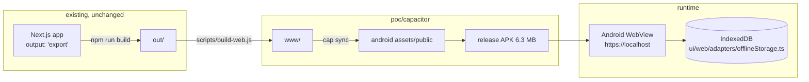

# Capacitor Shell POC

Question this POC answers: **can the existing web app, unchanged, serve as the Android
app — and is WebView list performance good enough to retire `ui/mobile`?**

Answer from the measurements below: yes on both counts, with three named caveats.
Emulator numbers only; a confirmation run on a physical device is still outstanding.

## What was built

`poc/capacitor/` — a Capacitor 8.5.1 shell whose web root is the **unmodified**
production static export from `npm run build`. No web source changes were needed
to make the app boot and render inside the WebView.



`androidScheme: 'https'` keeps the origin at `https://localhost`, so the secure-context
APIs the web app already depends on — `crypto.subtle` for Supabase PKCE, IndexedDB
persistence — behave exactly as in a browser.

## Measured results

Environment: Pixel 7 AVD (arm64), Android 16, WebView Chrome 133.0.6943.137,
1080×2400 @420dpi, 4 cores, 4 GB RAM. **Signed release APK** (not debug — `debuggable=true`
disables ART optimizations and inflates startup). Perf harness = `app/perf-harness/`
rendering the real production `NoteList` against synthetic notes, no auth, no backend.

### Artifacts

| Artifact | Size |
|---|---|
| Staged web root (`www/`) | 5.61 MB |
| Release APK (unminified, no shrinking) | 6.29 MB |
| Debug APK | 7.73 MB |

### Startup

`am start -W TotalTime` = native first frame. In-page timings are from
`window.__perf`, relative to that document's navigation start.

| Scenario | Cold start (median of 5–7) | DOMContentLoaded | load | List painted |
|---|---|---|---|---|
| Main app (real login screen) | 449 ms | — | — | — |
| Harness, 1000 notes (cold emulator) | 1072 ms | 302 ms | 364 ms | 624 ms |
| Harness, 1000 notes (warm emulator) | 381 ms | 165 ms | 165 ms | 325 ms |
| Harness, 5000 notes | 527 ms | 127 ms | 127 ms | 379 ms |

The same build measured 1072 ms and 381 ms depending on how warm the emulator was —
run-to-run spread across all runs was 280–1200 ms. Treat these as an order of
magnitude, not a precise figure. The consistent part is the shape: the WebView is
interactive with a full list in well under a second on a warm device.

### Scroll (12 adb-driven swipes over the list)

| Notes | Frames | Janky | p50 | p90 | p95 | p99 | JS-side FPS |
|---|---|---|---|---|---|---|---|
| 1000 (cold) | 293 | 4.10% | 21 ms | 32 ms | 36 ms | 61 ms | 44–60 |
| 1000 (warm) | 334 | 1.20% | 20 ms | 24 ms | 29 ms | 48 ms | 56–60 |
| 5000 | 328 | 2.13% | 24 ms | 31 ms | 32 ms | 44 ms | 52–60 |

Memory with 1000 notes loaded: 72 MB PSS / 239 MB RSS.

**Reading of these numbers.** Jank stays low — 1.2–4.1% — and, critically, **does not
degrade from 1000 to 5000 notes**: `react-window` virtualization holds, so list size
is not the scaling risk. The one blemish is a p50 frame time of 20–24 ms, above the
16.7 ms budget for a locked 60 fps, so scrolling is smooth but not perfectly so. Part
of that is emulator overhead; how much is unknown until this runs on real hardware.

## Findings that affect a real migration

### 1. Directory paths fall back to the root document

Capacitor's Android local server resolves any directory-style path to the **root**
`index.html`, not to that route's own file:

| Request | Result |
|---|---|
| `/settings/index.html` | 200, the settings document (13 346 B) |
| `/settings/` | 200, **the root document** (13 541 B) |
| `/settings/__next._tree.txt` | 200, correct RSC payload |
| `/settings/__next.settings.__PAGE__.txt` | 200, correct RSC payload |

Because every App Router payload file resolves correctly, **client-side navigation
works normally** — the failure mode is only a hard load of a deep URL, which a
Capacitor app never performs on its own (it always boots at `/`). It becomes real
only when deep links are added, e.g. an OAuth callback landing on `/auth/callback`.
Fixes, in increasing order of effort: keep booting at `/` and route client-side;
handle deep links via `@capacitor/app` and navigate in JS; or intercept requests in
a custom `WebViewClient`.

### 2. Console output is not visible on release builds

`loggingBehavior: 'production'` did not surface `Capacitor/Console` lines in logcat
on Capacitor 8.5.1. Measurement therefore reads `window.__perf` over the Chrome
DevTools Protocol (`scripts/cdp.js`), which is more reliable anyway. Worth knowing
before anyone tries to debug a release build through logcat.

### 3. Toolchain requirements

- Capacitor 8 needs **JDK 21**; JDK 17 fails with `invalid source release: 21`, and
  the JDK 25 on this machine is unsupported by AGP 8.13.
- compileSdk/targetSdk 36, minSdk 24 — matches the SDK already installed.
- Android Studio is **not** required; command line tools are sufficient, which keeps
  CI identical to the existing `android-build.yml` approach.

## Ecosystem risk: Ionic's commercial wind-down

Ionic has stopped selling and is winding down its commercial products — Appflow
(access ends 2027-12-31), Identity Vault, Auth Connect, Secure Storage, Portals.
The announcement states that Ionic Framework and Capacitor "will remain free and
open source" and continue to be maintained as part of the OutSystems mobile stack.
Observed corroboration: Capacitor 8.5.1 is current, a 9.0 alpha is in progress, and
nightly builds are being published.

Practical effect on this project: **none of the discontinued products are needed.**
Auth is Supabase PKCE through the system browser, storage is IndexedDB, CI is the
existing GitHub Actions. What it does change is that some of the "enterprise plugin"
territory is now served mainly by Capgo, a third-party vendor — so any future need
for OTA updates or hardened secure storage means depending on a single small vendor
or writing the plugin. That is a supplier-concentration risk to weigh, not a reason
to avoid Capacitor.

## Open questions

- Scroll behaviour on real hardware, especially a mid-range device. The p50 frame
  time above budget is the one number that could change the recommendation.
- Editor typing latency inside the WebView at full-app scope — this POC measured the
  list, not the Tiptap editor, though `ui/mobile` already runs that editor in a WebView.
- Android back-button, keyboard insets and safe-area behaviour across the app.
- Google Play "minimum functionality" review outcome.

## Reproducing

```bash
cd poc/capacitor
npm install
node scripts/build-web.js          # builds out/ and stages www/
node scripts/make-harness-www.js   # optional: boot straight into the perf harness
npx cap sync android
cd android && ./gradlew assembleRelease
cd .. && ./scripts/measure.sh android/app/build/outputs/apk/release/app-release.apk "label" 5
```

`measure.sh` works against any connected device, so the same numbers can be taken on
a physical phone via `adb connect`.
