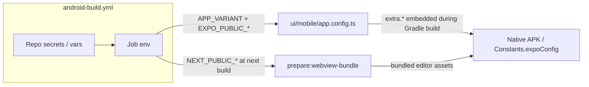

# Android Build Pipeline Environment Contract

## Problem this fixes

`android-build.yml` previously exported only `NEXT_PUBLIC_SUPABASE_URL(_ANON_KEY)` with
placeholder fallbacks and never set `APP_VARIANT`. During the Gradle build Expo evaluates
`ui/mobile/app.config.ts`, which resolved the **dev** variant with an empty Supabase URL,
so the release APK was produced "successfully" but crashed on startup
(`getSupabaseConfig()` throws when `extra.supabaseUrl`/`supabasePublishableKey` are empty).

## How configuration flows into the APK

Two independent consumers must receive **the same Supabase project** per environment:

1. **Native (Expo)** — `app.config.ts` reads variant-suffixed `EXPO_PUBLIC_*` vars while
   Gradle runs; `APP_VARIANT`/`EXPO_PUBLIC_APP_VARIANT` select the variant.
2. **Bundled editor WebView** — `prepare:webview-bundle` builds the Next.js app with
   `NEXT_PUBLIC_SUPABASE_URL`/`NEXT_PUBLIC_SUPABASE_ANON_KEY`; the workflow derives these
   from the target environment's EXPO values so native and WebView never diverge.

## Required repository configuration

| Environment | Name | Kind | Notes |
| --- | --- | --- | --- |
| stage | `EXPO_PUBLIC_SUPABASE_URL_STAGE` | secret | Falls back to `NEXT_PUBLIC_SUPABASE_URL` (must match the deployed web app's project — the stage APK loads the remote editor from it) |
| stage | `EXPO_PUBLIC_SUPABASE_PUBLISHABLE_KEY_STAGE` | secret | Falls back to `NEXT_PUBLIC_SUPABASE_ANON_KEY` |
| stage | `EXPO_PUBLIC_STAGE_EDITOR_WEBVIEW_URL` | variable | Defaults to `https://everfreenote.pages.dev/editor-webview` |
| stage | `EXPO_PUBLIC_TEST_AUTH_EMAIL` / `_PASSWORD` | secret | Fall back to `NEXT_PUBLIC_TEST_AUTH_EMAIL`/`_PASSWORD`; enable the test-login button in stage builds |
| prod | `EXPO_PUBLIC_SUPABASE_URL_PROD` | secret | **No fallback — must be configured before the first prod build** |
| prod | `EXPO_PUBLIC_SUPABASE_PUBLISHABLE_KEY_PROD` | secret | **No fallback — must be configured before the first prod build** |
| prod | `EXPO_PUBLIC_PROD_PUBLIC_WEB_ORIGIN` | variable | Defaults to `https://everfreenote.pages.dev`; used for share links from the bundled editor |

## Guard rails in the workflow

- **Validate build inputs** fails the job when any required value is empty or contains
  `placeholder`, and probes `<supabase-url>/auth/v1/health` so a stale/wrong project URL
  fails loudly instead of shipping an unusable APK.
- **Verify resolved Expo config** runs `npx expo config --type public` with the job env and
  asserts the resolved variant and a non-empty Supabase URL/key before Gradle starts.

## Triggering builds

- Manual: Actions → "Android Build" → `workflow_dispatch` on any branch with `environment`.
  Optional dispatch inputs `supabase_url`, `supabase_publishable_key`, and
  `editor_webview_url` override the secrets/vars (these are public client-side values);
  useful for ad-hoc builds and for forks that have no secrets configured.
- From a PR: comment `/build-android stage` (or `prod`) — `pr-build-trigger.yml` dispatches
  the workflow at the PR head ref. The APK lands in the run's `everfreenote-<env>-apk`
  artifact (signed with the committed debug keystore, as before).

## Local parity

Local builds read the same variables from `ui/mobile/.env` (gitignored, documented in
`ui/mobile/.env.example`); npm scripts (`android:stage`, `build:android:stage`, …) set
`APP_VARIANT` themselves.
