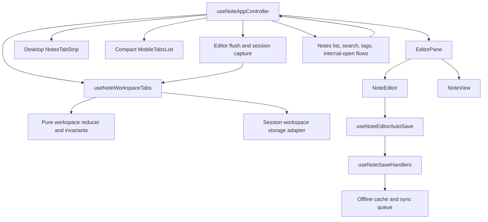

# System Design & Architecture

## Architecture Overview



`useNoteWorkspaceTabs` owns tab identity, ordering, active-tab selection, session snapshots, deduplication, and storage hydration. `useNoteAppController` remains the only navigation/write integration point: it flushes/captures the old tab, applies the reducer transition, and synchronizes the existing selected-note/editor API for the rest of the UI.

## Data Models

```ts
type NoteWorkspaceMode = 'reading' | 'editing'
type NoteSaveState = 'saved' | 'dirty' | 'saving' | 'error'

type NoteDraftSnapshot = {
  title: string
  description: string
  tags: string
}

type NoteViewSession = {
  scrollTop: number
  titleSelection?: { start: number; end: number }
  editorSelection?: { from: number; to: number }
}

type NoteWorkspaceTab = {
  id: string
  noteId: string | null
  note: NoteViewModel | null
  mode: NoteWorkspaceMode
  draft: NoteDraftSnapshot
  view: NoteViewSession
  saveState: NoteSaveState
  saveError: string | null
}

type NoteWorkspaceState = {
  version: 1
  tabs: NoteWorkspaceTab[]
  activeTabId: string
}
```

The persisted JSON contains only serializable values. Runtime refs, promises, React elements, and editor instances are never persisted. A tab with `noteId: null` is a blank working slot; a saved note tab stores a lightweight note snapshot so a reload can render immediately while existing note-opening/revalidation logic remains authoritative.

### Invariants

- `tabs.length >= 1`.
- `activeTabId` always points to a tab.
- At most one tab has a given non-null `noteId`.
- A blank tab has `note === null` and `noteId === null`.
- Closing an active tab applies right-neighbor-then-left-neighbor selection.
- Invalid persisted records are discarded rather than partially applied.

## API Design

The pure reducer/service exposes deterministic operations that both web and native presentation layers can use:

```ts
createWorkspaceState(idFactory?): NoteWorkspaceState
hydrateWorkspaceState(raw, idFactory?): NoteWorkspaceState
addWorkspaceTab(state, idFactory?): NoteWorkspaceState
activateWorkspaceTab(state, tabId): NoteWorkspaceState
openNoteInWorkspace(state, note, tabId?): NoteWorkspaceState
closeWorkspaceTab(state, tabId): NoteWorkspaceState
updateWorkspaceTab(state, tabId, patch): NoteWorkspaceState
findWorkspaceTabByNoteId(state, noteId): NoteWorkspaceTab | null
```

The React hook adds hydration/persistence and stable callbacks. Controller integration adds asynchronous operations around the reducer:

1. `flushPendingEditorSave()` waits for the current autosave pipeline.
2. `captureActiveSession()` reads the current editor/view draft and writes it to the active tab.
3. The transition is applied (`activate`, `open`, `add`, or `close`).
4. The controller synchronizes `selectedNote`/`isEditing` for existing consumers.

## Component Breakdown

| Area | Component/module | Responsibility |
|---|---|---|
| Shared model | `core/services/noteWorkspaceTabs.ts` | Types, invariants, reducer operations, safe hydration |
| Web persistence | `ui/web/lib/noteWorkspaceStorage.ts` | `sessionStorage` adapter, version/key/quota handling |
| Web hook | `ui/web/hooks/useNoteWorkspaceTabs.ts` | React state, hydration, persistence, stable actions |
| Desktop UI | `ui/web/components/features/notes/NotesTabStrip.tsx` | Horizontal tabs, add/close, active and save indicators |
| Mobile web UI | `ui/web/components/features/notes/MobileTabsList.tsx` | Active-tab summary and compact switch/close sheet/list |
| Controller | `ui/web/hooks/useNoteAppController.ts` | Flush/capture/transition; routes every note-open path through tabs |
| Editor session | `NoteEditor.tsx`, `RichTextEditor.tsx` | Capture/restore draft, scroll, caret/selection |
| Reading session | `NoteView.tsx` | Capture/restore reading scroll |
| Layout | `NotesShell.tsx` | Places tab UI above Reading/Editing actions and keeps it mounted across Notes subviews |

## Design Decisions

### Active-slot replacement is the default

`openNoteInWorkspace` updates the active tab. `addWorkspaceTab` is the only operation that increases tab count. This encodes the product's key rule in one reducer function instead of relying on individual click handlers.

### Deduplicate before asynchronous fetch work

The controller checks `findWorkspaceTabByNoteId` before replacing the active tab. If found, it flushes/captures the current tab and activates the existing tab. This prevents two concurrent sessions for one note and avoids unnecessary note-status checks.

### Local drafts belong to tabs

The existing editor remains mounted only for the active tab, so its DOM/TipTap instance is captured before unmount and restored from the tab's serializable draft/session. Existing autosave and offline queue behavior remains unchanged.

### Session storage is the web boundary

`sessionStorage` provides reload persistence while keeping separate external browser tabs isolated. Access is wrapped in try/catch and validated with a versioned schema. The in-memory reducer is always usable without storage.

### Save errors are explicit

The tab stores `saveState: 'error'` and `saveError`. Closing a failed tab requires an explicit confirmation from the user; an error is never silently discarded. Dirty/saving states are non-blocking indicators.

### Split View remains possible

The workspace is modeled as a list of independent tab sessions, while the controller exposes one active session today. A future split view can mount two active-session presenters without changing tab identity or persistence semantics.

## Non-Functional Requirements

- Switching tabs performs no new network request unless existing note revalidation is required; reducer transitions are synchronous after the current save flush.
- Storage writes are best-effort and serialized from a small, bounded state snapshot; storage failures never block editing.
- Tab buttons are keyboard reachable, have accessible names, and expose active/dirty/error state.
- Long titles are ellipsized; desktop overflow is horizontal and mobile uses a compact list.
- No secrets or auth tokens are added to workspace storage.

## Design Review Resolution (2026-08-01)

The design covers every requirements goal and transition:

| Requirement | Design coverage |
|---|---|
| Active-slot replacement and explicit Add | `openNoteInWorkspace` and `addWorkspaceTab` reducer operations |
| Duplicate note prevention | `findWorkspaceTabByNoteId` before controller replacement |
| Per-tab mode/draft/save state | `NoteWorkspaceTab` data model and active-session capture |
| Autosave safety | flush/capture sequence before reducer transitions; existing save handlers remain authoritative |
| Reading/editor context | `NoteView` scroll capture plus `NoteEditor`/TipTap session capture |
| Reload and browser-tab isolation | versioned `sessionStorage` adapter with in-memory fallback |
| Tags/Search/Settings/internal opens | one controller boundary and a mounted workspace hook |
| Desktop/mobile views | separate presentation components consuming the same hook/model |
| Future Split View | independent tab sessions with one active presenter today |

The only intentionally deferred behavior is native-mobile persistence policy; native UI can reuse the model without changing web `sessionStorage` semantics. No design gap blocks implementation.
