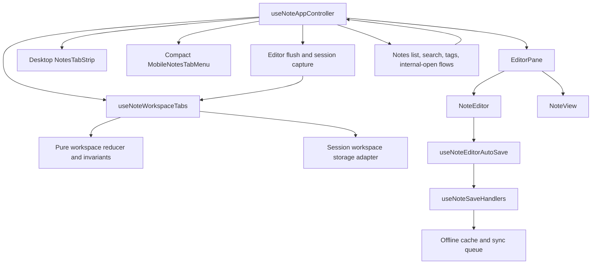

# System Design & Architecture

## Architecture Overview



`useNoteWorkspaceTabs` owns tab identity, ordering, active-tab selection, session snapshots, deduplication, and storage hydration. `useNoteAppController` remains the only navigation/write integration point: it flushes/captures the old tab, applies the reducer transition, and synchronizes the existing selected-note/editor API for the rest of the UI.

## Data Models

```ts
type NoteWorkspaceMode = 'reading' | 'editing'
type NoteSaveState = 'saved' | 'dirty' | 'saving' | 'error'

type NoteDraftSnapshot = {
  title: string
  description: string
  tags: string
}

type NoteViewSession = {
  scrollTop: number
  titleSelection?: { start: number; end: number }
  editorSelection?: { from: number; to: number }
}

type NoteWorkspaceTab = {
  id: string
  noteId: string | null
  note: NoteViewModel | null
  mode: NoteWorkspaceMode
  draft: NoteDraftSnapshot
  view: NoteViewSession
  saveState: NoteSaveState
  saveError: string | null
}

type NoteWorkspaceState = {
  version: 1
  userId: string | null
  tabs: NoteWorkspaceTab[]
  activeTabId: string
}
```

The persisted JSON contains only serializable values. Runtime refs, promises, React elements, and editor instances are never persisted. A tab with `noteId: null` is a blank working slot; a saved note tab stores a lightweight note snapshot so a reload can render immediately while existing note-opening/revalidation logic remains authoritative.

### Invariants

- `tabs.length >= 1`.
- `activeTabId` always points to a tab.
- At most one tab has a given non-null `noteId`.
- A blank tab has `note === null` and `noteId === null`.
- Closing an active tab applies right-neighbor-then-left-neighbor selection.
- Invalid persisted records are discarded rather than partially applied.
- Persisted state whose `userId` does not match the account being restored for
  is discarded, never partially adopted.

## API Design

The pure reducer/service exposes deterministic operations that both web and native presentation layers can use:

```ts
createWorkspaceState(idFactory?): NoteWorkspaceState
hydrateWorkspaceState(raw, idFactory?, userId?): NoteWorkspaceState
addWorkspaceTab(state, idFactory?): NoteWorkspaceState
activateWorkspaceTab(state, tabId): NoteWorkspaceState
openNoteInWorkspace(state, note, tabId?): NoteWorkspaceState
closeWorkspaceTab(state, tabId): NoteWorkspaceState
updateWorkspaceTab(state, tabId, patch): NoteWorkspaceState
resetWorkspaceTabsForNotes(state, noteIds): NoteWorkspaceState
findWorkspaceTabByNoteId(state, noteId): NoteWorkspaceTab | null
```

The React hook adds hydration/persistence and stable callbacks. Controller integration adds asynchronous operations around the reducer:

1. `flushPendingEditorSave()` waits for the current autosave pipeline.
2. `captureActiveSession()` reads the current editor/view draft and writes it to the active tab.
3. The transition is applied (`activate`, `open`, `add`, or `close`).
4. The controller synchronizes `selectedNote`/`isEditing` for existing consumers.

## Component Breakdown

| Area | Component/module | Responsibility |
|---|---|---|
| Shared model | `core/services/noteWorkspaceTabs.ts` | Types, invariants, reducer operations, safe hydration |
| Web persistence | `ui/web/lib/noteWorkspaceStorage.ts` | `sessionStorage` adapter, version/key/quota handling |
| Web hook | `ui/web/hooks/useNoteWorkspaceTabs.ts` | React state, hydration, persistence, stable actions |
| Desktop UI | `ui/web/components/features/notes/NotesTabStrip.tsx` | Horizontal tabs, add/close, active and save indicators |
| Mobile web UI | `ui/web/components/features/notes/MobileNotesTabMenu.tsx` | Active-tab summary and compact switch/close/add list |
| Controller | `ui/web/hooks/useNoteAppController.ts` | Flush/capture/transition; routes every note-open path through tabs |
| Editor session | `NoteEditor.tsx`, `RichTextEditor.tsx` | Capture/restore draft, scroll, caret/selection |
| Reading session | `NoteView.tsx` | Capture/restore reading scroll |
| Layout | `NotesShell.tsx` | Places tab UI above Reading/Editing actions and keeps it mounted across Notes subviews |

## Design Decisions

### Mobile empty-tab navigation

The mobile tab menu is mounted in the shared Notes header above both the note
list and the active editor. Adding a tab closes the menu and returns the mobile
layout to the note list, leaving the new blank tab active. Selecting a note from
that list replaces the active blank slot through the existing controller rule;
it does not create another tab. Activating an empty reading tab uses the same
list state so an empty tab never traps the user in a blank editor screen.

### Responsive desktop tab capacity

The desktop tab strip keeps Add as the first, non-scrolling control. The tab
viewport uses a browser-like flex layout: tabs grow while there is room, stop
at a 120px minimum, and horizontally scroll once they no longer fit.

Running out of horizontal room is a scrolling concern, not a capacity limit.
Add stays enabled until the shared 32-tab ceiling enforced by the core model
and controller, and its accessible name only reports that one number — an
earlier revision derived a second, width-based limit, which made Add dead at
four tabs on a 1024px window and announced "limit reached: 4 tabs" while eight
tabs were open. The screen width now decides how the strip scrolls, never how
many notes the user may keep open.

Because the strip scrolls, it also owns the affordances that make the hidden
tabs reachable:

- Chevron buttons appear on either side while the strip overflows and are
  disabled at each end. They are the primary control, since macOS hides
  overlay scrollbars until a scroll is already in progress.
- A vertical wheel over the strip scrolls it horizontally, for pointers with
  no horizontal axis.
- The native scrollbar is hidden (`.scrollbar-none`). It would otherwise add
  ~11px to the strip and make its height jump as tabs are opened and closed.
- Scroll snapping aligns tabs to the left edge, so the strip never leaves a
  sliver of a tab whose only visible part is its close button.
- A `ResizeObserver` on the tab viewport re-reveals the active tab. Without it,
  narrowing the window leaves the active tab scrolled out of sight while its
  note is the one on screen.

The mobile menu receives the controller's disabled state explicitly and keeps
its tab rows in a scrollable region while leaving Add available as the fixed
menu footer. The menu is an absolutely positioned popover: in flow it pushed
the note down by its own height (over 500px with a full tab list), leaving a
sliver of the note visible. It scrolls its active row into view on open and
dismisses on outside pointer-down and on Escape.

### Workspace state is scoped to the signed-in account

Tabs persist in per-browser-tab `sessionStorage`, and every tab caches the note
it shows — title, tags and body. That storage outlives a sign-out, so without a
guard the next account to sign in inside the same browser tab restores the
previous account's open notes and can read their contents.

Two layers close this:

- `NoteWorkspaceState` carries a `userId`. `hydrateNoteWorkspaceState` compares
  it against the account being restored for and starts a fresh workspace on any
  mismatch. State with no stamp at all (written before this guard) is treated
  as foreign. This covers every path that skips a clean sign-out — a crash, an
  expired token, a session swapped in another way.
- `handleSignOut` calls `clearNoteWorkspaceState()`, so the cached notes are
  gone at sign-out rather than lingering until the next sign-in.

The hook re-hydrates whenever the user id changes and only writes once the
in-memory state belongs to the account currently signed in, so the outgoing
account's tabs are never rewritten under the incoming one.

### The persisted workspace degrades in pieces, not all at once

Each tab caches the note it shows, so the 2MB session budget is a real
constraint rather than a theoretical one. Two rules keep it out of the way:

- A clean tab's draft is a byte-for-byte copy of its note, so it is not
  written; hydration rebuilds it from the note. That halves the cost per tab
  and moves the ceiling above the 32-tab cap for notes up to roughly 60KB —
  before this, a workspace of 60KB notes stopped persisting at 17 tabs.
- Over budget, the snapshot keeps the active tab, then every tab carrying
  unsaved work, then as many saved tabs as fit. Losing a saved note costs a
  re-open; losing a draft costs the user's typing. Previously one oversized
  snapshot threw, the write was swallowed, and the entire workspace silently
  stopped persisting.

Dropping tabs is reported once per session rather than per write, since
persistence runs on every workspace change. Nothing is written only when a
single note is too large for the budget on its own.

### Closing a tab is animated; opening one is acknowledged

A tab vanishing makes the whole strip jump, so a closed tab collapses out of
the way over 150ms while the rest slide into place. The tab is dropped from
workspace state the moment it is closed — the animation never delays that.
`useAnimatedTabList` only keeps a non-interactive copy (`aria-hidden`, `inert`)
rendered in the same slot until the exit finishes, shared by the desktop strip
and the mobile list so both behave the same way.

The exit is a CSS keyframe animation rather than a transition: the copy is
created already in its end state, and a transition has nothing to run from.
Desktop collapses horizontally, mobile vertically; same duration, same easing.

Opening does not mirror the collapse. The gap has to close when a tab leaves —
that is layout, not decoration — but a new tab arrives in space that already
exists, and growing it while the strip may also be scrolling to reveal it
reads as busy. A new tab fades and scales in over the same 150ms instead.

`prefers-reduced-motion` removes all of it: the hook skips the copy entirely,
and a global rule in `globals.css` neutralises animation and transition
durations app-wide.

### Active-slot replacement is the default

`openNoteInWorkspace` updates the active tab. `addWorkspaceTab` is the only operation that increases tab count. This encodes the product's key rule in one reducer function instead of relying on individual click handlers.

### Deduplicate before asynchronous fetch work

The controller checks `findWorkspaceTabByNoteId` before replacing the active tab. If found, it flushes/captures the current tab and activates the existing tab. This prevents two concurrent sessions for one note and avoids unnecessary note-status checks.

### Local drafts belong to tabs

The existing editor remains mounted only for the active tab, so its DOM/TipTap instance is captured before unmount and restored from the tab's serializable draft/session. Existing autosave and offline queue behavior remains unchanged.

### Session storage is the web boundary

`sessionStorage` provides reload persistence while keeping separate external browser tabs isolated. Access is wrapped in try/catch and validated with a versioned schema. The in-memory reducer is always usable without storage.

### Save errors are explicit

The tab stores `saveState: 'error'` and `saveError`. Closing a failed tab requires an explicit confirmation from the user; an error is never silently discarded. Dirty/saving states are non-blocking indicators.

`flushAndCaptureActiveTab` never rejects: it returns a success flag, and every
tab/note transition aborts explicitly when the flush fails, so the failed tab
keeps its draft and error marker and no caller is left with an unhandled
promise rejection. Entering edit mode changes only the tab mode and never
clears an unresolved dirty/error marker.

### Deleted notes reset their tabs

A successful delete (single or bulk, online or queued offline) resets every tab
whose `noteId` was deleted back to a blank landing slot via
`resetWorkspaceTabsForNotes`. Tab identity, order, and activation are
preserved; only affected tabs change. This prevents a stale tab from rendering
a deleted note or re-creating it through autosave, and bulk delete no longer
clears the active tab when its note survived.

### The editor's initial snapshot is frozen per session

`NoteEditor` reconciles its `initial*` props as an external (server-backed)
snapshot. The live tab draft echoes every keystroke back through
`handleDraftChange`, so `NotesShell` freezes the draft passed to the editor per
editor session (tab + note + mode). Feeding the live draft in directly makes
the autosave reconciliation acknowledge the user's own typing as an external
refresh and silently cancel every pending autosave — nothing is ever written
to Supabase until a manual Save. Guarded by the `NotesShellAutoSaveEcho`
component spec, which reproduces the echo loop with a real editor.

### Session updates are debounced

Typing and scrolling notify workspace state through
`useDebouncedSessionCallback` (250 ms, below the 500 ms autosave debounce).
Draft updates are cancelled on unmount and on manual Save/Read because every
transition captures the live editor synchronously first — a late flush would
re-mark a saved tab as dirty. Reading scroll has no synchronous capture path,
so its latest value is flushed on unmount instead.

### Split View remains possible

The workspace is modeled as a list of independent tab sessions, while the controller exposes one active session today. A future split view can mount two active-session presenters without changing tab identity or persistence semantics.

## Non-Functional Requirements

- Switching tabs performs no new network request unless existing note revalidation is required; reducer transitions are synchronous after the current save flush.
- Storage writes are best-effort and serialized from a small, bounded state snapshot; storage failures never block editing.
- Tab buttons are keyboard reachable, have accessible names, and expose active/dirty/error state.
- Long titles are ellipsized; desktop tabs grow/shrink within the 120px
  minimum and overflow horizontally when needed, with Add fixed on the left
  and chevron controls for the overflow; mobile uses a compact list.
- The strip height does not change as tabs are added, removed, or overflow.
- The active tab stays scrolled into view across activation, tab open/close,
  and window resize.
- No secrets or auth tokens are added to workspace storage.

## Design Review Resolution (2026-08-01)

The design covers every requirements goal and transition:

| Requirement | Design coverage |
|---|---|
| Active-slot replacement and explicit Add | `openNoteInWorkspace` and `addWorkspaceTab` reducer operations |
| Duplicate note prevention | `findWorkspaceTabByNoteId` before controller replacement |
| Per-tab mode/draft/save state | `NoteWorkspaceTab` data model and active-session capture |
| Autosave safety | flush/capture sequence before reducer transitions; existing save handlers remain authoritative |
| Reading/editor context | `NoteView` scroll capture plus `NoteEditor`/TipTap session capture |
| Reload and browser-tab isolation | versioned `sessionStorage` adapter with in-memory fallback |
| Tags/Search/Settings/internal opens | one controller boundary and a mounted workspace hook |
| Desktop/mobile views | separate presentation components consuming the same hook/model |
| Future Split View | independent tab sessions with one active presenter today |

The only intentionally deferred behavior is native-mobile persistence policy; native UI can reuse the model without changing web `sessionStorage` semantics. No design gap blocks implementation.
