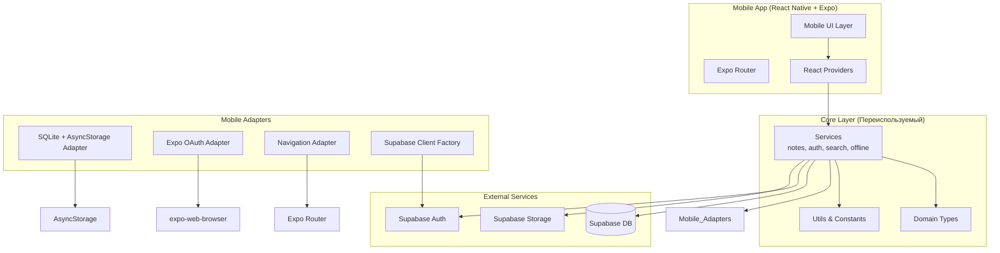
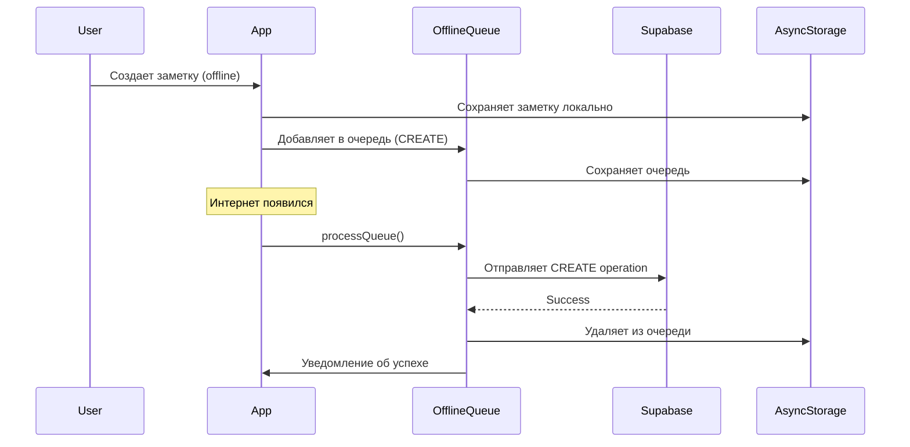
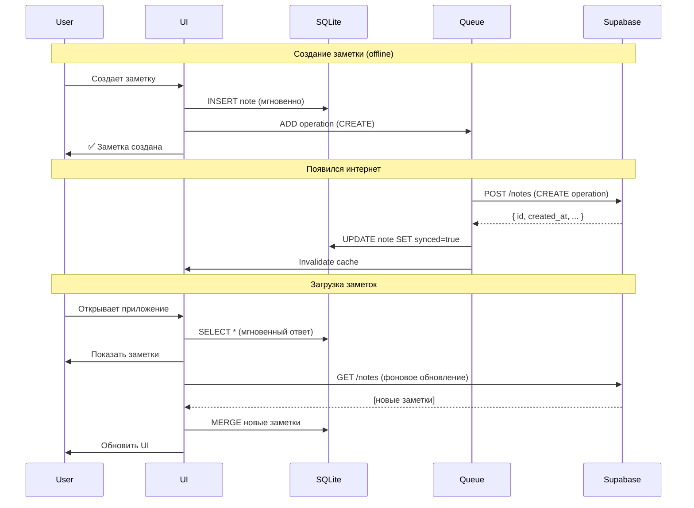
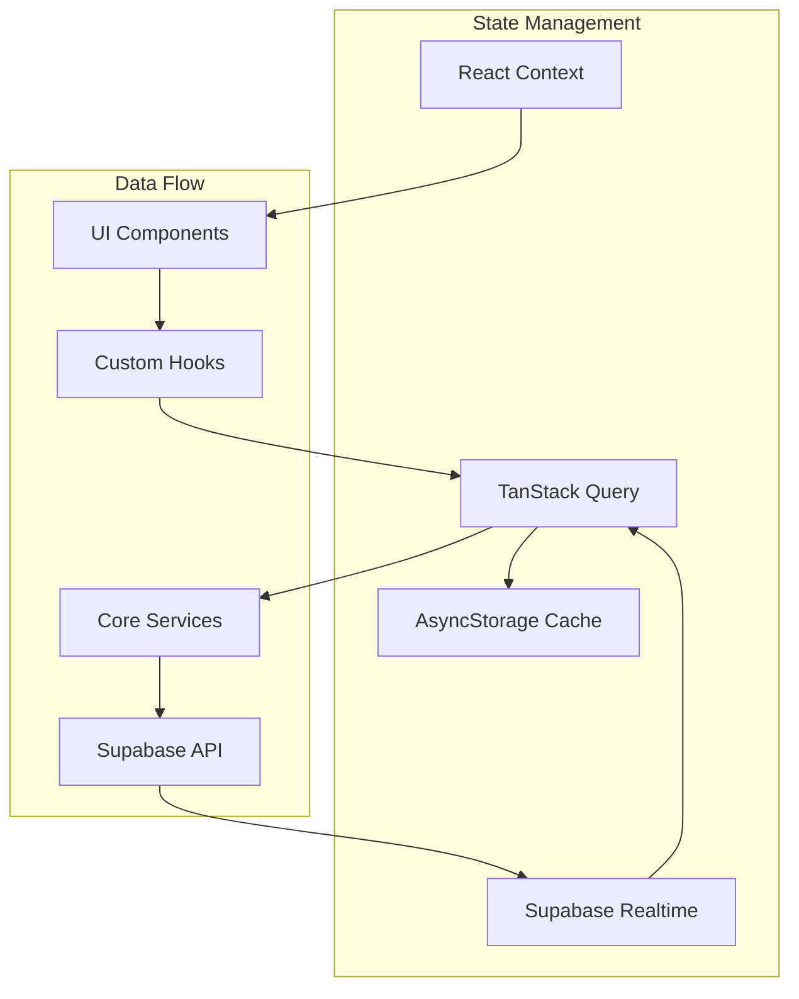

# Дизайн и архитектура мобильного приложения

## Обзор архитектуры

Мобильное приложение строится на основе принципа **максимального переиспользования core-слоя** с платформенно-специфичными адаптерами для React Native.

### Высокоуровневая архитектура



## Структура проекта

```
mobile/                          # Новая папка для React Native приложения
├── app/                         # Expo Router (file-based routing)
│   ├── (auth)/                  # Auth group
│   │   ├── login.tsx
│   │   └── callback.tsx        # OAuth callback
│   ├── (tabs)/                  # Main tabs group
│   │   ├── _layout.tsx         # Tabs layout
│   │   ├── index.tsx           # Notes list
│   │   ├── search.tsx          # Search screen
│   │   └── profile.tsx         # Profile screen
│   ├── note/
│   │   └── [id].tsx            # Note editor (dynamic route)
│   ├── _layout.tsx             # Root layout
│   └── +not-found.tsx
├── components/                  # React Native компоненты
│   ├── NoteList.tsx
│   ├── NoteCard.tsx
│   ├── RichTextEditor.tsx      # Адаптация для RN
│   ├── TagChip.tsx
│   ├── SearchBar.tsx
│   └── ui/                      # Базовые UI компоненты
│       ├── Button.tsx
│       ├── Input.tsx
│       ├── Card.tsx
│       └── ...
├── hooks/                       # React Native специфичные хуки
│   ├── useNotes.ts             # Переиспользует core/services/notes
│   ├── useAuth.ts              # Переиспользует core/services/auth
│   ├── useOfflineSync.ts       # Переиспользует core/services/offlineSyncManager
│   └── useTheme.ts
├── adapters/                    # Платформенные адаптеры
│   ├── storage.ts              # AsyncStorage adapter
│   ├── oauth.ts                # Expo OAuth adapter
│   ├── navigation.ts           # Expo Router adapter
│   └── supabaseClient.ts       # Mobile Supabase client
├── providers/                   # React Context провайдеры
│   ├── SupabaseProvider.tsx
│   ├── QueryProvider.tsx       # TanStack Query
│   └── ThemeProvider.tsx
├── constants/
│   ├── theme.ts                # Цвета, шрифты (синхронизированы с web)
│   └── config.ts
├── app.config.ts                # Expo config
├── package.json
└── tsconfig.json

core/                            # Существующий core (без изменений!)
├── services/
│   ├── notes.ts                # Переиспользуется
│   ├── auth.ts                 # Переиспользуется
│   ├── search.ts               # Переиспользуется
│   ├── offlineSyncManager.ts   # Переиспользуется
│   └── ...
├── types/
│   └── domain.ts               # Переиспользуется
├── utils/
│   └── ...                     # Переиспользуется
└── adapters/
    ├── storage.ts              # Interface (реализован в mobile/adapters)
    ├── oauth.ts                # Interface (реализован в mobile/adapters)
    └── navigation.ts           # Interface (реализован в mobile/adapters)
```

## Детальный дизайн компонентов

### 1. Адаптеры (Adapters Layer)

#### Storage Adapter (AsyncStorage)

```typescript
// mobile/adapters/storage.ts
import AsyncStorage from '@react-native-async-storage/async-storage'
import type { StorageAdapter } from '@core/adapters/storage'

export const mobileStorageAdapter: StorageAdapter = {
  async getItem(key: string): Promise<string | null> {
    try {
      return await AsyncStorage.getItem(key)
    } catch (error) {
      console.error('AsyncStorage getItem error:', error)
      return null
    }
  },
  
  async setItem(key: string, value: string): Promise<void> {
    try {
      await AsyncStorage.setItem(key, value)
    } catch (error) {
      console.error('AsyncStorage setItem error:', error)
      throw error
    }
  },
  
  async removeItem(key: string): Promise<void> {
    try {
      await AsyncStorage.removeItem(key)
    } catch (error) {
      console.error('AsyncStorage removeItem error:', error)
      throw error
    }
  },
}
```

**Ограничения AsyncStorage:**
- iOS: ~6MB лимит
- Android: практически без лимита
- **Решение для больших данных:** Мигрировать на expo-sqlite при необходимости

#### OAuth Adapter (Expo WebBrowser)

```typescript
// mobile/adapters/oauth.ts
import * as WebBrowser from 'expo-web-browser'
import * as Linking from 'expo-linking'
import type { OAuthAdapter } from '@core/adapters/oauth'

// Важно! Инициализация для iOS/Android
WebBrowser.maybeCompleteAuthSession()

export const mobileOAuthAdapter: OAuthAdapter = {
  async startOAuth(authUrl: string): Promise<void> {
    try {
      const redirectUrl = Linking.createURL('auth/callback')
      
      const result = await WebBrowser.openAuthSessionAsync(
        authUrl,
        redirectUrl,
        {
          // iOS specific
          preferEphemeralSession: true, // Не сохранять cookies
        }
      )
      
      if (result.type === 'success') {
        // URL будет обработан в app/(auth)/callback.tsx
        console.log('OAuth success:', result.url)
      } else if (result.type === 'cancel') {
        throw new Error('User cancelled OAuth flow')
      }
    } catch (error) {
      console.error('OAuth error:', error)
      throw error
    }
  },
}
```

**Deep Linking настройка:**
```json
// app.config.ts
{
  "expo": {
    "scheme": "everfreenote",
    "ios": {
      "bundleIdentifier": "com.everfreenote.app",
      "associatedDomains": ["applinks:everfreenote.app"]
    },
    "android": {
      "package": "com.everfreenote.app",
      "intentFilters": [
        {
          "action": "VIEW",
          "data": [
            {
              "scheme": "everfreenote"
            }
          ],
          "category": ["BROWSABLE", "DEFAULT"]
        }
      ]
    }
  }
}
```

#### Navigation Adapter (Expo Router)

```typescript
// mobile/adapters/navigation.ts
import { router } from 'expo-router'
import type { NavigationAdapter } from '@core/adapters/navigation'

export const mobileNavigationAdapter: NavigationAdapter = {
  navigate(url: string, options?: { replace?: boolean }): void {
    if (options?.replace) {
      router.replace(url)
    } else {
      router.push(url)
    }
  },
}
```

#### Supabase Client Factory

```typescript
// mobile/adapters/supabaseClient.ts
import { createClient } from '@supabase/supabase-js'
import { mobileStorageAdapter } from './storage'

const supabaseUrl = process.env.EXPO_PUBLIC_SUPABASE_URL!
const supabaseAnonKey = process.env.EXPO_PUBLIC_SUPABASE_ANON_KEY!

export const supabaseClient = createClient(supabaseUrl, supabaseAnonKey, {
  auth: {
    storage: mobileStorageAdapter, // Используем AsyncStorage
    autoRefreshToken: true,
    persistSession: true,
    detectSessionInUrl: false, // Не для мобильного
  },
})
```

### 2. UI компоненты

#### Rich Text Editor (WebView + TipTap)

**Проблема:** TipTap использует DOM API, которого нет в React Native

**Решение:** ✅ **WebView с полным переиспользованием web RichTextEditor**

**Архитектура:**
1. Создается отдельная страница `app/editor-webview/page.tsx` с чистым редактором
2. React Native компонент загружает эту страницу в WebView
3. Коммуникация через `postMessage` bridge

```typescript
// app/editor-webview/page.tsx - Новая страница
'use client'
import { RichTextEditor } from '@/components/editor/RichTextEditor'
import { useEffect, useState } from 'react'

export default function EditorWebViewPage() {
  const [content, setContent] = useState('')

  useEffect(() => {
    // Listen for messages from React Native
    const handleMessage = (event: MessageEvent) => {
      const { type, payload } = event.data
      
      if (type === 'SET_CONTENT') {
        setContent(payload)
      }
    }
    
    window.addEventListener('message', handleMessage)
    return () => window.removeEventListener('message', handleMessage)
  }, [])

  const handleChange = (html: string) => {
    // Send to React Native
    if (window.ReactNativeWebView) {
      window.ReactNativeWebView.postMessage(JSON.stringify({
        type: 'CONTENT_CHANGED',
        payload: html
      }))
    }
  }

  return (
    <div className="h-screen w-screen">
      <RichTextEditor 
        initialContent={content}
        onChange={handleChange}
      />
    </div>
  )
}
```

```typescript
// mobile/components/EditorWebView.tsx - React Native обертка
import React, { useRef, useImperativeHandle, forwardRef } from 'react'
import { View, StyleSheet } from 'react-native'
import WebView from 'react-native-webview'

export type EditorWebViewHandle = {
  setContent: (html: string) => void
  getContent: () => string
}

type EditorWebViewProps = {
  initialContent: string
  onContentChange?: (html: string) => void
}

export const EditorWebView = forwardRef<EditorWebViewHandle, EditorWebViewProps>(
  ({ initialContent, onContentChange }, ref) => {
    const webViewRef = useRef<WebView>(null)
    const currentContent = useRef(initialContent)

    useImperativeHandle(ref, () => ({
      setContent(html: string) {
        webViewRef.current?.postMessage(JSON.stringify({
          type: 'SET_CONTENT',
          payload: html
        }))
      },
      getContent() {
        return currentContent.current
      }
    }))

    const handleMessage = (event: any) => {
      const { type, payload } = JSON.parse(event.nativeEvent.data)
      
      if (type === 'CONTENT_CHANGED') {
        currentContent.current = payload
        onContentChange?.(payload)
      }
    }

    // В продакшене - URL вашего сервера
    // В разработке - localhost:3000
    const editorUrl = __DEV__ 
      ? 'http://localhost:3000/editor-webview'
      : 'https://everfreenote.app/editor-webview'

    return (
      <View style={styles.container}>
        <WebView
          ref={webViewRef}
          source={{ uri: editorUrl }}
          onMessage={handleMessage}
          javaScriptEnabled
          domStorageEnabled
          startInLoadingState
        />
      </View>
    )
  }
)

const styles = StyleSheet.create({
  container: {
    flex: 1,
  },
})
```

**Преимущества:**
- ✅ **100% переиспользование** существующего RichTextEditor
- ✅ Все TipTap расширения работают без изменений
- ✅ Единый источник правды для логики редактора
- ✅ Легко поддерживать (фиксы применяются сразу везде)
- ✅ Не нужно менять архитектуру проекта

**Ограничения:**
- ⚠️ Требуется запущенный Next.js сервер (или статичный экспорт)
- ⚠️ Небольшая задержка при загрузке WebView (но потом работает плавно)

#### Note List (Виртуализация)

```typescript
// mobile/components/NoteList.tsx
import React from 'react'
import { FlashList } from '@shopify/flash-list'
import { NoteCard } from './NoteCard'
import type { Note } from '@core/types/domain'

type NoteListProps = {
  notes: Note[]
  selectedNoteId?: string
  onSelectNote: (note: Note) => void
  onTagClick: (tag: string) => void
}

export const NoteList = ({ notes, selectedNoteId, onSelectNote, onTagClick }: NoteListProps) => {
  return (
    <FlashList
      data={notes}
      renderItem={({ item }) => (
        <NoteCard
          note={item}
          isSelected={item.id === selectedNoteId}
          onPress={() => onSelectNote(item)}
          onTagPress={onTagClick}
        />
      )}
      estimatedItemSize={120}
      keyExtractor={(item) => item.id}
    />
  )
}
```

**Почему FlashList вместо FlatList?**
- 10x быстрее для больших списков
- Меньше потребление памяти
- Используется в production (Shopify app)

### 3. Навигация (Expo Router)

```mermaid
graph LR
    Root[Root Layout] --> Auth{Authenticated?}
    Auth -->|No| Login[Login Screen]
    Auth -->|Yes| Tabs[Tabs Layout]
    
    Tabs --> Notes[Notes List]
    Tabs --> Search[Search]
    Tabs --> Profile[Profile]
    
    Notes --> NoteEditor[Note Editor<br/>/note/[id]]
    Search --> NoteEditor
    
    Login --> Callback[OAuth Callback]
    Callback --> Tabs
```

#### Root Layout

```typescript
// mobile/app/_layout.tsx
import { Stack } from 'expo-router'
import { SupabaseProvider } from '@/providers/SupabaseProvider'
import { QueryProvider } from '@/providers/QueryProvider'
import { ThemeProvider } from '@/providers/ThemeProvider'

export default function RootLayout() {
  return (
    <SupabaseProvider>
      <QueryProvider>
        <ThemeProvider>
          <Stack screenOptions={{ headerShown: false }}>
            <Stack.Screen name="(auth)" />
            <Stack.Screen name="(tabs)" />
          </Stack>
        </ThemeProvider>
      </QueryProvider>
    </SupabaseProvider>
  )
}
```

#### Tabs Layout

```typescript
// mobile/app/(tabs)/_layout.tsx
import { Tabs } from 'expo-router'
import { Home, Search, User } from 'lucide-react-native'

export default function TabsLayout() {
  return (
    <Tabs>
      <Tabs.Screen
        name="index"
        options={{
          title: 'Заметки',
          tabBarIcon: ({ color }) => <Home color={color} />,
        }}
      />
      <Tabs.Screen
        name="search"
        options={{
          title: 'Поиск',
          tabBarIcon: ({ color }) => <Search color={color} />,
        }}
      />
      <Tabs.Screen
        name="profile"
        options={{
          title: 'Профиль',
          tabBarIcon: ({ color }) => <User color={color} />,
        }}
      />
    </Tabs>
  )
}
```

### 4. Офлайн синхронизация



**Переиспользование существующего кода:**

```typescript
// mobile/hooks/useOfflineSync.ts
import { useEffect } from 'react'
import { AppState, AppStateStatus } from 'react-native'
import NetInfo from '@react-native-community/netinfo'
import { offlineSyncManager } from '@core/services/offlineSyncManager'

export const useOfflineSync = () => {
  useEffect(() => {
    // Слушаем изменения сети
    const unsubscribe = NetInfo.addEventListener((state) => {
      if (state.isConnected) {
        offlineSyncManager.processQueue() // Используем core-сервис!
      }
    })

    // Слушаем когда приложение возвращается на foreground
    const subscription = AppState.addEventListener('change', (nextAppState: AppStateStatus) => {
      if (nextAppState === 'active') {
        offlineSyncManager.processQueue()
      }
    })

    return () => {
      unsubscribe()
      subscription.remove()
    }
  }, [])
}
```

### SQLite ↔ Supabase Стратегия синхронизации

**Проблема:** Нужно синхронизировать локальную SQLite базу с удаленной Supabase PostgreSQL

**Решение:** Гибридная стратегия с оптимистичными обновлениями



**Стратегия по операциям:**

#### 1. CREATE (Создание заметки)
```typescript
// services/notesSync.ts
export const createNoteWithSync = async (note: CreateNoteInput) => {
  const localId = generateUUID()
  
  // 1. Сохранить в SQLite (мгновенно)
  await db.runAsync(
    'INSERT INTO notes (id, title, description, tags, synced, created_at) VALUES (?, ?, ?, ?, ?, ?)',
    [localId, note.title, note.description, JSON.stringify(note.tags), false, new Date().toISOString()]
  )
  
  // 2. Добавить в офлайн очередь
  await offlineQueue.add({
    operation: 'CREATE',
    table: 'notes',
    localId,
    data: note,
  })
  
  // 3. Попытаться синхронизировать (если есть интернет)
  if (await NetInfo.fetch().then(state => state.isConnected)) {
    try {
      const serverNote = await supabase.from('notes').insert(note).select().single()
      
      // Обновить локальную запись с server ID
      await db.runAsync(
        'UPDATE notes SET id = ?, synced = true WHERE id = ?',
        [serverNote.id, localId]
      )
      
      // Удалить из очереди
      await offlineQueue.remove(localId)
    } catch (error) {
      // Останется в очереди, синхронизируем позже
      console.log('Sync deferred:', error)
    }
  }
  
  return localId
}
```

#### 2. UPDATE (Редактирование заметки)
```typescript
export const updateNoteWithSync = async (id: string, updates: UpdateNoteInput) => {
  // 1. Обновить в SQLite
  await db.runAsync(
    'UPDATE notes SET title = ?, description = ?, tags = ?, synced = false, updated_at = ? WHERE id = ?',
    [updates.title, updates.description, JSON.stringify(updates.tags), new Date().toISOString(), id]
  )
  
  // 2. Добавить в очередь
  await offlineQueue.add({
    operation: 'UPDATE',
    table: 'notes',
    id,
    data: updates,
  })
  
  // 3. Синхронизировать
  if (await NetInfo.fetch().then(state => state.isConnected)) {
    try {
      await supabase.from('notes').update(updates).eq('id', id)
      await db.runAsync('UPDATE notes SET synced = true WHERE id = ?', [id])
      await offlineQueue.remove(id)
    } catch (error) {
      console.log('Sync deferred:', error)
    }
  }
}
```

#### 3. DELETE (Удаление заметки)
```typescript
export const deleteNoteWithSync = async (id: string) => {
  // 1. Soft delete в SQLite
  await db.runAsync(
    'UPDATE notes SET deleted_at = ?, synced = false WHERE id = ?',
    [new Date().toISOString(), id]
  )
  
  // 2. Добавить в очередь
  await offlineQueue.add({
    operation: 'DELETE',
    table: 'notes',
    id,
  })
  
  // 3. Синхронизировать
  if (await NetInfo.fetch().then(state => state.isConnected)) {
    try {
      await supabase.from('notes').delete().eq('id', id)
      
      // Hard delete из SQLite только после успешной синхронизации
      await db.runAsync('DELETE FROM notes WHERE id = ?', [id])
      await offlineQueue.remove(id)
    } catch (error) {
      console.log('Sync deferred:', error)
    }
  }
}
```

#### 4. FETCH (Загрузка заметок)
```typescript
export const fetchNotesWithSync = async (userId: string) => {
  // 1. Сначала из SQLite (мгновенный ответ)
  const localNotes = await db.getAllAsync(
    'SELECT * FROM notes WHERE user_id = ? AND deleted_at IS NULL ORDER BY updated_at DESC',
    [userId]
  )
  
  // Показываем пользователю сразу
  queryClient.setQueryData(['notes', userId], { notes: localNotes })
  
  // 2. Фоновое обновление из Supabase
  if (await NetInfo.fetch().then(state => state.isConnected)) {
    try {
      const { data: serverNotes } = await supabase
        .from('notes')
        .select('*')
        .eq('user_id', userId)
        .order('updated_at', { ascending: false })
      
      // 3. Merge: Supabase wins при конфликтах
      for (const serverNote of serverNotes) {
        const localNote = localNotes.find(n => n.id === serverNote.id)
        
        if (!localNote) {
          // Новая заметка с сервера
          await db.runAsync(
            'INSERT INTO notes (id, title, description, tags, user_id, synced, created_at, updated_at) VALUES (?, ?, ?, ?, ?, ?, ?, ?)',
            [serverNote.id, serverNote.title, serverNote.description, JSON.stringify(serverNote.tags), serverNote.user_id, true, serverNote.created_at, serverNote.updated_at]
          )
        } else if (new Date(serverNote.updated_at) > new Date(localNote.updated_at)) {
          // Сервер новее - обновляем локальную
          await db.runAsync(
            'UPDATE notes SET title = ?, description = ?, tags = ?, synced = true, updated_at = ? WHERE id = ?',
            [serverNote.title, serverNote.description, JSON.stringify(serverNote.tags), serverNote.updated_at, serverNote.id]
          )
        }
      }
      
      // Обновляем UI
      queryClient.invalidateQueries(['notes', userId])
    } catch (error) {
      console.log('Background sync failed:', error)
    }
  }
  
  return localNotes
}
```

**Конфликты (conflict resolution):**
- **Правило:** Last-write-wins (последняя запись побеждает)
- **Сравнение:** По полю `updated_at`
- **Server wins:** Если `server.updated_at > local.updated_at`
- **Исключение:** Если есть несинхронизированные изменения в очереди - они имеют приоритет

**Индикаторы синхронизации:**
```typescript
// components/SyncIndicator.tsx
export const SyncIndicator = () => {
  const queueSize = useOfflineQueueSize()
  const isOnline = useNetworkStatus()
  
  if (queueSize === 0) return null
  
  return (
    <View className="flex-row items-center px-2 py-1 bg-yellow-100 rounded">
      {isOnline ? (
        <>
          <ActivityIndicator size="small" />
          <Text className="ml-2">Синхронизация {queueSize} изменений...</Text>
        </>
      ) : (
        <>
          <CloudOffIcon size={16} />
          <Text className="ml-2">{queueSize} несинхронизированных изменений</Text>
        </>
      )}
    </View>
  )
}
```

## Дизайн UI/UX

### Цветовая схема (синхронизирована с web)

```typescript
// mobile/constants/theme.ts
export const colors = {
  light: {
    primary: 'hsl(221.2 83.2% 53.3%)',      // Синий
    background: 'hsl(0 0% 100%)',           // Белый
    card: 'hsl(0 0% 100%)',
    text: 'hsl(222.2 84% 4.9%)',
    muted: 'hsl(210 40% 96.1%)',
    border: 'hsl(214.3 31.8% 91.4%)',
  },
  dark: {
    primary: 'hsl(217.2 91.2% 59.8%)',
    background: 'hsl(222.2 84% 4.9%)',
    card: 'hsl(222.2 84% 4.9%)',
    text: 'hsl(210 40% 98%)',
    muted: 'hsl(217.2 32.6% 17.5%)',
    border: 'hsl(217.2 32.6% 17.5%)',
  },
}
```

### Типография (синхронизирована с web)

```typescript
export const typography = {
  fonts: {
    regular: 'System',
    medium: 'System',
    bold: 'System',
  },
  sizes: {
    xs: 10,
    sm: 12,
    base: 14,
    lg: 16,
    xl: 18,
    '2xl': 24,
    '3xl': 30,
  },
}
```

### Компонентная библиотека

**Выбор:** NativeWind v4 + кастомные компоненты (аналог shadcn/ui)

**Преимущества:**
- Максимальная совместимость с web-версией (те же классы)
- Полный контроль над дизайном
- Легковесность

**Пример компонента:**

```typescript
// mobile/components/ui/Button.tsx
import { Pressable, Text, StyleSheet } from 'react-native'
import { styled } from 'nativewind'

const StyledPressable = styled(Pressable)
const StyledText = styled(Text)

type ButtonProps = {
  variant?: 'default' | 'outline' | 'ghost'
  size?: 'sm' | 'md' | 'lg'
  onPress: () => void
  children: string
}

export const Button = ({ variant = 'default', size = 'md', onPress, children }: ButtonProps) => {
  return (
    <StyledPressable
      onPress={onPress}
      className={`
        rounded-lg items-center justify-center
        ${variant === 'default' ? 'bg-primary' : ''}
        ${variant === 'outline' ? 'bg-transparent border border-border' : ''}
        ${variant === 'ghost' ? 'bg-transparent' : ''}
        ${size === 'sm' ? 'px-3 py-2' : ''}
        ${size === 'md' ? 'px-4 py-3' : ''}
        ${size === 'lg' ? 'px-6 py-4' : ''}
      `}
    >
      <StyledText
        className={`
          font-medium
          ${variant === 'default' ? 'text-white' : 'text-foreground'}
          ${size === 'sm' ? 'text-sm' : ''}
          ${size === 'md' ? 'text-base' : ''}
          ${size === 'lg' ? 'text-lg' : ''}
        `}
      >
        {children}
      </StyledText>
    </StyledPressable>
  )
}
```

## Управление состоянием



**Используемые инструменты:**
1. **TanStack Query** - кэширование серверного состояния, автоматический refetch
2. **React Context** - глобальное состояние (theme, auth)
3. **AsyncStorage** - персистентное хранилище
4. **Supabase Realtime** - live обновления заметок

## Производительность

### Оптимизации для больших наборов данных (10000+ заметок)

1. **Виртуализация списка**
   - FlashList вместо FlatList
   - Lazy loading (пагинация)
   - Estimated item size для предсказуемости

2. **Мемоизация**
   ```typescript
   const NoteCard = React.memo(({ note, onPress }: NoteCardProps) => {
     // ...
   })
   ```

3. **Debouncing поиска**
   ```typescript
   const debouncedSearch = useDebouncedValue(searchQuery, 300)
   ```

4. **Инкрементальный рендеринг**
   - Initial Num To Render: 10
   - Max To Render Per Batch: 5
   - Window Size: 5

5. **Кэширование изображений**
   ```typescript
   import FastImage from 'react-native-fast-image'
   ```

### Bundle Size оптимизация

- **Tree shaking**: Expo автоматически удаляет неиспользуемый код
- **Hermes Engine**: Используется по умолчанию (быстрый старт)
- **Code splitting**: Lazy loading экранов через Expo Router

### Метрики производительности

| Метрика | Целевое значение | Текущее (web) | Ожидаемое (mobile) |
|---------|------------------|---------------|---------------------|
| Time to Interactive | < 2s | ~1.5s | ~1.8s |
| List scroll FPS | 60 FPS | 60 FPS | 60 FPS |
| Note switch time | < 100ms | ~50ms | ~80ms |
| Autosave debounce | 500ms | 500ms | 500ms |
| Search debounce | 300ms | 300ms | 300ms |

## Безопасность

### Хранение токенов

```typescript
// mobile/services/secureStorage.ts
import * as SecureStore from 'expo-secure-store'

export const secureStorage = {
  async setToken(key: string, value: string) {
    await SecureStore.setItemAsync(key, value)
  },
  
  async getToken(key: string) {
    return await SecureStore.getItemAsync(key)
  },
  
  async deleteToken(key: string) {
    await SecureStore.deleteItemAsync(key)
  },
}
```

**Для чего использовать:**
- Supabase access token
- Supabase refresh token
- Биометрические данные (в будущем)

**Не хранить в SecureStore:**
- Кэш заметок (слишком много данных, используем AsyncStorage)
- Настройки UI (AsyncStorage достаточно)

### OAuth безопасность

- ✅ PKCE flow (встроен в Supabase)
- ✅ State parameter для защиты от CSRF
- ✅ Короткий lifetime для access token (1 hour)
- ✅ Автоматический refresh token

## Тестирование

### Unit тесты (Jest)

```typescript
// mobile/components/__tests__/Button.test.tsx
import { render, fireEvent } from '@testing-library/react-native'
import { Button } from '../ui/Button'

describe('Button', () => {
  it('вызывает onPress при нажатии', () => {
    const onPress = jest.fn()
    const { getByText } = render(
      <Button onPress={onPress}>Нажми меня</Button>
    )
    
    fireEvent.press(getByText('Нажми меня'))
    expect(onPress).toHaveBeenCalledTimes(1)
  })
})
```

### Integration тесты (Detox)

```typescript
// e2e/notes.test.ts
describe('Notes Flow', () => {
  beforeAll(async () => {
    await device.launchApp()
  })

  it('создает новую заметку', async () => {
    await element(by.id('new-note-button')).tap()
    await element(by.id('note-title-input')).typeText('Тестовая заметка')
    await element(by.id('note-content-input')).typeText('Содержимое заметки')
    await element(by.id('save-button')).tap()
    
    await expect(element(by.text('Тестовая заметка'))).toBeVisible()
  })
})
```

### Покрытие тестами

- **Цель:** 80%+ покрытие компонентов
- **Приоритет:** Core services (100%), UI components (80%), hooks (90%)

## Мониторинг и отладка (Production)

### Crash Reporting (Sentry)

**Установка:**
```bash
npm install @sentry/react-native
npx @sentry/wizard -i reactNative
```

**Конфигурация:**
```typescript
// mobile/app/_layout.tsx
import * as Sentry from '@sentry/react-native'

// Инициализация Sentry
Sentry.init({
  dsn: process.env.EXPO_PUBLIC_SENTRY_DSN,
  enableInExpoDevelopment: false,
  debug: __DEV__,
  tracesSampleRate: 1.0,
  
  // Настройки для production
  environment: __DEV__ ? 'development' : 'production',
  
  // Фильтрация ошибок
  beforeSend(event, hint) {
    // Не отправлять network errors
    if (event.exception?.values?.[0]?.type === 'NetworkError') {
      return null
    }
    return event
  },
  
  // Интеграции
  integrations: [
    new Sentry.ReactNativeTracing({
      routingInstrumentation: new Sentry.ReactNavigationInstrumentation(),
    }),
  ],
})

export default Sentry.wrap(function RootLayout() {
  // ...
})
```

**Использование:**
```typescript
// Ручная отправка ошибок
try {
  await riskyOperation()
} catch (error) {
  Sentry.captureException(error)
  throw error
}

// Breadcrumbs для контекста
Sentry.addBreadcrumb({
  category: 'note',
  message: 'User created note',
  level: 'info',
})

// User context
Sentry.setUser({ id: user.id, email: user.email })
```

**Free tier:** 5,000 events/месяц (достаточно для MVP)

### Логирование (react-native-logs)

```typescript
// services/logger.ts
import { logger, consoleTransport } from 'react-native-logs'
import * as Sentry from '@sentry/react-native'

const sentryTransport = (props: any) => {
  if (props.level.severity >= 3) { // error и выше
    Sentry.captureMessage(props.msg, props.level.text)
  }
}

const log = logger.createLogger({
  levels: {
    debug: 0,
    info: 1,
    warn: 2,
    error: 3,
  },
  severity: __DEV__ ? 'debug' : 'info',
  transport: [consoleTransport, sentryTransport],
  transportOptions: {
    colors: {
      debug: 'blueBright',
      info: 'greenBright',
      warn: 'yellowBright',
      error: 'redBright',
    },
  },
})

export default log

// Использование
import log from '@/services/logger'

log.debug('User opened note', { noteId: '123' })
log.info('Note synced successfully')
log.warn('Slow network detected')
log.error('Failed to sync note', { error })
```

### Performance Monitoring (Expo Application Services)

**Встроенный мониторинг:**
- App start time
- Bundle size
- Update downloads
- Crash-free sessions rate

**Доступ:** https://expo.dev/accounts/[account]/projects/[project]/insights

---

## Развертывание и распространение

### Expo Application Services (EAS)

```json
// eas.json
{
  "cli": {
    "version": ">= 5.0.0"
  },
  "build": {
    "development": {
      "developmentClient": true,
      "distribution": "internal"
    },
    "preview": {
      "distribution": "internal",
      "ios": {
        "simulator": true
      }
    },
    "production": {
      "autoIncrement": true
    }
  },
  "submit": {
    "production": {
      "ios": {
        "appleId": "your-apple-id@example.com",
        "ascAppId": "1234567890",
        "appleTeamId": "ABCDEFGHIJ"
      },
      "android": {
        "serviceAccountKeyPath": "./service-account.json",
        "track": "internal"
      }
    }
  }
}
```

### Over-the-Air Updates (EAS Update)

```typescript
// mobile/app/_layout.tsx
import * as Updates from 'expo-updates'

export default function RootLayout() {
  useEffect(() => {
    async function checkForUpdates() {
      const update = await Updates.checkForUpdateAsync()
      if (update.isAvailable) {
        await Updates.fetchUpdateAsync()
        await Updates.reloadAsync()
      }
    }
    checkForUpdates()
  }, [])
  
  // ...
}
```

## Лучшие практики разработки

### Принципы организации кода

#### 1. **Один файл - одна ответственность (Single Responsibility Principle)**

**Проблема в веб-версии:**
- Файлы по 500+ строк (например, RichTextEditor.tsx - 544 строки)
- Смешивание логики, UI и стилей в одном файле
- Сложность поддержки и тестирования

**Решение для мобильной версии:**

✅ **Разделяем большие компоненты на модули:**

```typescript
// ❌ ПЛОХО: Один большой файл (500+ строк)
// mobile/components/RichTextEditor.tsx
export const RichTextEditor = () => {
  // 200 строк логики
  // 200 строк UI
  // 100 строк стилей
}

// ✅ ХОРОШО: Разделение на модули
// mobile/components/RichTextEditor/index.ts
export { RichTextEditor } from './RichTextEditor'

// mobile/components/RichTextEditor/RichTextEditor.tsx (50 строк)
import { useEditorLogic } from './hooks/useEditorLogic'
import { EditorToolbar } from './EditorToolbar'
import { EditorContent } from './EditorContent'

export const RichTextEditor = (props) => {
  const editor = useEditorLogic(props)
  return (
    <View>
      <EditorToolbar editor={editor} />
      <EditorContent editor={editor} />
    </View>
  )
}

// mobile/components/RichTextEditor/hooks/useEditorLogic.ts (40 строк)
export const useEditorLogic = (props) => {
  // Вся логика редактора
}

// mobile/components/RichTextEditor/EditorToolbar.tsx (60 строк)
export const EditorToolbar = ({ editor }) => {
  // Только UI тулбара
}

// mobile/components/RichTextEditor/EditorContent.tsx (50 строк)
export const EditorContent = ({ editor }) => {
  // Только UI контента
}
```

**Правило:** Файл > 150 строк = пора разделять

#### 2. **Структура папок по функциональности**

```
mobile/components/
├── RichTextEditor/           # Feature-based folder
│   ├── index.ts              # Public API
│   ├── RichTextEditor.tsx    # Main component (50 строк)
│   ├── EditorToolbar.tsx     # Sub-component (60 строк)
│   ├── EditorContent.tsx     # Sub-component (50 строк)
│   ├── hooks/
│   │   ├── useEditorLogic.ts     # Business logic (40 строк)
│   │   └── useEditorActions.ts   # Actions (30 строк)
│   ├── components/           # Internal components
│   │   ├── FormatButton.tsx  # (20 строк)
│   │   └── ColorPicker.tsx   # (30 строк)
│   └── types.ts              # Component types (20 строк)
│
├── NoteList/
│   ├── index.ts
│   ├── NoteList.tsx          # (40 строк)
│   ├── NoteCard.tsx          # (50 строк)
│   ├── hooks/
│   │   └── useNotesList.ts   # (30 строк)
│   └── types.ts
│
└── ui/                        # Shared UI components
    ├── Button/
    │   ├── index.ts
    │   ├── Button.tsx         # (30 строк)
    │   ├── Button.styles.ts   # (20 строк)
    │   └── Button.test.tsx    # (40 строк)
    ├── Input/
    └── Card/
```

#### 3. **Разделение бизнес-логики и UI**

```typescript
// ❌ ПЛОХО: Логика внутри компонента
export const NotesList = () => {
  const [notes, setNotes] = useState([])
  const [loading, setLoading] = useState(false)
  
  useEffect(() => {
    // 50 строк логики загрузки
  }, [])
  
  const handleCreate = async () => {
    // 30 строк логики создания
  }
  
  return <View>{/* UI */}</View>
}

// ✅ ХОРОШО: Логика в хуке
// hooks/useNotes.ts
export const useNotes = (userId: string) => {
  const queryClient = useQueryClient()
  
  const { data, isLoading } = useQuery({
    queryKey: ['notes', userId],
    queryFn: () => noteService.getNotes(userId),
  })
  
  const createMutation = useMutation({
    mutationFn: noteService.createNote,
    onSuccess: () => queryClient.invalidateQueries(['notes']),
  })
  
  return {
    notes: data?.notes || [],
    isLoading,
    createNote: createMutation.mutate,
  }
}

// components/NotesList.tsx
export const NotesList = ({ userId }: Props) => {
  const { notes, isLoading, createNote } = useNotes(userId)
  
  if (isLoading) return <LoadingSpinner />
  
  return (
    <FlashList
      data={notes}
      renderItem={({ item }) => <NoteCard note={item} />}
    />
  )
}
```

#### 4. **Константы и типы в отдельных файлах**

```typescript
// ❌ ПЛОХО: Константы внутри компонента
export const RichTextEditor = () => {
  const TOOLBAR_HEIGHT = 50
  const MAX_TITLE_LENGTH = 200
  const AUTOSAVE_DELAY = 500
  // ...
}

// ✅ ХОРОШО: Отдельный файл констант
// constants/editor.ts
export const EDITOR_CONFIG = {
  TOOLBAR_HEIGHT: 50,
  MAX_TITLE_LENGTH: 200,
  AUTOSAVE_DELAY: 500,
  FORMATS: ['bold', 'italic', 'underline'],
} as const

// types/editor.ts
export type EditorFormat = typeof EDITOR_CONFIG.FORMATS[number]

export interface EditorProps {
  initialContent: string
  onContentChange?: (content: string) => void
  maxLength?: number
}
```

#### 5. **Композиция вместо наследования**

```typescript
// ✅ ХОРОШО: Композиция через props
export const NoteCard = ({ note, variant = 'default' }: Props) => {
  return (
    <Card variant={variant}>
      <CardHeader>
        <CardTitle>{note.title}</CardTitle>
      </CardHeader>
      <CardContent>
        <CardDescription>{note.description}</CardDescription>
      </CardContent>
      <CardFooter>
        <Tags tags={note.tags} />
      </CardFooter>
    </Card>
  )
}
```

#### 6. **Изоляция side effects**

```typescript
// ✅ ХОРОШО: Side effects в отдельных хуках
// hooks/useOfflineSync.ts
export const useOfflineSync = () => {
  useEffect(() => {
    const unsubscribe = NetInfo.addEventListener((state) => {
      if (state.isConnected) {
        offlineSyncManager.processQueue()
      }
    })
    return () => unsubscribe()
  }, [])
}

// hooks/useAppStateSync.ts
export const useAppStateSync = () => {
  useEffect(() => {
    const subscription = AppState.addEventListener('change', (nextAppState) => {
      if (nextAppState === 'active') {
        offlineSyncManager.processQueue()
      }
    })
    return () => subscription.remove()
  }, [])
}

// app/_layout.tsx
export default function RootLayout() {
  useOfflineSync()
  useAppStateSync()
  
  return <Slot />
}
```

### Правила именования

#### Файлы и папки:
- **Компоненты:** PascalCase (`RichTextEditor.tsx`, `NoteCard.tsx`)
- **Хуки:** camelCase с префиксом `use` (`useNotes.ts`, `useEditorLogic.ts`)
- **Утилиты:** camelCase (`formatDate.ts`, `sanitizeHtml.ts`)
- **Типы:** camelCase (`editor.types.ts`, `note.types.ts`)
- **Константы:** camelCase (`editor.constants.ts`, `theme.constants.ts`)
- **Папки:** PascalCase для компонентов, camelCase для остального

#### Переменные и функции:
```typescript
// ✅ ХОРОШО
const notesList = []
const isLoading = false
const handleNotePress = () => {}
const fetchNotes = async () => {}

// ❌ ПЛОХО
const NotesList = []  // Не PascalCase для переменных
const is_loading = false  // Не snake_case
const HandleNotePress = () => {}  // Не PascalCase для функций
```

### Организация импортов

```typescript
// ✅ ХОРОШО: Группировка импортов
// 1. React и React Native
import React, { useState, useEffect } from 'react'
import { View, Text, Pressable } from 'react-native'

// 2. Сторонние библиотеки
import { useQuery } from '@tanstack/react-query'
import { FlashList } from '@shopify/flash-list'

// 3. Алиасы проекта (@core, @ui, @/)
import { NoteService } from '@core/services/notes'
import { Button } from '@ui/mobile/components/ui/Button'
import { useNotes } from '@/hooks/useNotes'

// 4. Относительные импорты
import { NoteCard } from './NoteCard'
import { useNotesList } from './hooks/useNotesList'
import type { NotesListProps } from './types'
```

### Ограничения размера файлов

| Тип файла | Макс. строк | Действие при превышении |
|-----------|-------------|-------------------------|
| **Component** | 150 | Разделить на sub-components |
| **Hook** | 100 | Разделить на несколько хуков |
| **Utility** | 100 | Разделить по функциональности |
| **Types** | 200 | Разделить по доменам |
| **Constants** | 100 | Разделить по категориям |

### Пример рефакторинга большого файла

**До (500 строк):**
```typescript
// RichTextEditor.tsx (500 строк)
export const RichTextEditor = () => {
  // 100 строк state и refs
  // 100 строк handlers
  // 100 строк effects
  // 200 строк JSX
}
```

**После (разделено на 7 файлов, каждый < 100 строк):**
```typescript
// RichTextEditor/index.ts (5 строк)
export { RichTextEditor } from './RichTextEditor'

// RichTextEditor/RichTextEditor.tsx (50 строк)
import { useEditorBridge } from './hooks/useEditorBridge'
import { EditorToolbar } from './EditorToolbar'
import { EditorContent } from './EditorContent'

export const RichTextEditor = (props) => {
  const editor = useEditorBridge(props)
  return (
    <KeyboardAvoidingView>
      <EditorToolbar editor={editor} />
      <EditorContent editor={editor} />
    </KeyboardAvoidingView>
  )
}

// RichTextEditor/hooks/useEditorBridge.ts (40 строк)
// RichTextEditor/hooks/useEditorActions.ts (50 строк)
// RichTextEditor/EditorToolbar.tsx (60 строк)
// RichTextEditor/EditorContent.tsx (50 строк)
// RichTextEditor/components/FormatButton.tsx (20 строк)
// RichTextEditor/types.ts (30 строк)
// RichTextEditor/constants.ts (20 строк)
```

### Чек-лист перед коммитом

- [ ] Файл < 150 строк (компонент) или < 100 строк (хук/утилита)
- [ ] Один экспорт по умолчанию на файл (для компонентов)
- [ ] Вся бизнес-логика в хуках, не в компонентах
- [ ] Константы и типы в отдельных файлах
- [ ] Импорты сгруппированы и отсортированы
- [ ] Нет дублирования кода (DRY)
- [ ] Компонент имеет четкую единую ответственность
- [ ] Написаны тесты (если > 50 строк кода)

---

## Связь с существующей архитектурой

### Что переиспользуется из core:

✅ **100% переиспользование:**
- `core/services/*` - все сервисы
- `core/types/*` - все типы
- `core/utils/*` - все утилиты
- `core/constants/*` - все константы
- `core/enex/*` - экспорт/импорт ENEX

✅ **Адаптировано через интерфейсы:**
- `core/adapters/storage.ts` → `mobile/adapters/storage.ts` (AsyncStorage)
- `core/adapters/oauth.ts` → `mobile/adapters/oauth.ts` (Expo WebBrowser)
- `core/adapters/navigation.ts` → `mobile/adapters/navigation.ts` (Expo Router)
- `core/adapters/supabaseClient.ts` → `mobile/adapters/supabaseClient.ts` (Mobile config)

❌ **Не переиспользуется (платформенно-специфично):**
- `ui/web/*` - веб-компоненты (Radix UI, shadcn/ui)
- `app/*` - Next.js файлы

### Что создается заново:

🆕 **Mobile-специфичные компоненты:**
- `mobile/components/*` - React Native компоненты (на основе NativeWind)
- `mobile/app/*` - Expo Router экраны
- `mobile/hooks/*` - RN-специфичные хуки

## Риски и митигация

| Риск | Вероятность | Влияние | Митигация |
|------|-------------|---------|-----------|
| TipTap не работает в RN | Высокая | Критическое | Использовать react-native-pell-rich-editor для MVP |
| AsyncStorage 6MB лимит | Средняя | Высокое | Мигрировать на expo-sqlite при необходимости |
| OAuth flow сложный | Средняя | Высокое | Использовать готовые примеры Supabase для Expo |
| Размер bundle > 50MB | Низкая | Среднее | Code splitting, tree shaking, Hermes |
| Производительность списка | Низкая | Среднее | FlashList + виртуализация + мемоизация |

## Следующие шаги

1. ✅ Создать базовую структуру проекта mobile/
2. ✅ Настроить Expo Router
3. ✅ Реализовать адаптеры (storage, oauth, navigation)
4. ✅ Создать базовые UI компоненты (Button, Input, Card)
5. ✅ Реализовать auth flow
6. ✅ Реализовать notes list + editor
7. ✅ Интегрировать офлайн-синхронизацию
8. ✅ Добавить поиск и фильтрацию
9. ✅ Тестирование
10. ✅ Подготовка к релизу

---

## Связанные документы

- [feature-mobile-app-react-native.md](../requirements/feature-mobile-app-react-native.md) - Требования
- [feature-core-web-mobile-split.md](../requirements/feature-core-web-mobile-split.md) - Архитектура разделения
- [planning/implementation-mobile-app.md](../planning/implementation-mobile-app.md) - План реализации (следующий документ)
