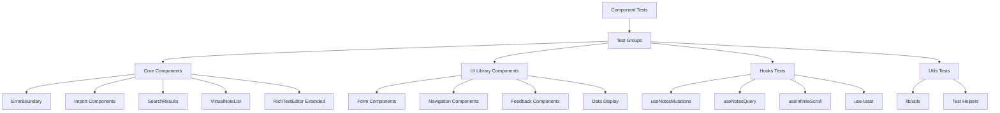

# System Design & Architecture

## Architecture Overview
**What is the high-level system structure?**



**Key components:**
- **Test Organization**: Группировка по типам компонентов
- **Mock Infrastructure**: Система моков для внешних зависимостей
- **Test Utilities**: Расширение существующих утилит
- **Coverage Reporting**: Детальные отчеты по каждой группе

**Technology stack:**
- Cypress Component Testing (уже настроен)
- @testing-library/cypress для queries
- babel-plugin-istanbul для coverage

## Data Models
**What data do we need to manage?**

**Test Fixtures Structure:**
```typescript
// Расширение существующих fixtures
interface TestFixtures {
  // Existing
  users: TestUser[]
  notes: TestNote[]
  
  // New fixtures needed
  searchResults: SearchResult[]
  importProgress: ImportProgress
  errorScenarios: ErrorScenario[]
  virtualListData: Note[] // Large dataset for virtualization
  hookStates: HookTestState[]
}

interface SearchResult {
  id: string
  title: string
  content: string
  snippet: string
  score: number
}

interface ImportProgress {
  total: number
  current: number
  status: 'idle' | 'processing' | 'complete' | 'error'
  errors: string[]
}

interface ErrorScenario {
  type: 'render' | 'async' | 'boundary'
  message: string
  stack?: string
}
```

## API Design
**How do components communicate?**

**Test Utilities Extension:**
```typescript

// Mock Supabase для компонентов
Cypress.Commands.add('mockSupabaseQuery', (table, data) => {
  cy.window().then((win) => {
    win.supabase.from(table).select().resolves({ data, error: null })
  })
})

// Mock для hooks тестирования
Cypress.Commands.add('mountHook', (hook, options) => {
  // Wrapper component для тестирования hooks
  const HookWrapper = () => {
    const result = hook(options)
    return <div data-testid="hook-result">{JSON.stringify(result)}</div>
  }
  return cy.mount(<HookWrapper />)
})

// Trigger errors для ErrorBoundary
Cypress.Commands.add('triggerError', (errorType) => {
  // Компонент который бросает ошибку
})

// Mock виртуализации
Cypress.Commands.add('mockVirtualList', (itemCount) => {
  // Setup для тестирования больших списков
})
```

## Component Breakdown
**What are the major building blocks?**

### Group 1: Core Components (Priority 1)
**Components:**
- ErrorBoundary\.tsx
- ImportButton\.tsx
- ImportDialog\.tsx
- ImportProgressDialog\.tsx
- SearchResults\.tsx
- VirtualNoteList\.tsx
- RichTextEditor\.tsx (расширение тестов)

**Test Files:**
- `cypress/component/core/ErrorBoundary\.cy\.tsx`
- `cypress/component/core/ImportButton\.cy\.tsx`
- `cypress/component/core/ImportDialog\.cy\.tsx`
- `cypress/component/core/ImportProgressDialog\.cy\.tsx`
- `cypress/component/core/SearchResults\.cy\.tsx`
- `cypress/component/core/VirtualNoteList\.cy\.tsx`
- `cypress/component/editor/RichTextEditor\.cy\.tsx` (расширить)

### Group 2: UI Library Components (Priority 2)
**Приоритетные компоненты (используются в приложении):**
- dialog\.tsx, alert-dialog\.tsx
- dropdown-menu\.tsx, context-menu\.tsx
- tabs\.tsx, accordion\.tsx
- progress\.tsx, skeleton\.tsx
- scroll-area\.tsx
- switch\.tsx, checkbox\.tsx
- toast\.tsx, toaster\.tsx
- tooltip\.tsx

**Test Files:**
- `cypress/component/ui/Dialog\.cy\.tsx`
- `cypress/component/ui/Dropdown\.cy\.tsx`
- `cypress/component/ui/Tabs\.cy\.tsx`
- и т.д.

### Group 3: Hooks (Priority 1)
**Hooks:**
- useNotesMutations.ts
- useNotesQuery.ts
- useInfiniteScroll.ts
- use-toast.ts
- use-mobile\.tsx

**Test Files:**
- `cypress/component/hooks/useNotesMutations\.cy\.tsx`
- `cypress/component/hooks/useNotesQuery\.cy\.tsx`
- `cypress/component/hooks/useInfiniteScroll\.cy\.tsx`
- `cypress/component/hooks/useToast\.cy\.tsx`
- `cypress/component/hooks/useMobile\.cy\.tsx`

### Group 4: Providers & Theme (Priority 3)
**Components:**
- QueryProvider\.tsx
- theme-provider\.tsx
- theme-toggle\.tsx

**Test Files:**
- `cypress/component/providers/QueryProvider\.cy\.tsx`
- `cypress/component/theme/ThemeProvider\.cy\.tsx`
- `cypress/component/theme/ThemeToggle\.cy\.tsx`

### Group 5: Utils (Priority 2)
**Files:**
- lib/utils.ts

**Test Files:**
- `cypress/component/utils/Utils\.cy\.tsx`

## Design Decisions
**Why did we choose this approach?**

**Key Decisions:**

1. **Группировка тестов по приоритету**
   - *Почему:* Позволяет итеративно достигать цели, начиная с критичных компонентов
   - *Альтернатива:* Тестировать все сразу (слишком долго)

2. **Использование Cypress для hooks**
   - *Почему:* Единый фреймворк для всех компонентных тестов
   - *Альтернатива:* @testing-library/react-hooks (дополнительная зависимость)
   - *Trade-off:* Нужны wrapper компоненты для hooks

3. **Моки Supabase на уровне window**
   - *Почему:* Простота и консистентность с существующими моками
   - *Принцип:* Изоляция внешних зависимостей

4. **Отдельная директория для core компонентов**
   - *Почему:* Логическое разделение от ui библиотеки
   - *Структура:* `cypress/component/core/`, `cypress/component/hooks/`

5. **Расширение существующих test utilities**
   - *Почему:* Переиспользование кода, консистентность API

## Non-Functional Requirements
**How should the system perform?**

**Performance targets:**
- Время запуска одного теста: < 5 секунд
- Время запуска группы тестов (10-15 тестов): < 30 секунд
- Полный набор тестов (150+ тестов): < 2 минуты
- Coverage generation: < 10 секунд

**Scalability considerations:**
- Поддержка до 200+ компонентных тестов
- Параллельный запуск по группам
- Кэширование результатов в CI/CD

**Reliability needs:**
- Flaky tests < 2%
- Детальные error messages
- Screenshots при падении тестов
- Retry механизм для нестабильных тестов

**Maintainability:**
- Документация паттернов для каждого типа компонентов
- Примеры тестов для новых разработчиков
- Консистентный стиль тестов

