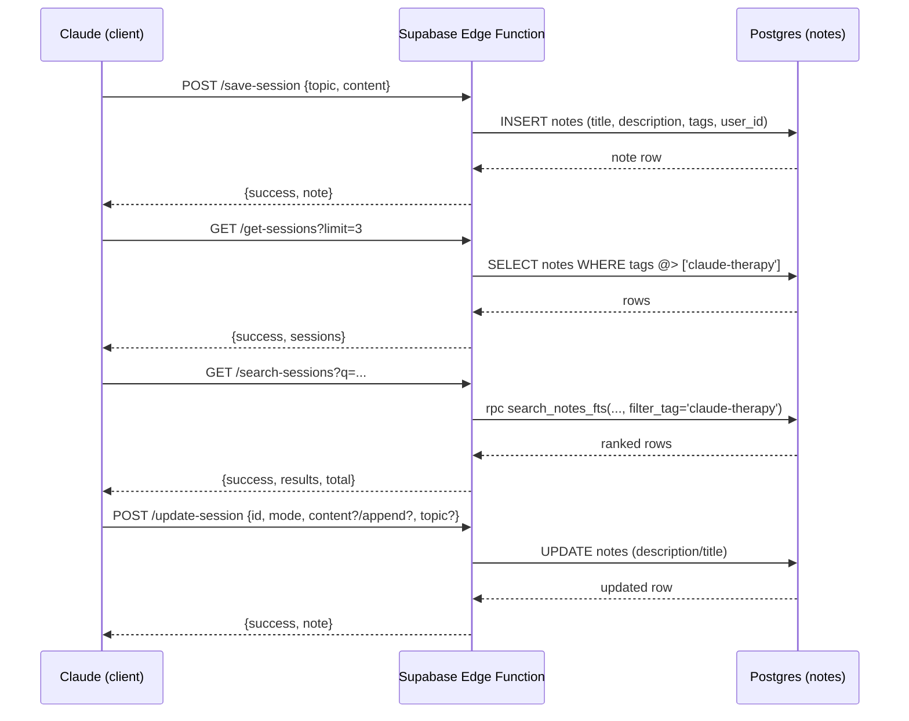

# Design: AI Coaching Session Edge Functions

## Overview
We add three Supabase Edge Functions that write/read session notes in the existing `notes` table. All sessions are tagged `claude-therapy` and follow the title format `Session YYYY-MM-DD - {topic}`.

## Data Flow (Mermaid)

## API Contracts

### 1) `save-session` (POST)
- **Body**: `{ topic: string, content: string }`
- **Limits**: `content` максимум 50KB
- **Behavior**:
  - Generates title with UTC date: `Session YYYY-MM-DD - {topic}`
  - Adds `tags = ['claude-therapy']`
  - Writes to `notes` with `COACHING_USER_ID`
- **Response**: `{ success: true, note }` or `{ error }`

### 2) `get-sessions` (GET)
- **Query**: `limit` (default 3, max 20)
- **Behavior**:
  - Filters by `COACHING_USER_ID`
  - Filters by `tags` containing `claude-therapy`
  - Sorts by `created_at desc`
- **Response**: `{ success: true, sessions }` or `{ error }`

### 3) `search-sessions` (GET, optional)
- **Query**: `q` (required), `limit` (default 10, max 20), `offset` (default 0), `lang` (ru/en/uk)
- **Behavior**:
  - Builds FTS tsquery from `q`
  - Calls `search_notes_fts` RPC with `filter_tag = 'claude-therapy'`
- **Response**: `{ success: true, results, total }` or `{ error }`

### 4) `update-session` (POST)
- **Body**: `{ id: string, mode: "replace" | "append", content?: string, append?: string, topic?: string }`
- **Limits**: итоговый `content` максимум 50KB
- **Behavior**:
  - `mode="replace"`: требует `content` (непустой), полностью заменяет `description`
  - `mode="append"`: требует `append` (непустой), добавляет в конец `description`
  - `topic` (если задан) обновляет `title` с датой из `created_at`
  - Обновляет только записи с тегом `claude-therapy`
- **Response**: `{ success: true, note }` или `{ error }`

## Security & Auth
- Edge functions are called with anon key; no user JWT is required.
- Functions use the service role key internally to bypass RLS.
- User targeting is fixed to `COACHING_USER_ID`.

## Error Handling
- 400 for invalid input (missing fields, invalid limit).
- 405 for unsupported methods.
- 500 for configuration or DB errors.
