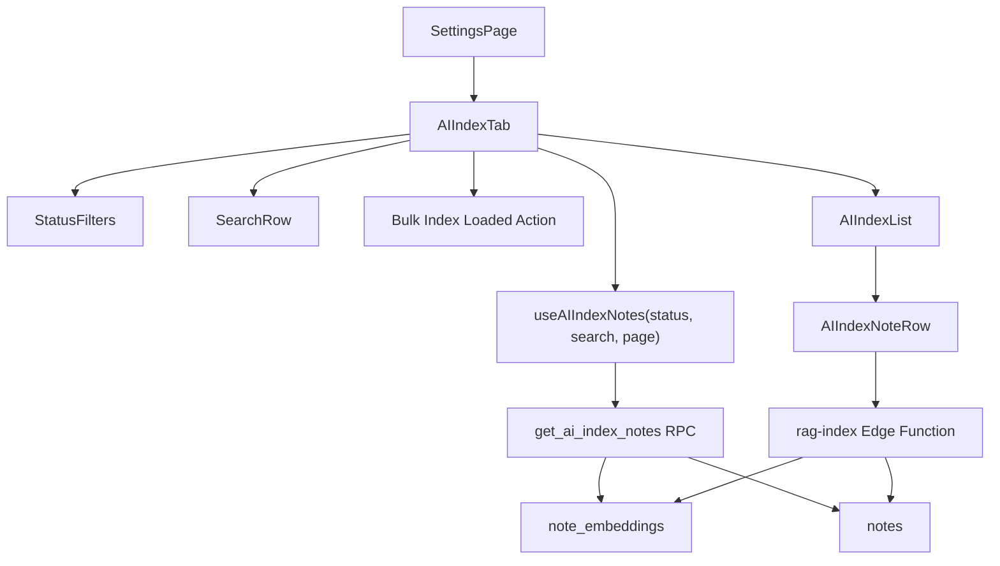
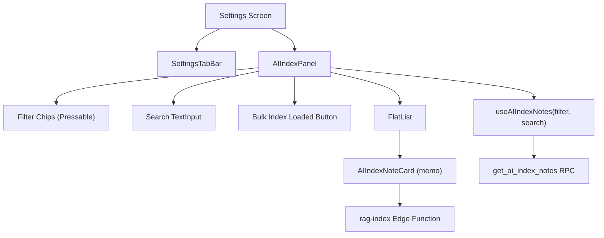

# System Design & Architecture

## Architecture Overview



- `SettingsPage` gets a new `AI Index` tab entry.
- `AIIndexTab` is a standalone settings flow, not a reuse of the notes page controller.
- `useAIIndexNotes` owns pagination, active filter, loading state, and cache invalidation for this page only.
- `AIIndexTab` also owns the summary-level bulk action state for the currently loaded result set.
- `AIIndexList` reuses the virtualization pattern from `NoteList`, but renders dedicated AI-index rows/cards.
- `AIIndexNoteRow` renders note metadata and per-row actions.
- A dedicated server-side RPC returns notes together with aggregated index status so filtering and pagination remain correct.

## Data Models

### AI index row payload

```ts
type AIIndexStatus = "indexed" | "not_indexed" | "outdated"

interface AIIndexNoteRow {
  id: string
  title: string
  updatedAt: string
  lastIndexedAt: string | null
  status: AIIndexStatus
}

interface AIIndexNotesPage {
  notes: AIIndexNoteRow[]
  totalCount: number
  hasMore: boolean
  nextCursor?: number
}
```

### Status derivation

- `not_indexed`: no `note_embeddings` rows exist for the note.
- `indexed`: latest embedding `indexed_at >= notes.updated_at`.
- `outdated`: latest embedding `indexed_at < notes.updated_at`.

The aggregation must collapse many embedding rows into one latest timestamp per note before pagination and filtering are applied.

## API Design

### Dedicated AI index list RPC

- Use a dedicated Postgres RPC named `get_ai_index_notes`.
- Invocation shape:

```ts
supabase.rpc("get_ai_index_notes", {
  filter_status: "all" | "indexed" | "not_indexed" | "outdated",
  page_number: number,
  page_size: number,
  search_query: string | null,
  search_ts_query: string | null,
  search_language: "english" | "russian" | null,
})
```

### RPC responsibilities

1. Run in the authenticated user's context.
2. Query the user's notes.
3. Aggregate latest `indexed_at` per note from `note_embeddings`.
4. Derive the status in the server response.
5. If a search query is present, apply the same ordinary note-search semantics as the main notes flow:
   - `FTS` first using the shared ts-query/lang rules
   - `ILIKE` fallback when FTS returns no matches
6. Apply requested filter before pagination output is returned.
7. Sort rows by search relevance when search is active, otherwise by `notes.updated_at DESC`.

The `all` filter is the default page state so the Settings tab opens with the full note inventory visible before the user narrows it.

### Per-row mutations

- Reuse the existing `rag-index` Edge Function for:
  - `index`
  - `reindex`
  - `delete`
- After a mutation succeeds, invalidate or refresh the AI index query so the row status and timestamp update immediately.

## Component Breakdown

### `SettingsPage`

- Adds a new `AI Index` tab definition and routes `tab=ai-index`.

### `AIIndexTab`

- Settings-specific container for:
  - heading / summary
  - summary-level bulk action button for loaded notes
  - filter pills
  - ordinary search row below the pills
  - list body
  - empty/loading states

### `useAIIndexNotes`

- Dedicated React Query hook for the AI Index flow.
- Owns:
  - active filter key
  - active search key
  - infinite pagination
  - flattening pages
  - total count / hasMore
  - invalidation after row actions

### `AIIndexList`

- Dedicated virtualized list implementation modeled on `NoteList`.
- Reuses the same principles:
  - `react-window` list
  - dynamic row heights
  - overscan
  - automatic `onRowsRendered` prefetch

### `AIIndexNoteRow`

- Dedicated row/card component.
- Must not directly reuse `NoteCard`.
- Renders:
  - note title
  - status badge
  - last indexed timestamp
  - note-level action buttons

### Bulk action behavior

- The summary/header area gets one bulk action button beside the existing reset/filter context.
- The bulk action scopes itself to the currently loaded client list after server-side filter and search have already been applied.
- It must not fetch additional pages or infer unseen matches from `totalCount`.
- Eligible rows:
  - `not_indexed`: invoke `rag-index` with `action: "index"`
  - `outdated`: invoke `rag-index` with `action: "reindex"`
  - `indexed`: skip
- The implementation reuses the existing single-note `rag-index` contract in a client-side loop instead of adding a separate bulk RPC or Edge Function.
- On web, successful mutations should flow through the same optimistic row-update and exit-animation pipeline already used for per-row actions so filtered rows disappear gracefully.
- On mobile, successful mutations should reuse the same cache patch + invalidate path already used for per-row actions so cards disappear from filtered views consistently.

## Design Decisions

### Dedicated fetch path instead of client-side joining

- Decision: fetch AI index rows through a dedicated server-side RPC.
- Rationale: status filtering depends on aggregated `note_embeddings` state. Doing this purely in the browser would either require loading all notes first or produce incorrect pagination/filter behavior.

### Separate list and row components

- Decision: build `AIIndexTab`, `AIIndexList`, and `AIIndexNoteRow` as isolated components.
- Rationale: the page has different columns, actions, and semantics from `NoteCard`, even though it shares list performance constraints.

### Reuse mutations, isolate reads

- Decision: keep `rag-index` for write actions and add a dedicated RPC read path for AI index state.
- Rationale: existing mutation behavior is already shipped and tested; the missing capability is efficient list aggregation and filtering.

### Bulk action targets loaded notes, not all matching notes

- Decision: the bulk button processes only the currently loaded notes that remain visible after the active filter and active committed search query.
- Rationale: this matches the mental model already shown in the summary ("Showing X loaded notes out of Y"), avoids hidden work on notes the user cannot currently inspect, and keeps the feature aligned with the paginated/infinite-list architecture on both web and mobile.

### Bulk action stays on the client and reuses the single-note mutation API

- Decision: do not add a backend bulk-index endpoint for this refinement.
- Rationale: the existing `rag-index` function is explicitly single-note, the AI Index page already owns the loaded list on the client, and reusing the current mutation path is the smallest, safest change for web and mobile parity.

### Reuse ordinary search semantics without reusing the notes controller

- Decision: reuse the main note-search query construction and UX (`Search` input, debounce, 3-character threshold, FTS-first behavior) inside the dedicated AI Index flow.
- Rationale: the user asked for the familiar search behavior, but the AI Index page still needs its own server-backed filtering, pagination, and row model rather than the full notes/search controller stack.

### Use virtualization inside Settings

- Decision: keep virtualization for the AI index list instead of rendering a plain settings table.
- Rationale: the user explicitly wants the same large-dataset behavior as `NoteList`, and Settings may still need to handle hundreds or thousands of notes.

## Mobile Architecture

### Component Diagram



### Mobile Component Breakdown

#### `SettingsTabBar` (modified)
- Added `'aiIndex'` to `SettingsTabKey` union type.

#### `AIIndexPanel`
- Standalone panel component rendered inside a dedicated `flex: 1` AI Index viewport in `SettingsScreen` (not wrapped in the general settings `ScrollView`).
- Filter row: one horizontally scrolling Pressable-chip rail matching `SettingsTabBar` interaction and sizing.
- Search TextInput with clear button, debounced at 300ms.
- Summary row can expose one bulk button near the count/reset affordances when the current loaded list contains `not_indexed` or `outdated` cards.
- FlatList with `onEndReached` for infinite scroll, `onRefresh` for pull-to-refresh.
- Loading spinner, empty message, and error + retry states.
- Summary text ("X notes" or "Showing X of Y notes").

#### `AIIndexNoteCard` (memo)
- Per-note card with title, status badge, status description, and action buttons.
- Status badge colors: green (indexed), gray (not_indexed), amber (outdated).
- Action labels change by status: "Index note" / "Reindex" / "Update index".
- "Remove index" button shown only when indexed/outdated.
- Calls `supabase.functions.invoke('rag-index', ...)` for mutations.
- Toast notifications via `react-native-toast-message`.

#### `useAIIndexNotes` hook
- Port of web `useAIIndexNotes` using `useInfiniteQuery`.
- Same RPC contract (`get_ai_index_notes`), same search utilities (`buildTsQuery`, `detectLanguage`, `ftsLanguage`).
- Difference from web: uses `useSupabase()` returning `{ client, user }` (mobile provider pattern).

### Mobile Design Decisions

- **Dedicated viewport for AI Index**: the settings screen should branch to a dedicated AI Index viewport instead of nesting a `FlatList` under the main settings `ScrollView`.
- **FlatList over FlashList**: the existing mobile stack already uses React Native primitives and does not need another list dependency for this settings feature.
- **Query cache invalidation over optimistic updates**: Simpler than the web's optimistic exit-animation approach; mobile mutation flow invalidates all filter views on success.
- **Note navigation via modal**: Tapping the note title in `AIIndexNoteCard` opens the note editor as a modal via `useOpenNote`. `router.back()` returns to the settings screen with AI Index state preserved (always-mounted panels with `display: 'none'` toggle). Unlike the web's sessionStorage bridge, mobile relies on the modal stack and always-mounted settings panels.
- **Scrollable filter rail, not a boxed sub-panel**: the filter chips should behave like the top settings tabs and stay visually light, separated with a divider rather than another full card surface.

## Non-Functional Requirements

- Performance:
  - initial page should load only the first slice of rows
  - list scrolling should trigger prefetch before the user reaches the end
  - row rendering should stay smooth for large datasets
- Reliability:
  - row action failures must not corrupt list state
  - successful mutations must refresh the affected data without manual reload
- Security:
  - all list data remains scoped to the authenticated user
  - RPC and index mutations continue to rely on authenticated server-side checks
