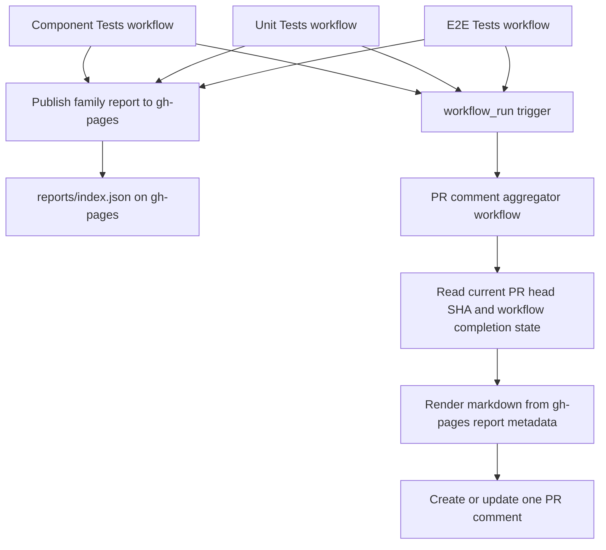

# Allure PR Comment Design

## Architecture Overview

## Data Models

- PR comment marker:
  `<!-- allure-reports-comment -->`
- Comment payload fields:
  `prNumber`, `headSha`, `updatedAt`, `catalogUrl`, and one row per family.
- Family row fields:
  `family`, `workflowName`, `workflowConclusion`, `workflowRunUrl`, `reportUrl`, `publishedState`.

## API Design

- Trigger source:
  `workflow_run` on `Component Tests`, `Unit Tests`, and `E2E Tests (PR Preview)`.
- GitHub API usage:
  fetch current PR head SHA, list workflow runs for that SHA, and upsert one issue comment on the PR.
- Report metadata source:
  `.pages-existing/reports/index.json` from the `gh-pages` branch.

## Component Breakdown

- New renderer/update script:
  loads PR workflow context, reads Pages metadata, decides whether all workflows are complete, and renders markdown.
- New aggregator workflow:
  runs on `workflow_run`, exits early for stale or incomplete states, and updates the PR comment only when the full set is ready.
- Existing family publish workflows:
  stay responsible only for publishing reports and shared catalog metadata.

## Design Decisions

- Use `final-only` publication instead of progressive updates to avoid race conditions between parallel workflows.
- Read report URLs from `gh-pages` metadata instead of recomputing them in the comment workflow.
- Keep one durable comment and update it by marker rather than posting a new comment per run.
- Match reports to the active PR by `prNumber` plus current `headSha`, so stale runs cannot overwrite the latest state.

## Non-Functional Requirements

- Reliability:
  stale workflow completions must no-op.
- Maintainability:
  comment rendering logic should live in a local script, not inline YAML, so future expansion to broader PR status stays manageable.
- Permissions:
  only the aggregator workflow needs `issues: write`; existing publish workflows should not gain extra PR-comment permissions.
