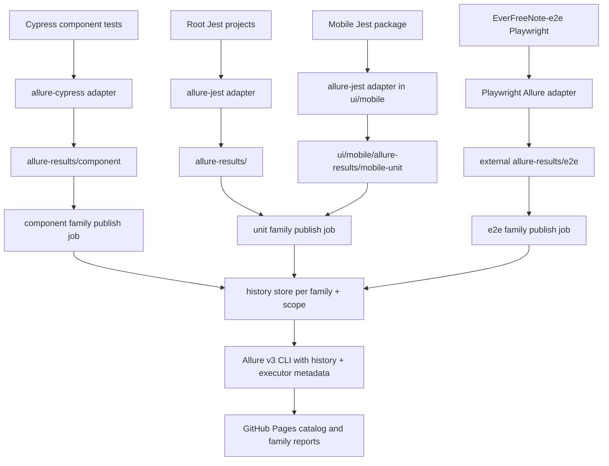

# Allure Report v3 Design

## Architecture Overview



## Component Breakdown

- `allure-cypress`: records Cypress component test execution into `allure-results/component`.
- `allure-jest`: planned adapter for root Jest projects and mobile Jest.
- `allure`: Allure Report v3 CLI used by npm scripts to generate HTML reports.
- `.github/workflows/*`: CI upload points for Allure artifacts and family-level Pages publication.
- `.github/pages/*`: static landing page template and report catalog assets for GitHub Pages.
- `scripts/*`: report catalog generation and history-path preparation for report families.

## Design Decisions

- Use suite-specific results directories to avoid collisions between test runners and parallel CI jobs.
- Keep existing reporters and summaries in place to reduce migration risk.
- Add Allure generation scripts separately from existing test scripts so local developers can opt in.
- Treat web E2E as a cross-repository increment because the Playwright configuration is not stored in this repository.
- Publish three report families instead of one report per suite:
  `e2e`, `component`, and `unit`.
- Merge `core-unit`, `core-integration`, `web-unit`, and `mobile-unit` raw Allure results into the `unit` family report.
- Preserve suite discoverability inside merged reports through stable labels such as `family`, `suite`, `surface`, `layer`, and `workflow`.
- Keep report history isolated by both family and scope so unrelated runs do not distort trend charts.
- Replace the current Playwright HTML Pages publish with an Allure-based `e2e` family report while keeping the same URL shape for run pages.
- Keep one shared Pages index that lists published family reports and links to individual run pages.

## Pages Structure

```text
reports/
  index.json
  index.html
  e2e/pr-<number>/run-<id>-attempt-<n>/
  e2e/manual/run-<id>-attempt-<n>/
  component/pr-<number>/run-<id>-attempt-<n>/
  unit/pr-<number>/run-<id>-attempt-<n>/
_history/
  e2e/pr-<number>.jsonl
  e2e/branch-main.jsonl
  e2e/branch-develop.jsonl
  component/pr-<number>.jsonl
  unit/pr-<number>.jsonl
  unit/branch-main.jsonl
```

## Report Identity Model

- `family`: top-level Pages grouping and history namespace.
- `suite`: concrete producer such as `core-unit`, `core-integration`, `web-unit`, `mobile-unit`, `component`, or `e2e`.
- `surface`: product surface such as `core`, `web`, or `mobile`.
- `layer`: testing layer such as `unit`, `integration`, `component`, or `e2e`.
- `workflow`: source workflow, used to keep traceability back to GitHub Actions.

## History Strategy

- `PR` runs append to family-specific history files keyed by PR number.
- `main` and `develop` append to family-specific branch history files for long-lived trends.
- Manual runs publish under `manual` paths and may use their own manual history key or stay history-less if no stable scope exists.
- Every published family report includes `executor.json` metadata pointing to the GitHub Actions run and the final Pages URL.

## Non-Functional Requirements

- Reporting must not change test pass/fail semantics.
- Generated reports and raw results must be ignored by git.
- CI artifact retention should match existing suite retention unless a later decision changes it.
- Pages publication must remain resilient when one family has no results for a given run.
- Family publication must be concurrency-safe so one report family does not prune or overwrite another family's files.
