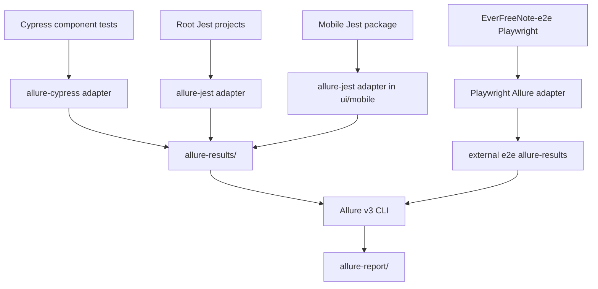

# Allure Report v3 Design

## Architecture Overview

## Component Breakdown

- `allure-cypress`: records Cypress component test execution into `allure-results/component`.
- `allure-jest`: planned adapter for root Jest projects and mobile Jest.
- `allure`: Allure Report v3 CLI used by npm scripts to generate HTML reports.
- `.github/workflows/*`: CI upload points for Allure artifacts, added suite by suite.

## Design Decisions

- Use suite-specific results directories to avoid collisions between test runners and parallel CI jobs.
- Keep existing reporters and summaries in place to reduce migration risk.
- Add Allure generation scripts separately from existing test scripts so local developers can opt in.
- Treat web E2E as a cross-repository increment because the Playwright configuration is not stored in this repository.

## Non-Functional Requirements

- Reporting must not change test pass/fail semantics.
- Generated reports and raw results must be ignored by git.
- CI artifact retention should match existing suite retention unless a later decision changes it.
