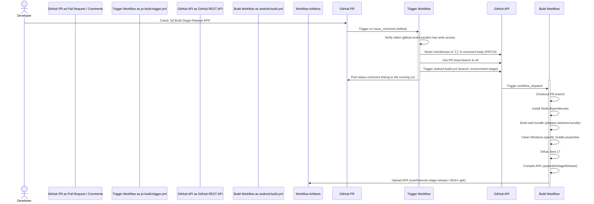

# Android Build Pipeline Design

## Architecture Overview

The system consists of two GitHub Actions workflows and a Node.js script modification:

1. **Manual Build Workflow (`android-build.yml`)**:
   - Compiles the Android APK for either `stage` or `prod` environment.
   - Run on-demand via `workflow_dispatch` on any branch.
   - Uploads the compiled APKs.

2. **PR Comment Trigger Workflow (`pr-build-trigger.yml`)**:
   - Monitors issue comments on Pull Requests.
   - Listens for `/build-android stage` and `/build-android prod` comments (event `created`).
   - Listens for checkbox edits in the bot status comment (event `edited` containing `- [x] 🚀 Build Stage Release APK` or `- [x] 🚀 Build Prod Release APK`).
   - Verifies that the editor/commenter (`github.event.sender.login`) has write or admin permissions.
   - Resets the checked checkbox back to `[ ]` via a `PATCH` request to the comment API.
   - Triggers the build workflow for the PR's head branch using the GitHub REST API.
   - Comments back on the PR with a link to the running workflow.

3. **Status Comment Script (`scripts/render-pr-status-comment.js`)**:
   - Appends an interactive "Android Build Panel" containing checkboxes for Stage and Prod builds to the PR status comment markdown.

### Workflow Interaction Diagram



## Component Breakdown

### 1. PR Comment Trigger Workflow (`pr-build-trigger.yml`)
- **Triggers**: `issue_comment` (created, edited).
- **Condition**:
  - For `created`: body starts with `/build-android stage` or `/build-android prod`.
  - For `edited`: body contains `- [x] 🚀 Build Stage Release APK` or `- [x] 🚀 Build Prod Release APK`.
- **Permissions check**: Ensure the executor (`github.event.sender.login`) has `write` or `admin` permission using the `collaborator` API.
- **Durable Comment Reset**: If triggered via checkbox edit:
  - Read comment body, replace `- [x] 🚀 Build Stage Release APK` and `- [x] 🚀 Build Prod Release APK` with their unchecked versions.
  - Call `PATCH /repos/{owner}/{repo}/issues/comments/{comment_id}` with the updated body.
- **Branch retrieval**: Use GitHub API `GET /repos/{owner}/{repo}/pulls/{number}` to get the `head.ref` (the branch name) and `head.sha`.
- **Trigger build**: Use GitHub API `POST /repos/{owner}/{repo}/actions/workflows/android-build.yml/dispatches` with `ref` set to `head.ref` and inputs `environment` mapped to the selected environment.
- **PR feedback**: Post a comment linking to the triggered run.

### 2. Status Comment Script (`scripts/render-pr-status-comment.js`)
- Appends the following section:
  ```markdown
  ### 🤖 Android Build Panel
  Check a box below to trigger a release build:
  - [ ] 🚀 Build Stage Release APK
  - [ ] 🚀 Build Prod Release APK
  ```
- This ensures the interactive panel is present on every PR status comment created by unit, component, or E2E tests.

## Design Decisions

- **Why use `github.event.sender.login` instead of `github.event.comment.user.login`?**
  - When a comment is edited (e.g. checking a box), `github.event.comment.user` remains the original author of the comment (which is `github-actions[bot]`), while `github.event.sender` is the actual user who performed the edit. Checking `github.event.sender` ensures we perform permission checks against the human editor, not the bot.
- **Why reset checkboxes?**
  - If we don't reset the checkbox back to `[ ]`, it will stay in the `[x]` checked state, preventing users from clicking it again to trigger another build. Resetting it makes it reusable.
