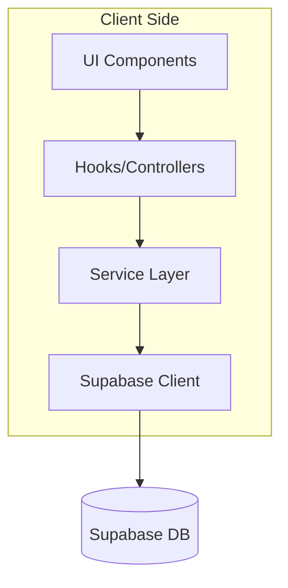

# System Design & Architecture

## Architecture Overview
**What is the high-level system structure?**

The architecture will shift from a Monolithic View to a Layered Architecture (Client-side).

- **UI Components**: Pure presentational components (`Sidebar`, `NoteEditor`, `NoteView`).
- **Controllers**: Custom hooks (`useNoteAppController`) managing local state and calling services.
- **Service Layer**: Pure functions/classes handling API calls (`NoteService`, `AuthService`).
- **Adapters**: Wrappers for `window`, `localStorage`, `alert`.

## Data Models
**What data do we need to manage?**

No changes to the database schema are required. The client-side data models (TypeScript interfaces) should be moved to a shared `types` directory if not already there, ensuring they are decoupled from Supabase-generated types where appropriate for UI consumption.

## API Design
**How do components communicate?**

- **Service Interface:**
  - `NoteService.getNotes(filter)`
  - `NoteService.saveNote(note)`
  - `NoteService.deleteNote(id)`
  - `AuthService.signIn()`
  - `SearchService.search(query)`

- **Controller Interface:**
  - `useNoteAppController()` returns `{ state, actions }`

## Component Breakdown
**What are the major building blocks?**

1.  **Providers**: `SupabaseProvider` (Context for Supabase client).
2.  **Layouts**: `AuthShell`, `NotesShell`.
3.  **Panes**: `Sidebar`, `EditorPane`, `ListPane`, `EmptyState`.
4.  **Services**: `lib/services/notes.ts`, `lib/services/auth.ts`, `lib/services/search.ts`.
5.  **Utils**: `lib/utils/sanitizer.ts`, `lib/adapters/storage.ts`, `lib/adapters/browser.ts`.

## Design Decisions
**Why did we choose this approach?**

- **Client-side Services**: Chosen because of the SPA constraint. We cannot use Next.js Server Actions.
- **DOMPurify**: Standard industry choice for client-side sanitization.
- **Adapter Pattern**: Essential for abstracting browser-specific APIs to support React Native later.

## Non-Functional Requirements
**How should the system perform?**

- **Maintainability**: Code complexity of `page.tsx` should be reduced by >70%.
- **Security**: Zero instances of unsanitized HTML injection.
- **Performance**: No degradation in load time; potential improvement due to better Supabase client management.
