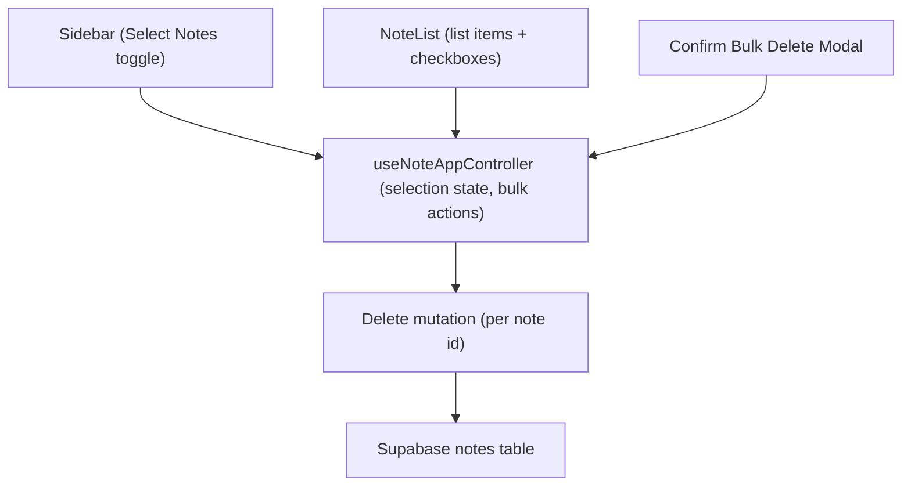

# System Design & Architecture

## Architecture Overview
**What is the high-level system structure?**

- Sidebar: добавляет кнопку `Select Notes`; показывает состояние выбора; держит кнопку Delete (visible on selection).
- NoteList/NoteCard: в режиме выбора рендерит чекбокс и кликом по карточке/чекбоксу отмечает/снимает.
- Controller: хранит selection state (Set of ids), флаги режима выбора, total notes, exposes handlers select/unselect all, delete selected.
- Bulk delete: подтверждающее модальное окно с вводом числа выбранных заметок; активирует Delete только при совпадении.
- API: используем существующий delete mutation по id; вызов по массиву в цикл/Promise.all (нет отдельного bulk endpoint).
- Технологии: Next.js/React, Supabase, React Query для инвалидации/обновления списка.

## Data Models
**What data do we need to manage?**

- Selection state: `Set<string>` noteIds, `isSelectionMode: boolean`.
- Derived counts: `selectedCount`, `totalNotes` (уже есть).
- Modal input: `confirmValue: string` (сравнивается с `selectedCount`).
- Note entity не меняется; удаление — списком ids.

## API Design
**How do components communicate?**

- Внутренние интерфейсы контроллера:
  - `enterSelectionMode/exitSelectionMode`
  - `toggleNoteSelection(id)`
  - `selectAllVisible()/clearSelection()`
  - `deleteSelected()` с возвратом результата/ошибок.
- Внешний API: существующий Supabase delete по id (одно- или многократные вызовы); после успеха — `invalidateQueries(['notes'])`.
- Авторизация: как в текущем приложении (Supabase session); доступ к своим заметкам.

## Component Breakdown
**What are the major building blocks?**

- Frontend:
  - Sidebar: новая кнопка Select Notes; счетчик выбранных; Delete + селекты (all/none); триггер модалки.
  - NoteList/NoteCard: чекбоксы/клики в режиме выбора.
  - BulkDeleteModal: текст с `N` и поле ввода количества, кнопки Cancel/Delete.
- Hooks/logic: `useNoteAppController` расширить selection state/handlers.
- Services: переиспользуем delete mutation (нет новых сервисов).
- DB: таблица `notes` без изменений.

## Design Decisions
**Why did we choose this approach?**

- Держим selection state на клиенте, чтобы не менять схему БД и API.
- Удаляем пачкой через существующие мутации (параллельно/последовательно) — проще, чем поднимать новый bulk endpoint.
- Подтверждение числом минимизирует случайное удаление.
- UI без "корзины": соответствуем текущей модели мгновенного удаления.

## Non-Functional Requirements
**How should the system perform?**

- Удаление 100–200 заметок должно завершаться за пару секунд; ограничить одновременные вызовы (например, Promise.allSettled с небольшим пулом) при необходимости.
- UI responsive: чекбоксы и кнопки работают на мобильных, меню не перекрывает основные элементы.
- Безопасность: удаляем только заметки текущего пользователя; подтверждение ввода числа.
- Надёжность: показываем итог успехов/ошибок, сбрасываем выбор после операции; инвалидация кэша нот.
