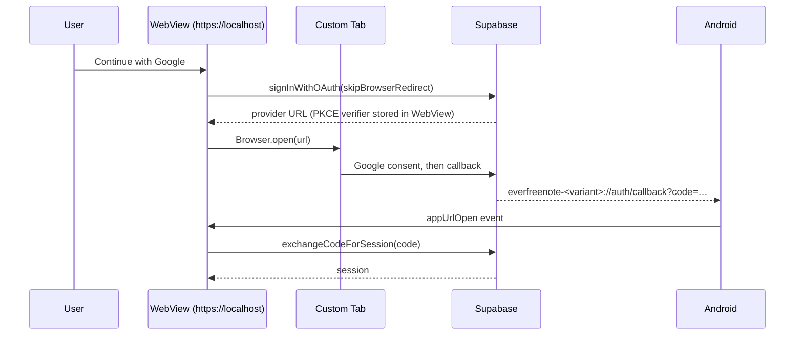

# System Design & Architecture: Capacitor Android Shell

## Context

EverFreeNote maintains two UIs over one core: `ui/web` (~23k lines) and `ui/mobile`
(~15.5k lines of React Native), against a shared `core` of ~7.9k. Every user-facing
feature is therefore built twice — `docs/ai/design/` contains `feature-mobile-tags`,
`feature-mobile-bulk-edit`, `feature-mobile-note-deletion`, `feature-mobile-settings-menu`
and more, each a second implementation of something the web already has.

The React Native app already renders the hardest part — the Tiptap editor — inside a
WebView loading the web build (`feature-offline-webview-bundle`). What the native layer
still owns is lists, search, settings and auth: the screens where nativeness buys least.

`docs/ai/analysis/capacitor-shell-poc.md` measured whether the web build could simply
*be* the Android app. It can: scroll jank of 1.2–4.1% that does not degrade from 1000 to
5000 notes, a 6.3 MB APK, and an interactive list in well under a second.

## Decision

Add `ui/shell`: a Capacitor 8 shell whose web root is the unmodified root static export.
Keep `ui/mobile` untouched until the shell demonstrates parity in real use.

```mermaid
graph TB
    subgraph "shared"
        Core[core/<br/>services, types, adapters contracts]
    end

    subgraph "web bundle — one build, two destinations"
        Web[ui/web + app/<br/>Next.js output: 'export']
        Runtime[ui/shell/runtime/<br/>native integration]
        Core --> Web
        Runtime -.mounted by app/layout.tsx.-> Web
    end

    Web -->|npm run build| Out[out/]
    Out -->|browser| Site[Cloudflare Pages]
    Out -->|scripts/build-web.js| WWW[ui/shell/www]
    WWW -->|cap sync| APK[Android APK]

    subgraph "still separate"
        Mobile[ui/mobile<br/>React Native]
        Core --> Mobile
    end
```

## Key design points

### The shell ships the same bundle as the website

`scripts/build-web.js` runs the repo-root `npm run build` and stages `out/` into `www/`.
There is no shell-specific web build and no second bundler configuration. The variant
(`APP_VARIANT`) is passed through as `NEXT_PUBLIC_APP_VARIANT` so the runtime can derive
its own OAuth scheme.

`androidScheme: 'https'` keeps the WebView origin at `https://localhost`, which the web
app needs for secure-context APIs it already depends on: `crypto.subtle` for Supabase
PKCE, and IndexedDB persistence in `ui/web/adapters/offlineStorage.ts`.

### Native integration lives in the web bundle, behind a runtime guard

`ui/shell/runtime/` is TypeScript compiled into the web bundle, not into the native
project. `NativeShellProvider` is mounted unconditionally in `app/layout.tsx` and
returns early in a browser, so the website is unaffected. The native OAuth adapter is
loaded with a dynamic import, so `@capacitor/browser` only lands in the chunk that needs it.

### OAuth goes out through a Custom Tab and comes back through a custom scheme



Two properties matter. The flow must leave the WebView — Google rejects OAuth in
embedded WebViews with `disallowed_useragent`. And the exchange must happen back in the
WebView, because that is where Supabase stored the PKCE verifier.

`skipBrowserRedirect: true` is what makes both platforms go through the same adapter:
Supabase hands back a URL instead of navigating, and `resolveOAuthAdapter()` decides
whether that URL is opened by navigating the page or by a Custom Tab. This finally uses
the `webOAuthAdapter` that already existed in the codebase but was never called.

### Variants reuse ui/mobile's schemes

`everfreenote-dev` / `everfreenote-stage` / `everfreenote` are already registered in
Supabase Auth, so the shell authenticates with no dashboard change — and these are the
schemes it would inherit anyway once it replaces the React Native app. App ids stay
distinct (`com.everfreenote.shell*`) so both apps can be installed together.

Trade-off: with both installed, Android shows an app chooser on the callback.
`SHELL_SCHEME` / `NEXT_PUBLIC_SHELL_SCHEME` override it for anyone who prefers a
dedicated scheme.

### The native project is generated, not committed

Unlike `ui/mobile/android`, `ui/shell/android` is gitignored. The two modifications a
stock Capacitor project needs — the OAuth intent-filter and the release signing config —
are applied by `scripts/add-android.js`. A reviewed script is easier to audit than a
vendored directory, and CI regenerates it on every run. If native customization grows
beyond what a patch script can express, commit the directory instead.

### The WebView origin is not a web address

Two defects came out of this, both from code that assumed the serving origin is
something a user can open:

- **Share links.** `ShareNoteDialog` built them from `window.location.origin`, which in
  the shell is `https://localhost`. The deployment origin now comes from
  `NEXT_PUBLIC_PUBLIC_WEB_ORIGIN[_DEV|_STAGE|_PROD]` — configuration, not code, matching
  `ui/mobile`'s `EXPO_PUBLIC_PUBLIC_WEB_ORIGIN` — and is resolved by
  `ui/web/adapters/publicWebOrigin.ts`. An unconfigured build says so at build time and
  reports it at share time, rather than handing out a dead link.
- **Exports.** An `<a download>` click produces no file, no prompt and no error in an
  Android WebView — verified on device. `ui/web/adapters/fileDownload.ts` writes the
  file and opens the share sheet in the shell, which is what `ui/mobile` does with
  expo-file-system and expo-sharing.

Two things that looked risky turned out fine, and were checked rather than assumed:
WordPress publishing goes through the `wordpress-bridge` Edge Function (so the shell's
origin never reaches WordPress, and every function answers `Access-Control-Allow-Origin: *`),
and `target="_blank"` links dispatch an `ACTION_VIEW` intent to the system browser.

## Testing

`ui/shell/tests/unit/` runs inside the existing `unit-web` Jest project, since the
runtime executes in the same jsdom environment. Covered: variant and scheme resolution
including the env override, platform detection, the Custom Tab adapter, and every branch
of the callback handler — success, provider error, failed exchange, foreign scheme,
missing code, already-dismissed tab, back-button behaviour and listener cleanup.

`ui/web/tests/unit/adapters/oauth.test.ts` covers platform resolution from the web side.

On-device verification is `scripts/measure.sh` plus a synthetic deep link:

```bash
adb shell am start -a android.intent.action.VIEW \
  -d "everfreenote-stage://auth/callback?code=<code>"
```

which exercises the whole return leg without any credentials.

### Variants earn their keep, or they go

Unlike `ui/mobile`, where a variant also drove icons and the editor WebView URL, the
shell has no native divergence between variants: only the Supabase project, the OAuth
scheme, the applicationId and the deployment origin differ, and all four are build
configuration.

That leaves three variants with distinct jobs. **prod** ships. **stage** is the
candidate you install next to prod and hand to someone. **dev** exists for one reason —
working against a local Supabase — which is why it is served over `http://localhost`:
Android blocks cleartext on targetSdk 36, an https page cannot fetch http, and
`http://localhost` remains a secure context. An http page can still reach a remote
https backend, so a single dev mode covers both; a dev build pointed at a remote project
is just `android:stage` under another name, which is why there is no second dev script.

Only stage and prod are built by CI or handed to anyone, matching what
`android-build.yml` already offers for the React Native app.

## Retiring ui/mobile

Done, once the shell had been used for real on a device: sign-in, notes, search, the
editor, ENEX import and export end to end. `ui/mobile` is gone, along with the code that
existed only to serve it — the `editor-webview` route and `RichTextEditorWebView`, which
bridged the web build into the React Native WebView, and the script that copied the web
bundle into the native assets.

What went with it: 34.8k lines and 64 npm dependencies, an Android Build workflow, a
mobile coverage job, and a second implementation of every feature. Its phase
documentation stays as history.

Still unproven at the time of retirement, and worth watching rather than assuming:
offline behaviour over days rather than minutes, and a Play Store review under the
"minimum functionality" policy. Both are recoverable — the package is one `git revert`
away for as long as the history exists.

## Ecosystem note

Ionic has discontinued its commercial products (Appflow, Identity Vault, Auth Connect,
Secure Storage, Portals) while stating that Ionic Framework and Capacitor remain open
source and maintained as part of the OutSystems mobile stack. None of the discontinued
products are used here: auth is Supabase PKCE through the system browser, storage is
IndexedDB, CI is GitHub Actions. The residual risk is that some plugin territory is now
served mainly by a single third-party vendor (Capgo), which matters only if OTA updates
or hardened secure storage are ever needed.
