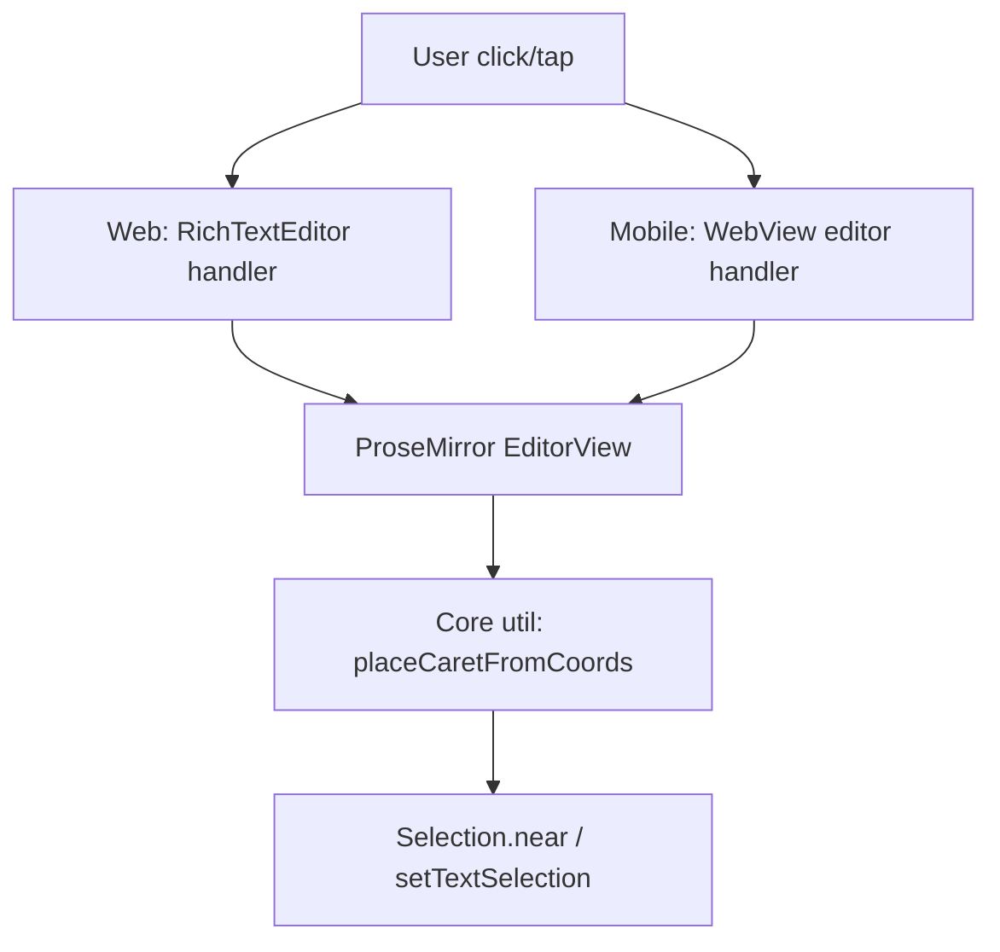

# System Design & Architecture

## Architecture Overview
**What is the high-level system structure?**

- High-level idea: replace “background click → focus(end)” with “background click → compute nearest ProseMirror position by coordinates” on both platforms.
- We implement a small shared core utility that operates on ProseMirror `EditorView`.
- We only take over behavior for **single click/tap on editor background** (i.e. when the click target is the editor root / padding / margins), and do not interfere with native ProseMirror clicks on actual content nodes.

- Key components and their responsibilities
  - Web `RichTextEditor`: intercepts background clicks and delegates to utility.
  - Mobile WebView editor: intercepts taps/clicks and delegates to the same utility (or via a bridge wrapper).
  - Core utility: turns (x, y) into the “best” caret position using ProseMirror APIs.

Algorithm (core utility):
- Input: `EditorView`, `(clientX, clientY)`.
- Try `view.posAtCoords({ left: x, top: y })`.
  - If it returns a position, set selection to the nearest valid insertion point via `Selection.near(doc.resolve(pos))`, dispatch a transaction, and focus the editor.
  - This naturally handles “internal gaps” between blocks (e.g. heading margins) by selecting a near insertion point around the gap.
- If `posAtCoords` returns `null` (click truly outside content), fall back based on editor bounds:
  - above editor → selection at start
  - below editor → selection at end
  - otherwise → do nothing (let ProseMirror handle)

## Data Models
**What data do we need to manage?**

- No persistent data model changes.
- Runtime inputs
  - Pointer/touch coordinates (clientX/clientY or computed from touch).
  - EditorView instance.

## API Design
**How do components communicate?**

- Web
  - Direct call: handler has access to TipTap editor → `editor.view`.
- Mobile
  - Option A (preferred): run the logic inside WebView context where ProseMirror lives.
  - Option B: RN side sends a message with coordinates, WebView applies selection.

Implementation note:
- In both Web and WebView, we already have access to TipTap `editor.view`, so Option A is expected to work without additional RN bridge messages.

## Component Breakdown
**What are the major building blocks?**

- Frontend components (if applicable)
  - `ui/web/components/RichTextEditor.tsx` (adjust click handler)
- Backend services/modules
  - None
- Shared/core
  - New helper: `core/utils/prosemirrorCaret.ts` exporting `placeCaretFromCoords(view, x, y)` (returns whether it handled the event)

## Design Decisions
**Why did we choose this approach?**

- Use ProseMirror-native APIs (`posAtCoords`, `Selection.near`) to get “expected editor” behavior.
- Avoid DOM heuristics (“if target is ProseMirror root → end”) which misclassify internal gaps.
- Make logic shared across platforms to guarantee parity.

Trade-offs:
- `posAtCoords` is coordinate-based and can be sensitive to layout; tests should avoid asserting exact offsets and instead assert “not appended to end” for internal-gap clicks.

Alternatives considered
- “Always focus end on background click” (current) → fails for internal gaps.
- DOM hit-testing (`closest('p')` etc.) → fragile across node types and styling.

## Non-Functional Requirements
**How should the system perform?**

- Performance targets
  - O(1) per click; should not add noticeable latency.
- Reliability
  - Must never throw on click; safe fallbacks to native focus or start/end.
- Security
  - No security impact.
