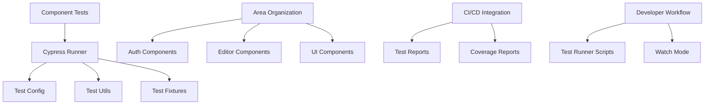

# System Design & Architecture

## Architecture Overview
**What is the high-level system structure?**



**Key components:**
- **Cypress Component Testing Framework**: Основной фреймворк для тестирования
- **Area-based Organization**: Разделение тестов по областям приложения
- **Test Utils**: Вспомогательные функции и утилиты
- **Test Fixtures**: Тестовые данные и моки
- **CI/CD Integration**: Интеграция в пайплайн

**Technology stack:**
- Cypress для компонентного тестирования
- React Testing Library для утилит
- Jest-style assertions
- Custom test utilities

## Data Models
**What data do we need to manage?**

**Test Fixtures:**
- User data (authenticated/unauthenticated states)
- Note data (various states: empty, with content, large content)
- UI state data (loading, error, success states)
- Mock API responses

**Test Data Schemas:**
```typescript
interface TestUser {
  id: string;
  email: string;
  name: string;
  role: 'admin' | 'user';
}

interface TestNote {
  id: string;
  title: string;
  content: string;
  created_at: Date;
  updated_at: Date;
  user_id: string;
}

interface TestFixture {
  users: TestUser[];
  notes: TestNote[];
  apiResponses: Record<string, any>;
}
```

**Data Flow:**
1. Test setup → Load fixtures → Initialize component
2. Component interactions → Mock API calls → Verify state changes
3. Test assertions → Compare with expected fixtures

## API Design
**How do components communicate?**

**Test Runner API:**
```typescript
// Main test runner interface
interface ComponentTestRunner {
  mount(component: React.Component, options?: MountOptions): Cypress.Chainable
  setupMocks(mocks: MockConfig[]): void
  waitForComponent(selector: string, timeout?: number): Cypress.Chainable
}

// Mount options for components
interface MountOptions {
  props?: Record<string, any>
  context?: Record<string, any>
  mocks?: MockConfig[]
  fixtures?: string[]
}
```

**Test Utility APIs:**
```typescript
// Common test utilities
interface TestUtils {
  // User interaction helpers
  typeInEditor(content: string): Cypress.Chainable
  clickButton(selector: string): Cypress.Chainable
  waitForLoading(): Cypress.Chainable

  // Assertion helpers
  expectEditorContent(expected: string): Cypress.Chainable
  expectButtonState(selector: string, state: ButtonState): Cypress.Chainable
  expectErrorMessage(message: string): Cypress.Chainable
}
```

**Mock Configuration:**
```typescript
interface MockConfig {
  service: string
  method: string
  response: any
  delay?: number
  error?: boolean
}
```

## Component Breakdown
**What are the major building blocks?**

**Core Framework Components:**
- **Test Runner**: Основной движок для запуска компонентных тестов
- **Configuration Manager**: Управление конфигурацией Cypress для компонентных тестов
- **Mock Service**: Система для мокирования зависимостей
- **Fixture Manager**: Управление тестовыми данными

**Test Organization Components:**
- **Area Organizer**: Логика разделения тестов по областям приложения
- **Test Suite Manager**: Группировка и запуск тестов по категориям
- **Coverage Reporter**: Генерация отчетов о покрытии

**Utility Components:**
- **Test Helpers**: Вспомогательные функции для типичных операций
- **Assertion Library**: Кастомные assertions для компонентов
- **Debug Tools**: Инструменты для отладки тестов

**Integration Components:**
- **CI/CD Adapter**: Интеграция с системами непрерывной интеграции
- **Report Generator**: Создание отчетов для различных форматов
- **Watch Mode Handler**: Поддержка режима наблюдения за изменениями

## Design Decisions
**Why did we choose this approach?**

**Key Decisions:**

1. **Cypress для компонентного тестирования**
   - *Почему:* Лучшая поддержка React компонентов, интеграция с DOM, мощные утилиты
   - *Альтернативы:* Jest + React Testing Library (меньше интеграции с DOM), Testing Library + jsdom

2. **Area-based организация тестов**
   - *Почему:* Логическое разделение по функциональным областям приложения
   - *Trade-off:* Дополнительная сложность vs лучшая поддерживаемость

3. **Независимость от е2е тестов**
   - *Почему:* Разные скоупы и цели тестирования, разные конфигурации
   - *Принцип:* Separation of Concerns

4. **Custom утилиты вместо чистого Cypress**
   - *Почему:* Упрощение типичных операций, консистентность API
   - *Trade-off:* Дополнительный слой абстракции vs гибкость

5. **Fixture-based подход к тестовым данным**
   - *Почему:* Переиспользование данных, консистентность между тестами
   - *Альтернативы:* Inline data (менее поддерживаемо)

**Patterns Applied:**
- Page Object Pattern для сложных компонентов
- Builder Pattern для конфигурации тестов
- Factory Pattern для создания тестовых данных

## Non-Functional Requirements
**How should the system perform?**

**Performance targets:**
- Время запуска одного компонентного теста: < 2 секунды
- Время запуска полного набора тестов: < 30 секунд
- Память: < 500MB на процесс тестирования

**Scalability considerations:**
- Поддержка до 100+ компонентных тестов
- Параллельный запуск тестов
- Инкрементальное тестирование (только измененные компоненты)

**Security requirements:**
- Безопасная обработка тестовых данных
- Нет доступа к production данным в тестах
- Изоляция тестовых окружений

**Reliability/availability needs:**
- Стабильность тестов (flaky tests < 5%)
- Детальная диагностика при падениях
- Восстановление после сбоев
- Поддержка CI/CD прерываний
