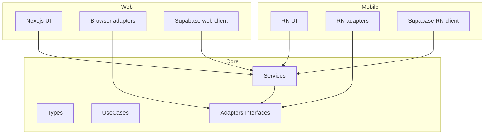

# System Design & Architecture

## Architecture Overview
**What is the high-level system structure?**

- Слои:
  - Core: типы, сервисы (Supabase API wrapper, sanitizer, search, enex), use-cases (auth, notes CRUD), портовые интерфейсы для storage/config/navigation/oauth.
  - Web UI: Next.js страницы/компоненты, web-адаптеры (localStorage, window.location, web OAuth redirect), web Supabase client factory.
  - Mobile UI: RN entrypoint (позже), RN-адаптеры (AsyncStorage, deep links/custom tabs), mobile Supabase client factory. Предпочтительно Expo как стартовый стек (проще старт, готовые модули).
- Mermaid:

- Ключевые компоненты: core services/use-cases, platform adapters, platform client factories, UI слои.

## Data Models
**What data do we need to manage?**

- Используем текущие доменные модели (notes, tags, search results, user). Нет изменений схемы БД.
- Дополняем конфиг-модель: Supabase config + adapter config (storage, deep-link scheme).

## API Design
**How do components communicate?**

- Core expose: функции/классы use-cases с зависимостями через интерфейсы:
  - `StorageAdapter`: `getItem(key): Promise<string | null>`, `setItem(key, val): Promise<void>`, `removeItem(key): Promise<void>`.
  - `NavigationAdapter`: web — `redirect(url: string)`, mobile — `openDeepLink(url: string)`, общее API может быть `navigate(url: string, options?)`.
  - `OAuthAdapter` (опционально): `startOAuth(redirectUri: string): Promise<void>`; для web это redirect, для mobile — custom tab/deep link.
  - `SupabaseClientFactory`: `createClient(config, platformDeps) -> SupabaseClient` (platformDeps: fetch, storage).
  - `ConfigProvider`: env/urls (Supabase URL/key, OAuth redirect URIs, deep link scheme).
- Web/Mobile реализуют адаптеры и прокидывают в core провайдер/фабрику.

### Mobile OAuth / Deep Link
- Placeholder deep link: `everfreenote://auth/callback` — будет добавлен в Supabase redirect URLs при старте mobile.
- Web остаётся на HTTPS redirect `/auth/callback`.

## Component Breakdown
**What are the major building blocks?**

- Core:
  - `/core/types`, `/core/services`, `/core/usecases`, `/core/adapters` (interfaces), `/core/config`.
- Web:
  - `/ui/web/providers` (Query/Supabase web), `/ui/web/adapters` (browser/localStorage/location), страницы и компоненты.
  - OAuth web callback (`/auth/callback`) остаётся веб-спецификой.
- Mobile:
  - `/ui/mobile` (пока заглушка), `/ui/mobile/adapters` (AsyncStorage, Linking), Supabase RN client init.

## Design Decisions
**Why did we choose this approach?**

- Разделение по слоям минимизирует дублирование и даёт единый источник истины для бизнес-логики.
- Интерфейсы адаптеров позволяют подключать разные платформы без изменения core.
- Supabase остаётся основным backend; разные фабрики клиентов под web/RN решают разницу storage/fetch/locks.

## Non-Functional Requirements
**How should the system perform?**

- Производительность: core остаётся лёгким TS-кодом; избегаем лишних зависимостей в core.
- Масштабируемость: добавление новых платформ = реализация адаптеров, без правок core.
- Security: секреты Supabase остаются в конфиге окружений; адаптеры не должны логировать чувствительные токены; Web/RN хранят сессии в platform storage.
- Надёжность: web не регрессирует; mobile сборка core должна проходить tsc.***
