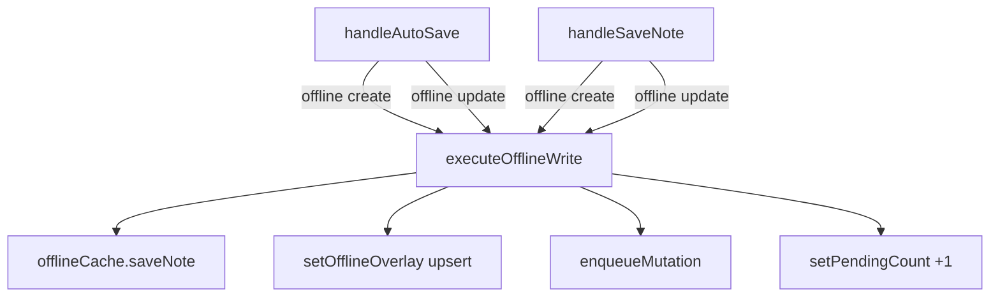

# System Design & Architecture

## Architecture Overview



`executeOfflineWrite` is a private `async function` defined inside `useNoteSaveHandlers` (closure over the hook params). It is not exported.

Both `handleAutoSave` and `handleSaveNote` call it for their offline branches. Online branches remain unchanged and continue to call `createNoteMutation.mutateAsync` / `updateNoteMutation.mutateAsync` directly.

## Data Models

### OfflineWriteInput (parameter bag)

```typescript
type OfflineWriteInput = {
  operation: 'create' | 'update'
  noteId: string
  payload: {
    title?: string
    description?: string
    tags?: string[]
    userId?: string
  }
  baseNote?: NoteViewModel | null   // used only to carry created_at for display
  clientUpdatedAt: string           // ISO string, caller-generated
}
```

### Return value

`executeOfflineWrite` returns the `CachedNote` it persisted, so callers can use it to update `selectedNote` optimistically.

```typescript
// return type
Promise<CachedNote>
```

## Component Breakdown

### executeOfflineWrite (private closure)

Responsibilities:
1. Build `CachedNote` from input (single canonical shape — no `@ts-ignore`)
2. `await offlineCache.saveNote(cached)`
3. Upsert `setOfflineOverlay` (replace if id exists, append otherwise)
4. `await enqueueMutation({ noteId, operation, payload, clientUpdatedAt })`
5. Optimistically `setPendingCount(prev => prev + 1)`
6. Return `cached`

### handleAutoSave (refactored)

- Keeps all its guard logic (diff check, empty-field skip, user check)
- Replaces inline offline create/update blocks with calls to `executeOfflineWrite`
- Retains its `finally` block full-queue refresh (`offlineQueueRef.current.getQueue()`) because it already does a full scan and is the most authoritative count

### handleSaveNote (refactored)

- Removes the internal `offlineMutation` closure entirely
- Replaces offline create/update blocks with calls to `executeOfflineWrite`
- `setSelectedNote` calls (optimistic UI) move just after `executeOfflineWrite` returns
- `toast.success` calls stay in `handleSaveNote`
- `setLastSavedAt` calls stay in `handleSaveNote`

## Design Decisions

| Decision | Rationale |
|---|---|
| Private closure, not separate file | `executeOfflineWrite` needs `offlineCache`, `setOfflineOverlay`, `enqueueMutation`, `setPendingCount` — all available via closure. Exporting it would require passing all params explicitly, adding no value. |
| Optimistic `setPendingCount(+1)` inside shared util | Consistent across both callers; avoids the divergence that currently exists |
| `handleAutoSave` still does full queue refresh in finally | It already did; retaining is safe and correct |
| `CachedNote` shape unified | Remove `created_at`/`updated_at` `@ts-ignore` fields — `CachedNote` type already has `updatedAt: string`; the display layer should use that |

## Non-Functional Requirements

- No performance regression — all operations remain the same async calls
- No new module boundary — stays in `useNoteSaveHandlers.ts`
- TypeScript strict, no `any`, no `@ts-ignore`
