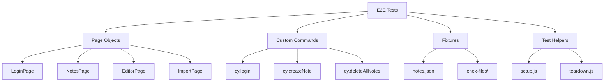

# System Design & Architecture

## Architecture Overview
**High-level system design**

### E2E Testing Architecture



### Test Organization

```
cypress/
├── e2e/
│   ├── user-journeys/
│   │   ├── complete-workflow.cy.js      # Full user journey
│   │   ├── import-workflow.cy.js        # ENEX import flow
│   │   └── theme-workflow.cy.js         # Theme switching
│   ├── critical-paths/
│   │   ├── notes-crud.cy.js             # CRUD operations
│   │   ├── tags-management.cy.js        # Tags functionality
│   │   └── infinite-scroll.cy.js        # Pagination
│   └── integration/
│       ├── search-integration.cy.js     # Search UI + filters
│       └── auth-integration.cy.js       # OAuth (if possible)
├── support/
│   ├── e2e.js                           # Global config
│   ├── commands.js                      # Custom commands
│   ├── page-objects/
│   │   ├── LoginPage.js
│   │   ├── NotesPage.js
│   │   ├── EditorPage.js
│   │   └── ImportPage.js
│   └── helpers/
│       ├── setup.js
│       └── teardown.js
└── fixtures/
    ├── notes/
    │   ├── simple-note.json
    │   ├── rich-text-note.json
    │   └── tagged-notes.json
    └── enex/
        ├── single-note.enex
        └── multiple-notes.enex
```

## Data Models
**What data structures do we need?**

### Page Object Models

#### LoginPage
```javascript
class LoginPage {
  // Selectors
  get skipAuthButton() { return cy.contains('Skip Authentication') }
  get googleAuthButton() { return cy.contains('Continue with Google') }
  get appTitle() { return cy.contains('EverFreeNote') }
  
  // Actions
  skipAuth() {
    this.skipAuthButton.click()
    return new NotesPage()
  }
  
  loginWithGoogle() {
    this.googleAuthButton.click()
    // Handle OAuth flow
  }
  
  // Assertions
  assertOnLoginPage() {
    this.appTitle.should('be.visible')
    this.skipAuthButton.should('be.visible')
  }
}
```

#### NotesPage
```javascript
class NotesPage {
  // Selectors
  get newNoteButton() { return cy.contains('New Note') }
  get searchInput() { return cy.get('input[placeholder*="Search"]') }
  get notesList() { return cy.get('[data-cy="notes-list"]') }
  get userEmail() { return cy.contains('@example.com') }
  get logoutButton() { return cy.get('svg.lucide-log-out').parent('button') }
  get themeToggle() { return cy.get('button[title*="mode"]') }
  
  // Actions
  createNewNote() {
    this.newNoteButton.click()
    return new EditorPage()
  }
  
  searchNotes(query) {
    this.searchInput.clear().type(query)
  }
  
  selectNote(title) {
    cy.contains(title).click()
    return new EditorPage()
  }
  
  filterByTag(tag) {
    cy.contains(tag).click()
  }
  
  logout() {
    this.logoutButton.click()
    return new LoginPage()
  }
  
  toggleTheme() {
    this.themeToggle.click()
  }
  
  // Assertions
  assertNoteExists(title) {
    cy.contains(title).should('be.visible')
  }
  
  assertNoteNotExists(title) {
    cy.contains(title).should('not.exist')
  }
  
  assertOnNotesPage() {
    this.newNoteButton.should('be.visible')
    this.searchInput.should('be.visible')
  }
}
```

#### EditorPage
```javascript
class EditorPage {
  // Selectors
  get titleInput() { return cy.get('input[placeholder="Note title"]') }
  get contentEditor() { return cy.get('[data-cy="editor-content"]') }
  get tagsInput() { return cy.get('input[placeholder="work, personal, ideas"]') }
  get saveButton() { return cy.contains('button', 'Save') }
  get deleteButton() { return cy.contains('button', 'Delete') }
  get editButton() { return cy.contains('button', 'Edit') }
  
  // Actions
  fillTitle(title) {
    this.titleInput.clear().type(title)
    return this
  }
  
  fillContent(content) {
    this.contentEditor.click().type(content)
    return this
  }
  
  fillTags(tags) {
    this.tagsInput.clear().type(tags)
    return this
  }
  
  save() {
    this.saveButton.click()
    cy.contains('Note created successfully').should('be.visible')
    return new NotesPage()
  }
  
  update() {
    this.saveButton.click()
    cy.contains('Note updated successfully').should('be.visible')
    return new NotesPage()
  }
  
  delete() {
    this.deleteButton.click()
    // Handle confirmation dialog if exists
    cy.contains('Note deleted successfully').should('be.visible')
    return new NotesPage()
  }
  
  edit() {
    this.editButton.click()
    return this
  }
  
  // Assertions
  assertOnEditorPage() {
    this.titleInput.should('be.visible')
    this.contentEditor.should('be.visible')
  }
}
```

#### ImportPage
```javascript
class ImportPage {
  // Selectors
  get importButton() { return cy.contains('Import from Evernote') }
  get fileInput() { return cy.get('input[type="file"]') }
  get duplicateStrategyPrefix() { return cy.get('#prefix') }
  get duplicateStrategySkip() { return cy.get('#skip') }
  get startImportButton() { return cy.contains('button', 'Import') }
  get progressDialog() { return cy.contains('Importing from Evernote') }
  get closeButton() { return cy.contains('button', 'Close') }
  
  // Actions
  openImportDialog() {
    this.importButton.click()
  }
  
  selectFile(filename) {
    this.fileInput.selectFile(`cypress/fixtures/enex/${filename}`)
  }
  
  selectDuplicateStrategy(strategy) {
    if (strategy === 'prefix') {
      this.duplicateStrategyPrefix.click()
    } else {
      this.duplicateStrategySkip.click()
    }
  }
  
  startImport() {
    this.startImportButton.click()
  }
  
  waitForImportComplete() {
    this.progressDialog.should('be.visible')
    cy.contains('Import completed', { timeout: 30000 }).should('be.visible')
  }
  
  closeImportDialog() {
    this.closeButton.click()
    return new NotesPage()
  }
  
  // Full flow
  importFile(filename, strategy = 'prefix') {
    this.openImportDialog()
    this.selectFile(filename)
    this.selectDuplicateStrategy(strategy)
    this.startImport()
    this.waitForImportComplete()
    return this.closeImportDialog()
  }
}
```

### Custom Commands

```javascript
// cypress/support/commands.js

// Authentication
Cypress.Commands.add('login', () => {
  cy.visit('/')
  cy.contains('Skip Authentication').click()
  cy.contains('New Note', { timeout: 10000 }).should('be.visible')
})

// Notes CRUD
Cypress.Commands.add('createNote', (title, content, tags = '') => {
  cy.contains('New Note').click()
  cy.get('input[placeholder="Note title"]').type(title)
  cy.get('[data-cy="editor-content"]').click().type(content)
  if (tags) {
    cy.get('input[placeholder="work, personal, ideas"]').type(tags)
  }
  cy.contains('button', 'Save').click()
  cy.contains('Note created successfully').should('be.visible')
})

Cypress.Commands.add('deleteNote', (title) => {
  cy.contains(title).click()
  cy.contains('button', 'Delete').click()
  cy.contains('Note deleted successfully').should('be.visible')
})

// Cleanup
Cypress.Commands.add('deleteAllNotes', () => {
  // Implementation depends on if we have "Delete All" feature
  // Or we can use direct DB access
})

// Search
Cypress.Commands.add('searchNotes', (query) => {
  cy.get('input[placeholder*="Search"]').clear().type(query)
})

// Tags
Cypress.Commands.add('filterByTag', (tag) => {
  cy.contains(tag).click()
})

// Theme
Cypress.Commands.add('toggleTheme', () => {
  cy.get('button[title*="mode"]').click()
})
```

### Fixtures

#### notes/simple-note.json
```json
{
  "title": "Simple Test Note",
  "content": "This is a simple test note content",
  "tags": "test, simple"
}
```

#### notes/rich-text-note.json
```json
{
  "title": "Rich Text Note",
  "content": "This note has **bold** and *italic* text",
  "tags": "test, rich-text"
}
```

#### notes/tagged-notes.json
```json
[
  {
    "title": "Work Note",
    "content": "Work related content",
    "tags": "work, important"
  },
  {
    "title": "Personal Note",
    "content": "Personal content",
    "tags": "personal"
  },
  {
    "title": "Ideas Note",
    "content": "Ideas and thoughts",
    "tags": "ideas, brainstorming"
  }
]
```

## API Design
**What interfaces do we expose?**

### Custom Commands API

```javascript
// Authentication
cy.login()                                    // Skip auth login
cy.loginWithGoogle()                          // OAuth login (if possible)

// Notes CRUD
cy.createNote(title, content, tags?)          // Create note
cy.updateNote(oldTitle, newTitle, newContent) // Update note
cy.deleteNote(title)                          // Delete note
cy.deleteAllNotes()                           // Cleanup

// Search & Filter
cy.searchNotes(query)                         // Search notes
cy.filterByTag(tag)                           // Filter by tag
cy.clearSearch()                              // Clear search

// Import
cy.importEnex(filename, strategy?)            // Import ENEX file

// Theme
cy.toggleTheme()                              // Toggle light/dark
cy.setTheme(theme)                            // Set specific theme

// Assertions
cy.assertNoteExists(title)                    // Check note exists
cy.assertNoteNotExists(title)                 // Check note doesn't exist
cy.assertTagExists(tag)                       // Check tag exists
```

## Component Breakdown
**What are the major pieces?**

### Test Files

#### 1. complete-workflow.cy.js
**Purpose:** Full end-to-end user journey  
**Flow:** Login → Create note → Edit note → Search → Filter by tag → Delete → Logout  
**Duration:** ~2 minutes  
**Coverage:** Main happy path

#### 2. import-workflow.cy.js
**Purpose:** ENEX import functionality  
**Flow:** Login → Import ENEX → Verify imported notes → Work with imported notes  
**Duration:** ~3 minutes  
**Coverage:** Import feature

#### 3. notes-crud.cy.js
**Purpose:** Extended CRUD operations  
**Flow:** Create multiple notes → Edit → Delete → Verify  
**Duration:** ~2 minutes  
**Coverage:** CRUD edge cases

#### 4. tags-management.cy.js
**Purpose:** Tags functionality  
**Flow:** Create notes with tags → Filter by tags → Remove tags → Add tags  
**Duration:** ~2 minutes  
**Coverage:** Tags feature

#### 5. infinite-scroll.cy.js
**Purpose:** Pagination and scroll  
**Flow:** Create 100+ notes → Scroll → Verify lazy loading  
**Duration:** ~3 minutes  
**Coverage:** Performance with many notes

#### 6. search-integration.cy.js
**Purpose:** Search UI and filters  
**Flow:** Create notes → Search → Verify results → Filter → Combine filters  
**Duration:** ~2 minutes  
**Coverage:** Search feature

#### 7. theme-workflow.cy.js
**Purpose:** Theme switching  
**Flow:** Login → Toggle theme → Verify persistence → Logout → Login → Verify theme  
**Duration:** ~1 minute  
**Coverage:** Theme feature

## Design Decisions
**Key technical choices and rationale**

### Decision 1: Page Object Pattern
**Choice:** Use Page Object pattern for all pages  
**Rationale:**
- ✅ Reduces code duplication
- ✅ Easier maintenance
- ✅ Better readability
- ✅ Encapsulates selectors and actions

**Alternatives considered:**
- ❌ Direct Cypress commands in tests → too much duplication
- ❌ Helper functions → less organized than Page Objects

### Decision 2: No Duplication with Component Tests
**Choice:** E2E tests focus on user flows, not UI elements  
**Rationale:**
- ✅ Component tests already cover UI
- ✅ Faster e2e tests
- ✅ Clear separation of concerns

**What to test in E2E:**
- ✅ Authentication flow
- ✅ Navigation between pages
- ✅ Data persistence
- ✅ Integration between components
- ✅ Critical user journeys

**What NOT to test in E2E:**
- ❌ Button styling
- ❌ Form validation
- ❌ Edge cases (empty inputs, long text)
- ❌ Individual component behavior

### Decision 3: Optimize Test Execution
**Choice:** Extend existing tests instead of creating new ones  
**Rationale:**
- ✅ Faster overall execution
- ✅ Less setup/teardown overhead
- ✅ More realistic user flows

**Example:**
```javascript
// ❌ BAD: Multiple separate tests
it('should create note', () => { /* ... */ })
it('should edit note', () => { /* create → edit */ })
it('should delete note', () => { /* create → delete */ })

// ✅ GOOD: One comprehensive flow
it('should handle complete note lifecycle', () => {
  // create → edit → delete (all in one flow)
})
```

### Decision 4: Fixtures for Test Data
**Choice:** Use fixtures for consistent test data  
**Rationale:**
- ✅ Consistent test data
- ✅ Easy to maintain
- ✅ Reusable across tests

### Decision 5: Custom Commands for Common Actions
**Choice:** Create custom commands for repetitive actions  
**Rationale:**
- ✅ DRY principle
- ✅ Easier to maintain
- ✅ More readable tests

## Security Considerations
**What security measures are needed?**

### Test Data Security
- ⚠️ Never commit real user credentials
- ✅ Use test accounts only (skip-auth@example.com)
- ✅ Use environment variables for sensitive data
- ✅ Clean up test data after tests

### Database Access
- ✅ Use separate test database
- ✅ Reset database state before tests
- ✅ Don't expose production data

## Performance Considerations
**How do we keep it fast?**

### Test Execution Speed
- ✅ Each test ≤ 3 minutes
- ✅ Total execution ≤ 10 minutes
- ✅ Parallel execution (if possible)
- ✅ Skip unnecessary waits

### Optimization Strategies
1. **Combine related tests** into single flows
2. **Use fixtures** instead of creating data in tests
3. **Minimize page loads** (stay on same page when possible)
4. **Use cy.intercept()** to mock slow API calls (if needed)
5. **Skip animations** in test environment

### Performance Targets
```javascript
// cypress.config.js
e2e: {
  defaultCommandTimeout: 10000,
  pageLoadTimeout: 30000,
  requestTimeout: 10000,
  responseTimeout: 30000,
  
  // Disable animations for faster tests
  env: {
    'cypress-plugin-snapshots': {
      autoCleanUp: true
    }
  }
}
```

## Testing Strategy
**How do we validate this works?**

### E2E Test Coverage Matrix

| Feature | Component Tests | E2E Tests | API Tests |
|---------|----------------|-----------|-----------|
| Login UI | ✅ AuthForm | ✅ Auth flow | ❌ |
| Notes CRUD | ✅ Editor, Form | ✅ Full flow | ❌ |
| Rich Text | ✅ RichTextEditor | ✅ Integration | ❌ |
| Search UI | ✅ SearchResults | ✅ Search flow | ❌ |
| Tags UI | ✅ InteractiveTag | ✅ Tags flow | ❌ |
| Import UI | ✅ Import components | ✅ Import flow | ❌ |
| Theme | ✅ ThemeToggle | ✅ Theme flow | ❌ |
| Infinite Scroll | ⏭️ Skipped | ✅ Scroll test | ❌ |

### Test Execution Order
1. **Setup:** Login, create test data
2. **Execute:** Run test flow
3. **Teardown:** Clean up test data (optional)

### CI/CD Integration
```yaml
# .github/workflows/e2e-tests.yml
name: E2E Tests
on: [push, pull_request]

jobs:
  e2e:
    runs-on: ubuntu-latest
    steps:
      - uses: actions/checkout@v3
      - uses: actions/setup-node@v3
      - run: npm ci
      - run: npm run build
      - run: npm run test:e2e
      
      # Upload screenshots/videos on failure
      - uses: actions/upload-artifact@v3
        if: failure()
        with:
          name: cypress-screenshots
          path: cypress/screenshots
```

## Migration Plan
**How do we transition from old to new?**

### Phase 1: Create New Architecture
1. Create Page Objects
2. Create Custom Commands
3. Create Fixtures
4. Update cypress.config.js

### Phase 2: Refactor Existing Tests
1. ✅ Keep: `auth-and-notes.cy.js` → refactor to `complete-workflow.cy.js`
2. ❌ Delete: `basic-notes.cy.js` (covered by component tests)
3. 🔄 Refactor: `fts-search.cy.js` → `search-integration.cy.js` (UI focus)

### Phase 3: Add New Tests
1. `import-workflow.cy.js`
2. `tags-management.cy.js`
3. `infinite-scroll.cy.js`
4. `theme-workflow.cy.js`

### Phase 4: Documentation
1. Update README with e2e architecture
2. Add examples for new developers
3. Document Page Objects usage

