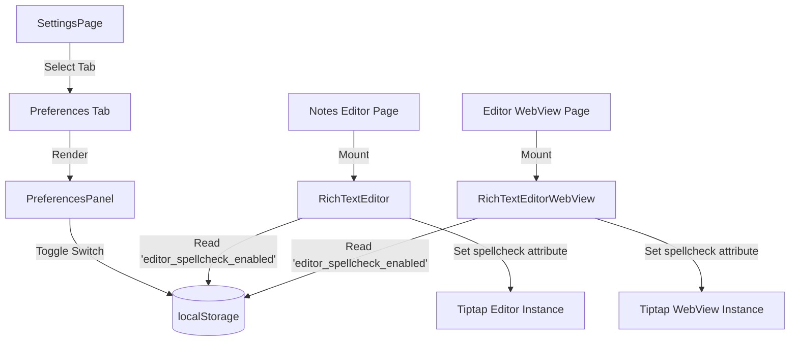

# System Design & Architecture - Editor Spellcheck

## Architecture Overview
The spellcheck toggle is a client-side setting persisted in the browser's `localStorage` and read by the rich text editors upon initialization.

## Data Models & Storage
We will persist the preference in the browser's `localStorage`:
- **Key**: `editor_spellcheck_enabled`
- **Value**: `"true"` or `"false"` (default: `"true"` if key is absent)

## Component Breakdown

### 1. `PreferencesPanel` (New Component)
- **Path**: `ui/web/components/features/settings/PreferencesPanel.tsx`
- **Responsibilities**:
  - Load the state from `localStorage` on mount (avoiding Next.js SSR hydration mismatch).
  - Show a card with a toggle `Switch` and description for Spellcheck.
  - Write new state back to `localStorage` when toggled.

### 2. `SettingsPage` (Modified)
- **Path**: `ui/web/components/features/settings/SettingsPage.tsx`
- **Responsibilities**:
  - Add `"preferences"` tab definition, specifying its label, description, and icon (`Sliders` or `Settings` from `lucide`).
  - Render `PreferencesPanel` when the `"preferences"` tab is active.

### 3. `RichTextEditor` (Modified)
- **Path**: `ui/web/components/RichTextEditor.tsx`
- **Responsibilities**:
  - Retrieve the current spellcheck setting from `localStorage` in a React state/ref on mount.
  - Dynamically set the `spellcheck` attribute within `editorProps.attributes`.

### 4. `RichTextEditorWebView` (Modified)
- **Path**: `ui/web/components/RichTextEditorWebView.tsx`
- **Responsibilities**:
  - Similar to the main editor, retrieve the preference from local storage and pass it to Tiptap editor attributes.

## Design Decisions
- **Native Browser Engine**: Rely entirely on `spellcheck="true|false"` standard contenteditable attribute, which is fast and lightweight.
- **Hydration Safety**: Use client-side only mount effect (`useEffect`) to load from `localStorage` to prevent hydration mismatches during Next.js server-side rendering fallback generation.
