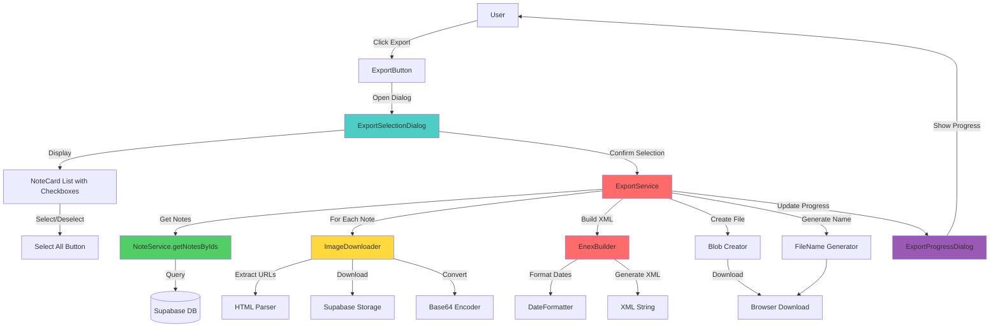

# System Design & Architecture: Evernote Export (.enex)

## Architecture Overview
**What is the high-level system structure?**



**Key components:**
- **ExportButton** - UI кнопка для запуска экспорта (под ImportButton)
- **ExportSelectionDialog** - Диалог выбора заметок с карточками
- **ExportService** - Основной сервис, координирующий экспорт
- **NoteService** - Получение заметок из БД
- **ImageDownloader** - Скачивание изображений из Supabase Storage
- **EnexBuilder** - Построение XML структуры .enex
- **ProgressTracker** - Отслеживание прогресса экспорта

**Technology stack:**
- String concatenation для генерации XML (с правильным экранированием)
- Fetch API для скачивания изображений
- Blob API для создания файла
- Supabase Client для доступа к данным и Storage
- React state для progress tracking
- FileReader API для конвертации изображений в base64

## Data Models
**What data do we need to manage?**

### .enex File Structure (XML)
```xml
<?xml version="1.0" encoding="UTF-8"?>
<!DOCTYPE en-export SYSTEM "http://xml.evernote.com/pub/evernote-export3.dtd">
<en-export export-date="20250101T120000Z" application="EverFreeNote" version="1.0">
  <note>
    <title>Note Title</title>
    <content><![CDATA[<?xml version="1.0" encoding="UTF-8"?>
      <!DOCTYPE en-note SYSTEM "http://xml.evernote.com/pub/enml2.dtd">
      <en-note>HTML content here</en-note>
    ]]></content>
    <created>20230101T120000Z</created>
    <updated>20230102T150000Z</updated>
    <tag>work</tag>
    <tag>important</tag>
    <note-attributes>
      <author>User Name</author>
    </note-attributes>
    <resource>
      <data encoding="base64">...</data>
      <mime>image/png</mime>
      <width>800</width>
      <height>600</height>
      <resource-attributes>
        <file-name>image.png</file-name>
      </resource-attributes>
    </resource>
  </note>
</en-export>
```

### Note Structure (from DB)
```typescript
interface Note {
  id: string
  user_id: string
  title: string
  description: string // Tiptap HTML
  tags: string[]
  created_at: string // ISO timestamp
  updated_at: string // ISO timestamp
}
```

### Export Note Structure
```typescript
interface ExportNote {
  title: string
  content: string // ENML with <en-media> referencing resources by hash
  created: Date
  updated: Date
  tags: string[]
  resources: ExportResource[]
}

interface ExportResource {
  data: string // base64 encoded (original binary md5 hashed)
  mime: string
  hash: string // md5 hex lowercase of binary data
  width?: number
  height?: number
  fileName: string
}
```

### Supabase Notes Table (existing)
```sql
notes (
  id uuid PRIMARY KEY,
  user_id uuid REFERENCES auth.users,
  title text,
  description text, -- Tiptap HTML
  tags text[],
  created_at timestamp,
  updated_at timestamp
)
```

### Supabase Storage Structure (existing)
```
Bucket: note-images
Path: {user_id}/{note_id}/{timestamp}_{filename}.{ext}
Public: true
```

### ENML Content Transformation (images)
- Разбор HTML и замена `` на `<en-media type="{mime}" hash="{md5}"/>` в ENML (hash = md5 от бинарных данных ресурса, нижний регистр, без пробелов) по аналогии с Evernote.
- Ресурсы добавляются в порядке появления в контенте, хэш используется для линковки `<en-media>` → `<resource><data>`.
- Атрибуты alt/title могут использоваться как fallback для `<en-media>` (title) если потребуется доступность.
- Для идемпотентности: фиксированный порядок тегов, ресурсов и атрибутов; одинаковый формат дат и переносов строк.

## API Design
**How do components communicate?**

### Internal Interfaces

#### ExportService
```typescript
class ExportService {
  /**
   * Export selected notes to .enex format
   * @param noteIds - Array of note IDs to export
   * @param userId - User ID (for security validation)
   * @param onProgress - Progress callback
   * @returns Promise with blob and skipped images count
   */
  async exportNotes(
    noteIds: string[],
    userId: string,
    onProgress?: (progress: ExportProgress) => void
  ): Promise<{ blob: Blob; fileName: string; skippedImages: number }>
}

interface ExportProgress {
  currentNote: number
  totalNotes: number
  currentStep: 'fetching' | 'downloading-images' | 'building-xml' | 'complete'
  message: string
}
```

#### ImageDownloader
```typescript
class ImageDownloader {
  /**
   * Download image from URL and convert to base64
   * @param url - Public URL of image
   * @returns Promise<ExportResource | null> - null if download fails (includes md5 hash)
   */
  async downloadImage(url: string): Promise<ExportResource | null>
  
  /**
   * Extract image URLs from HTML content
   * @param html - HTML content
   * @returns Array of image URLs (absolute URLs only)
   */
  extractImageUrls(html: string): string[]
}
```

#### EnexBuilder
```typescript
class EnexBuilder {
  /**
   * Build .enex XML from notes
   * @param notes - Array of export notes
   * @returns string - XML content
   */
  build(notes: ExportNote[]): string
  
  /**
   * Build single note XML
   * @param note - Export note
   * @returns string - Note XML
   */
  private buildNote(note: ExportNote): string
  
  /**
   * Build resource XML
   * @param resource - Export resource
   * @returns string - Resource XML
   */
  private buildResource(resource: ExportResource): string
}
```

## Component Breakdown
**What are the major building blocks?**

### 1. Frontend Components

#### ExportButton Component
**File:** `components/ExportButton.tsx`

**Responsibilities:**
- Отображение кнопки экспорта (под ImportButton в Sidebar)
- Открытие диалога выбора заметок
- Интеграция с ExportSelectionDialog
- Инициирование скачивания файла после успешного экспорта
- Отображение уведомлений об успехе/ошибках экспорта

**Placement:**
- Размещается в `components/features/notes/Sidebar.tsx` под `ImportButton`
- В том же блоке с кнопками действий (div с классом `space-y-2`)

**Code integration:**
```tsx
// В Sidebar.tsx, после ImportButton:
<ImportButton onImportComplete={onImportComplete} />
<ExportButton onExportComplete={handleExportComplete} />
```

**Props:**
```typescript
interface ExportButtonProps {
  onExportComplete?: (success: boolean, exportedCount: number) => void
}
```

#### ExportSelectionDialog Component
**File:** `components/ExportSelectionDialog.tsx`

**Responsibilities:**
- Отображение диалога выбора заметок
- Список карточек заметок (как в левом баре) с чекбоксами
- Кнопка "Выбрать все"
- Подтверждение выбора и запуск экспорта
- Отображение количества выбранных заметок

**Props:**
```typescript
interface ExportSelectionDialogProps {
  open: boolean
  onOpenChange: (open: boolean) => void
  onExport: (selectedNoteIds: string[]) => void
  notes: Note[] // Все заметки пользователя
}
```

**UI Structure:**
- Заголовок диалога: "Экспорт заметок в .enex"
- Кнопка "Выбрать все" / "Снять выделение" в заголовке
- Список карточек заметок (используя NoteCard с variant="compact")
- Чекбокс на каждой карточке (слева от карточки или интегрированный)
- Отображение количества выбранных заметок: "Выбрано: N из M"
- Если список заметок пуст: отобразить сообщение "У вас пока нет заметок для экспорта"
- Кнопки "Отмена" и "Экспортировать (N)" в футере
- Валидация: кнопка "Экспортировать" неактивна, если ничего не выбрано

**Visual Design:**
- Карточки заметок выглядят идентично карточкам в левом баре (NoteCard variant="compact")
- Чекбоксы визуально интегрированы с карточками (слева от карточки или как часть карточки)
- При выборе карточка может иметь визуальную индикацию (например, border или background)
- Скроллируемый список для большого количества заметок
- Поиск/фильтрация заметок в диалоге (опционально, для будущих версий)

#### ExportProgressDialog Component
**File:** `components/ExportProgressDialog.tsx`

**Responsibilities:**
- Отображение прогресса экспорта
- Показ текущего этапа (fetching, downloading-images, building-xml, complete)
- Показ количества обработанных заметок (currentNote / totalNotes)
- Отображение предупреждения о пропущенных изображениях (если были)
- Кнопка закрытия после завершения

**Props:**
```typescript
interface ExportProgressDialogProps {
  open: boolean
  progress: ExportProgress
  skippedImages?: number
  onClose: () => void
}
```

### 2. Backend Services

#### ExportService
**File:** `lib/enex/export-service.ts`

**Responsibilities:**
- Координация процесса экспорта
- Получение выбранных заметок через NoteService
- Вызов ImageDownloader для каждой заметки
- Конвертация HTML → ENML с <en-media> и md5-хэшами ресурсов как в Evernote
- Обеспечение идемпотентности: детерминированный порядок заметок/ресурсов/тегов, единый формат дат
- Вызов EnexBuilder для генерации XML
- Создание Blob файла
- Обработка ошибок скачивания изображений (graceful degradation)

**Flow:**
1. Валидация: проверить, что noteIds не пустой массив
2. Получить выбранные заметки по их ID через NoteService.getNotesByIds()
3. Для каждой заметки:
   - Извлечь URL изображений из HTML через ImageDownloader.extractImageUrls()
   - Скачать изображения батчами (до 5 параллельно) и конвертировать в base64, вычислить md5 от бинарных данных
   - Пропускать проблемные изображения (возвращают null), логировать ошибки
   - Собрать ExportResource (hash, mime, data, fileName, width/height) в порядке появления
   - Заменить  в HTML на <en-media type="..." hash="..."> с ссылкой на ExportResource.hash
   - Подготовить данные для экспорта (ExportNote)
4. Сгенерировать XML через EnexBuilder.build()
5. Создать Blob с типом 'application/xml'
6. Сгенерировать имя файла: `everfreenote-export-YYYYMMDD-HHMMSS.enex` (дата/время экспорта в UTC)
7. Вернуть blob, имя файла и количество пропущенных изображений

**Error Handling:**
- При ошибке скачивания изображения: логировать с контекстом (URL, noteId), пропускать изображение, увеличивать счетчик skippedImages, продолжать экспорт
- При ошибке получения заметки через NoteService: пропускать заметку, логировать, продолжать экспорт остальных заметок
- При пустом списке заметок: возвращать валидный .enex файл с пустым en-export
- При критической ошибке генерации XML: прерывать экспорт, показывать ошибку пользователю, не создавать файл
- При сетевых ошибках: retry до 3 раз с экспоненциальной задержкой

#### NoteService (extension)
**File:** `lib/services/notes.ts` (existing service, needs new method)

**New method:**
```typescript
async getNotesByIds(noteIds: string[], userId: string): Promise<Note[]>
```

**Responsibilities:**
- Получение заметок по их ID из Supabase
- Фильтрация по user_id для RLS безопасности
- Возврат пустого массива если noteIds пустой
- Сортировка по updated_at (descending)

**Implementation:**
- Использует Supabase `.in('id', noteIds)` для фильтрации
- Применяет RLS политики через `.eq('user_id', userId)`
- Возвращает только необходимые поля: id, title, description, tags, created_at, updated_at

#### ImageDownloader
**File:** `lib/enex/image-downloader.ts`

**Responsibilities:**
- Извлечение URL изображений из HTML
- Скачивание изображений через fetch
- Конвертация в base64 и вычисление md5 (hash для <en-media>)
- Определение MIME типа
- Извлечение размеров изображения (если возможно)
- Возврат ExportResource с hash/data/mime/fileName/width/height

**Error handling:**
- Пропускать изображения при ошибках скачивания (graceful degradation)
- Логировать ошибки с контекстом (URL, noteId)
- Возвращать null для неудачных загрузок
- Не прерывать процесс экспорта из-за ошибок отдельных изображений

#### EnexBuilder
**File:** `lib/enex/enex-builder.ts`

**Responsibilities:**
- Генерация валидного XML .enex файла
- Форматирование дат в формат Evernote (ISO 8601)
- Экранирование XML специальных символов
- Обертка ENML контента в CDATA (<en-note> + <en-media>)
- Генерация ресурсов (изображений) в base64 с hash, линкованных через <en-media>
- Детерминированный порядок: теги, ресурсы, заметки — для идемпотентности импорта/экспорта

**XML generation:**
- Использовать строковую конкатенацию с правильным экранированием (проще и быстрее, чем DOMParser)
- Включить DOCTYPE и DTD ссылки для совместимости с Evernote
- Правильно экранировать XML специальные символы (`<`, `>`, `&`, `"`, `'`)
- Обернуть ENML контент (<en-note>) в CDATA для избежания проблем с экранированием

### 3. Utilities

#### Date Formatter
**File:** `lib/enex/date-formatter.ts`

**Responsibilities:**
- Конвертация ISO timestamp в формат Evernote (YYYYMMDDTHHMMSSZ)
- Обработка timezone

#### File Name Generator
**File:** `lib/enex/file-name-generator.ts` (или встроенная функция в ExportService)

**Responsibilities:**
- Генерация имени файла экспорта в формате `everfreenote-export-YYYYMMDD-HHMMSS.enex`
- Использование текущей даты/времени в UTC
- Формат: `everfreenote-export-20250120-143022.enex` (год-месяц-день-час-минута-секунда)

**File Download Process:**
- После создания Blob, использовать `URL.createObjectURL(blob)` для создания временной ссылки
- **Хранение файла:** Файл находится в памяти браузера (RAM) как Blob объект, не сохраняется на диск до момента скачивания пользователем
- Создать невидимый `<a>` элемент с атрибутами `href` (временная ссылка), `download` (с именем файла)
- Программно кликнуть на элемент для инициирования скачивания браузером
- Браузер скачивает файл из памяти в папку загрузок пользователя
- Освободить объект URL через `URL.revokeObjectURL()` после скачивания (освобождает память)
- **Важно:** Если пользователь закроет страницу до скачивания, файл будет потерян (находится только в памяти браузера)

## Design Decisions
**Why did we choose this approach?**

**Decision 1: Browser-side экспорт**
- **Rationale:** Не требует серверной части, работает офлайн после получения данных, мгновенная обратная связь
- **Alternatives:** Server-side экспорт через API endpoint
- **Trade-offs:** Ограничения браузера на размер файла и память, но достаточно для большинства случаев

**Decision 2: Скачивание изображений в base64**
- **Rationale:** Стандартный формат .enex требует включения изображений в файл, обеспечивает портативность
- **Alternatives:** Сохранение ссылок на изображения (несовместимо с .enex)
- **Trade-offs:** Увеличение размера файла, но полная совместимость с Evernote

**Decision 3: Пропуск изображений при ошибках (Graceful Degradation)**
- **Rationale:** Не прерывать экспорт из-за проблем с отдельными изображениями. Пользователь получает экспорт с максимально возможным количеством данных.
- **Alternatives:** Прерывать экспорт при первой ошибке
- **Trade-offs:** Частичная потеря данных (проблемные изображения), но успешный экспорт остальных заметок и изображений
- **Implementation:** Логировать ошибки, пропускать проблемные изображения, показывать предупреждение в итоговом сообщении

**Decision 4: Использование существующего NoteService**
- **Rationale:** Переиспользование кода, единая точка доступа к данным
- **Alternatives:** Прямой доступ к Supabase
- **Trade-offs:** Зависимость от существующего сервиса, но консистентность

**Decision 5: Совместимость изображений с Evernote (md5 + <en-media>)**
- **Rationale:** Evernote использует md5-хэш бинарных данных в атрибуте `hash` тега `<en-media>` для связывания с `<resource>`. Повторение этой схемы дает корректное отображение и идемпотентный экспорт/импорт.
- **Alternatives:** Использовать data URI в HTML или произвольные идентификаторы ресурсов (ломает совместимость Evernote).
- **Trade-offs:** Дополнительные вычисления md5 на клиенте и жесткий порядок ресурсов, но полная совместимость и детерминизм.

## Non-Functional Requirements
**How should the system perform?**

- Performance targets
  - Экспорт 100 заметок с изображениями: <30 секунд
  - Экспорт 1000 заметок без изображений: <10 секунд
  - Обработка изображений параллельно (batch processing, до 5 одновременно)
  - Использование памяти: <500MB для 1000 заметок

- Scalability considerations
  - Обработка изображений батчами для ограничения параллельных запросов
  - Потоковая обработка заметок для экономии памяти
  - Индикация прогресса для длительных операций

- Security requirements
  - Экспорт только собственных заметок пользователя (RLS)
  - Валидация данных перед экспортом
  - Санитизация HTML контента

- Reliability/availability needs
  - Graceful degradation при ошибках скачивания изображений
  - Retry механизм для временных сбоев сети (максимум 3 попытки с экспоненциальной задержкой)
  - Валидация XML перед созданием файла
  - Обработка пустого списка заметок (валидный .enex с пустым en-export)
  - Обработка сетевых таймаутов при скачивании изображений
  - Корректная обработка ошибок скачивания файла в браузере (блокировка всплывающих окон)
  - Идемпотентность экспорта/импорта: детерминированный вывод (порядок заметок/ресурсов/тегов, формат дат), различия только в export-date
