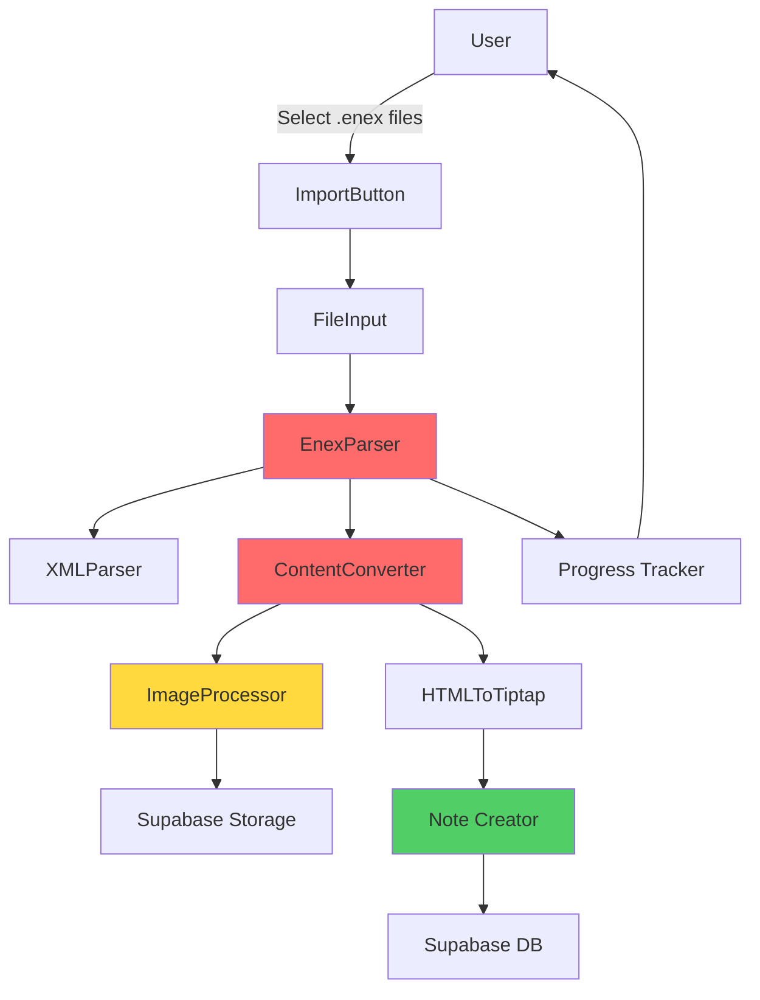

# System Design & Architecture

## Architecture Overview
**What is the high-level system structure?**



**Key components:**
- **ImportButton** - UI кнопка для запуска импорта
- **FileInput** - File picker для выбора .enex файлов
- **EnexParser** - Парсинг XML структуры .enex
- **ContentConverter** - Конвертация HTML → Tiptap JSON
- **ImageProcessor** - Обработка и загрузка изображений
- **NoteCreator** - Создание заметок в Supabase
- **ProgressTracker** - Отслеживание прогресса импорта

**Technology stack:**
- DOMParser API (browser native XML parsing)
- Tiptap Image extension (@tiptap/extension-image)
- Supabase Storage для изображений
- Supabase DB для заметок
- React state для progress tracking

## Data Models
**What data do we need to manage?**

### .enex File Structure (XML)
```xml
<?xml version="1.0" encoding="UTF-8"?>
<!DOCTYPE en-export SYSTEM "http://xml.evernote.com/pub/evernote-export3.dtd">
<en-export>
  <note>
    <title>Note Title</title>
    <content><![CDATA[<?xml version="1.0" encoding="UTF-8"?>
      <!DOCTYPE en-note SYSTEM "http://xml.evernote.com/pub/enml2.dtd">
      <en-note>HTML content here</en-note>
    ]]></content>
    <created>20230101T120000Z</created>
    <updated>20230102T150000Z</updated>
    <tag>work</tag>
    <tag>important</tag>
    <note-attributes>
      <author>User Name</author>
    </note-attributes>
    <resource>
      <data encoding="base64">...</data>
      <mime>image/png</mime>
      <width>800</width>
      <height>600</height>
      <resource-attributes>
        <file-name>image.png</file-name>
      </resource-attributes>
    </resource>
  </note>
</en-export>
```

### Parsed Note Structure
```typescript
interface ParsedNote {
  title: string
  content: string // HTML from CDATA
  created: Date
  updated: Date
  tags: string[]
  resources: ParsedResource[]
}

interface ParsedResource {
  data: string // base64
  mime: string
  width?: number
  height?: number
  fileName?: string
}
```

### Supabase Notes Table (existing)
```sql
notes (
  id uuid PRIMARY KEY,
  user_id uuid REFERENCES auth.users,
  title text,
  description text, -- Tiptap HTML
  tags text[],
  created_at timestamp,
  updated_at timestamp
)
```

**Note:** Нужно добавить возможность установки custom created_at/updated_at при импорте

### Supabase Storage Structure (new)
```
Bucket: note-images
Path: {user_id}/{note_id}/{image_id}.{ext}
```

## API Design
**How do components communicate?**

### Internal Interfaces

#### EnexParser
```typescript
class EnexParser {
  /**
   * Parse .enex file and extract notes
   * @param file - .enex File object
   * @returns Array of parsed notes
   * @throws Error if XML is invalid
   */
  async parse(file: File): Promise<ParsedNote[]>
  
  /**
   * Parse single note XML element
   */
  private parseNote(noteElement: Element): ParsedNote
  
  /**
   * Parse resources (images) from note
   */
  private parseResources(noteElement: Element): ParsedResource[]
}
```

#### ContentConverter
```typescript
class ContentConverter {
  /**
   * Convert Evernote HTML to Tiptap JSON
   * @param html - HTML from .enex CDATA
   * @param resources - Images from note
   * @returns Tiptap-compatible HTML
   */
  async convert(html: string, resources: ParsedResource[]): Promise<string>
  
  /**
   * Replace unsupported elements with placeholders
   */
  private replaceUnsupported(html: string): string
  
  /**
   * Process and upload images
   */
  private async processImages(html: string, resources: ParsedResource[]): Promise<string>
}
```

#### ImageProcessor
```typescript
class ImageProcessor {
  /**
   * Upload image to Supabase Storage
   * @param base64 - Image data in base64
   * @param mime - MIME type
   * @param userId - User ID for path
   * @param noteId - Note ID for path
   * @returns Public URL of uploaded image
   */
  async upload(
    base64: string,
    mime: string,
    userId: string,
    noteId: string
  ): Promise<string>
  
  /**
   * Convert base64 to Blob
   */
  private base64ToBlob(base64: string, mime: string): Blob
}
```

#### NoteCreator
```typescript
class NoteCreator {
  /**
   * Create note in Supabase with custom dates
   * @param note - Parsed note data
   * @param userId - Current user ID
   * @returns Created note ID
   */
  async create(note: ParsedNote, userId: string): Promise<string>
  
  /**
   * Check for duplicates and add [duplicate] prefix
   */
  private async checkDuplicate(title: string, userId: string): Promise<string>
}
```

## Component Breakdown
**What are the major building blocks?**

### 1. UI Components

#### ImportButton Component
**File:** `components/ImportButton\.tsx`

```jsx
<Button onClick={handleImportClick}>
  <Upload className="w-4 h-4 mr-2" />
  Import from Evernote
</Button>
<input
  type="file"
  accept=".enex"
  multiple
  ref={fileInputRef}
  onChange={handleFileSelect}
  style={{ display: 'none' }}
/>
```

**Features:**
- Hidden file input с accept=".enex"
- Multiple file selection
- Trigger file picker on button click
- Show progress dialog during import

#### ImportProgressDialog Component
**File:** `components/ImportProgressDialog\.tsx`

```jsx
<Dialog open={importing}>
  <DialogContent>
    <DialogHeader>
      <DialogTitle>Importing from Evernote</DialogTitle>
      <DialogDescription>
        Processing {currentFile} of {totalFiles} files...
        {currentNote} of {totalNotes} notes imported
      </DialogDescription>
    </DialogHeader>
    <Progress value={progress} />
  </DialogContent>
</Dialog>
```

### 2. Core Services

#### EnexParser Service
**File:** `lib/enex/parser.ts`

**Responsibilities:**
- Parse XML using DOMParser
- Extract note metadata (title, dates, tags)
- Extract content from CDATA
- Extract resources (images)
- Handle malformed XML gracefully

**Error handling:**
- Invalid XML → throw descriptive error
- Missing required fields → use defaults
- Invalid dates → use current date

#### ContentConverter Service
**File:** `lib/enex/converter.ts`

**Responsibilities:**
- Convert Evernote HTML to clean HTML
- Replace `<en-media>` tags with `` tags
- Remove unsupported elements (tables, code blocks)
- Add placeholder text for removed elements
- Ensure Tiptap compatibility

**Unsupported elements mapping:**
```javascript
const UNSUPPORTED_ELEMENTS = {
  'table': '[Unsupported content: Table]',
  'pre': '[Unsupported content: Code Block]',
  'en-todo': '[Unsupported content: Checkbox]',
  'en-crypt': '[Unsupported content: Encrypted Text]'
}
```

#### ImageProcessor Service
**File:** `lib/enex/image-processor.ts`

**Responsibilities:**
- Decode base64 images
- Upload to Supabase Storage
- Generate public URLs
- Replace `<en-media>` with ``
- Handle upload errors

**Storage structure:**
```
Bucket: note-images
Path: {user_id}/{note_id}/{timestamp}_{filename}
Public: true
```

### 3. Database Integration

#### Supabase Storage Setup
**Bucket configuration:**
```sql
-- Create bucket for note images
INSERT INTO storage.buckets (id, name, public)
VALUES ('note-images', 'note-images', true);

-- RLS policies
CREATE POLICY "Users can upload their own images"
ON storage.objects FOR INSERT
TO authenticated
WITH CHECK (bucket_id = 'note-images' AND (storage.foldername(name))[1] = auth.uid()::text);

CREATE POLICY "Images are publicly readable"
ON storage.objects FOR SELECT
TO public
USING (bucket_id = 'note-images');
```

#### Notes Table Modification
**Migration:** `supabase/migrations/YYYYMMDD_add_custom_timestamps.sql`

```sql
-- Allow setting custom created_at/updated_at during import
-- Note: Supabase automatically sets these, need to handle in app logic
```

## Design Decisions
**Why did we choose this approach?**

**Decision 1: Browser-side XML parsing (DOMParser)**
- **Rationale:** No server-side needed, works offline, instant feedback
- **Alternatives:** Server-side parsing, third-party XML libraries
- **Trade-offs:** Limited to browser file size limits (~100MB), but sufficient for most use cases

**Decision 2: Supabase Storage для изображений**
- **Rationale:** Already using Supabase, built-in CDN, RLS policies
- **Alternatives:** External CDN (Cloudflare R2, AWS S3), base64 in DB
- **Trade-offs:** Dependency on Supabase, but consistent with architecture

**Decision 3: Placeholder text для неподдерживаемых элементов**
- **Rationale:** Graceful degradation, user knows what was lost
- **Alternatives:** Skip silently, fail import, convert to plain text
- **Trade-offs:** Visible markers in content, but transparent to user

**Decision 4: Tiptap Image extension**
- **Rationale:** Native Tiptap support, consistent with editor
- **Alternatives:** Custom image component, markdown images
- **Trade-offs:** Need to add extension, but standard solution

**Decision 5: Batch processing с progress tracking**
- **Rationale:** Better UX for large imports, non-blocking UI
- **Alternatives:** Synchronous import, background worker
- **Trade-offs:** More complex state management, but better UX

**Decision 6: [duplicate] prefix для дубликатов**
- **Rationale:** Simple, visible, preserves all data
- **Alternatives:** Skip duplicates, merge, user prompt
- **Trade-offs:** Manual cleanup needed, but no data loss

## Non-Functional Requirements
**How should the system perform?**

**Performance:**
- Single note import: < 1 second
- 10 notes: < 5 seconds
- 100 notes: < 30 seconds
- Image upload: parallel processing (max 5 concurrent)
- UI remains responsive during import

**Scalability:**
- Support files up to 100MB
- Support up to 1000 notes per file
- Support up to 50 images per note
- Graceful degradation for larger files

**Security:**
- Validate file type (.enex only)
- Sanitize HTML content (XSS prevention)
- RLS policies for image storage
- User can only import to their own account

**Reliability:**
- Atomic note creation (all or nothing per note)
- Rollback on critical errors
- Detailed error messages
- Retry logic for network failures

**Usability:**
- Clear progress indication
- Informative error messages
- List of unsupported features before import
- Success notification with count

**Maintainability:**
- Modular service architecture
- Comprehensive error handling
- Logging for debugging
- Unit tests for parsers and converters

