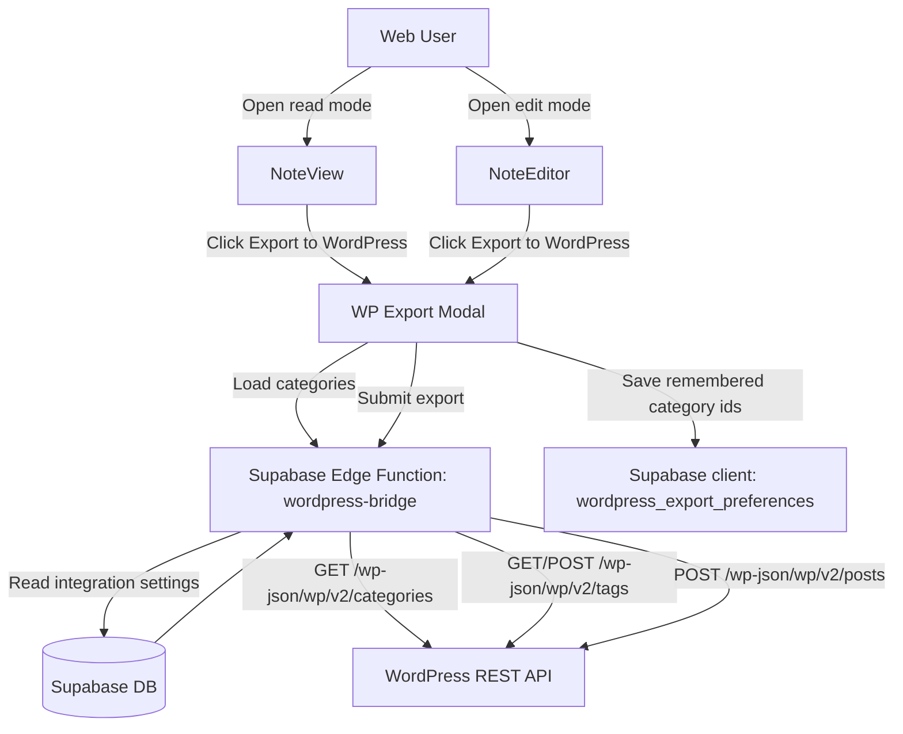

# System Design & Architecture

## Architecture Overview
**What is the high-level system structure?**

- Key components and their responsibilities
  - `WordPress Settings UI`:
    - Manage site URL and API auth credentials.
    - Enable/disable integration state.
  - `Per-note Export Trigger` (web only):
    - Renders export button only when integration is configured.
    - Opens lightweight modal.
    - Placement:
      - `NoteView` header near `Edit/Delete`.
      - `NoteEditor` header near `Read`.
  - `WP Export Modal`:
    - Fetches categories from backend bridge.
    - Allows category selection, tag edits, slug edit.
    - Shows inline progress/errors.
  - `wordpress-bridge` Edge Function:
    - Protects credentials from client exposure.
    - Calls WordPress REST API for categories and post creation.
    - Normalizes WordPress errors for UI.
  - `Persistence layer`:
    - Stores WordPress integration settings per user.
    - Stores remembered category selection per user.
- Technology stack choices and rationale
  - Existing Next.js web app for UI integration.
  - Supabase tables + RLS for per-user configuration storage.
  - Supabase Edge Function to avoid browser CORS/auth leakage and centralize WP error handling.
  - WordPress REST API (`/categories`, `/posts`) for interoperability.

## Data Models
**What data do we need to manage?**

- Core entities and their relationships
  - Existing `notes` table remains source for title/content/tags.
  - New `wordpress_integrations` table (1:1 with user) stores connection/auth metadata.
  - New `wordpress_export_preferences` table (1:1 with user) stores remembered category ids.
  - Optional transient modal state keeps export-time tag edits and slug edits client-side only.

- Data schemas/structures
  - `wordpress_integrations`
    - `user_id uuid primary key references auth.users(id)`
    - `site_url text not null`
    - `wp_username text not null`
    - `wp_app_password_encrypted text not null`
    - `enabled boolean not null default true`
    - `created_at timestamptz not null default now()`
    - `updated_at timestamptz not null default now()`
  - `wordpress_export_preferences`
    - `user_id uuid primary key references auth.users(id)`
    - `remembered_category_ids int[] not null default '{}'`
    - `updated_at timestamptz not null default now()`
  - Export payload (client -> bridge)
    - `noteId: string`
    - `categoryIds: number[]`
    - `tags: string[]`
    - `slug: string`
    - `status: "publish"` (fixed default for this phase)

- Data flow between components
  - Settings save path: Web UI -> Supabase table (RLS-protected).
  - Modal init path: Web UI -> bridge (`get-categories`) + preferences query.
  - Export path: Web UI -> bridge (`export-note`) -> WordPress posts endpoint.
  - Preferences update path: Web UI -> Supabase preferences table after successful export or category selection change.

## API Design
**How do components communicate?**

- External APIs (if applicable)
  - WordPress:
    - `GET /wp-json/wp/v2/categories?per_page=100`
    - `GET /wp-json/wp/v2/tags?search=<name>`
    - `POST /wp-json/wp/v2/tags`
    - `POST /wp-json/wp/v2/posts`

- Internal interfaces
  - Edge function endpoint: `POST /functions/v1/wordpress-bridge`
  - Actions:
    - `action: "get_categories"` -> returns categories and remembered ids.
    - `action: "export_note"` -> creates post using note + modal payload.
  - Settings endpoint(s):
    - `GET /functions/v1/wordpress-settings-status` -> returns `configured` flag and safe metadata.
    - `POST /functions/v1/wordpress-settings-upsert` -> saves/updates `site_url`, `wp_username`, encrypted app password.
  - Preferences write path:
    - `upsert` to `wordpress_export_preferences` via Supabase client + RLS after successful export or selection change.

- Request/response formats
  - `get_categories` request:
    - `{ action: "get_categories" }`
  - `get_categories` response:
    - `{ categories: Array<{ id: number; name: string }>, rememberedCategoryIds: number[] }`
  - `export_note` request:
    - `{ action: "export_note", noteId: string, categoryIds: number[], tags: string[], slug: string, status: "publish" }`
  - `export_note` success response:
    - `{ postId: number, postUrl: string, slug: string }`
  - Error response (normalized):
    - `{ code: string, message: string, details?: unknown }`
  - Slug conflict behavior:
    - Bridge returns conflict error (e.g. `code: "slug_conflict"`).
    - Client does not auto-append suffixes; user must edit slug manually.
  - Tag mapping behavior:
    - Bridge resolves `tags: string[]` to WordPress term IDs.
    - For each tag:
      - try find via `GET /wp-json/wp/v2/tags?search=...`;
      - if exact tag absent, create via `POST /wp-json/wp/v2/tags`;
      - collect resulting term IDs and submit them in post create payload.

- Authentication/authorization approach
  - Client authenticates with Supabase session JWT.
  - Bridge validates authenticated user and reads only that user's integration settings.
  - RLS enforces per-user row access for settings/preferences tables.
  - WordPress credentials are not returned to client after save.

## Component Breakdown
**What are the major building blocks?**

- Frontend components (if applicable)
  - `WordPressSettingsSection` (new, web):
    - In settings dropdown/panel.
    - Site URL, username, application password inputs.
  - `ExportToWordPressButton` (new, web):
    - Rendered per note entry point.
    - Hidden when integration settings are absent/disabled.
  - `WordPressExportDialog` (new, web):
    - Category selector, editable tags list, editable slug field.
    - Inline loading + error states.
  - Existing components to modify:
    - `ui/web/components/features/notes/NoteEditor.tsx` (button near `Read`)
    - `ui/web/components/features/notes/NoteView.tsx`
    - `ui/web/components/features/notes/SettingsPanel.tsx` or settings dropdown composition.

- Backend services/modules
  - `core/services/wordpressSettings.ts` (new)
  - `core/services/wordpressExport.ts` (new client-side facade for bridge calls)
  - Supabase Edge Function: `supabase/functions/wordpress-bridge/index.ts` (new)

- Database/storage layer
  - New migrations for `wordpress_integrations` and `wordpress_export_preferences`.
  - RLS policies: owner-only select/insert/update/delete.

- Third-party integrations
  - WordPress REST API using basic auth with application password over HTTPS.

## Design Decisions
**Why did we choose this approach?**

- Key architectural decisions and trade-offs
  - Decision: Use Edge Function bridge instead of direct browser -> WordPress requests.
    - Pros: avoids credential leakage and CORS issues, centralized error normalization.
    - Cons: extra backend component to maintain.
  - Decision: Persist remembered category IDs per user.
    - Pros: fast repeated export flow.
    - Cons: user preference is global and not note-specific.
  - Decision: Keep tag edits export-scoped in modal state only.
    - Pros: avoids accidental mutation of notebook data.
    - Cons: no long-term per-note tag override history.
  - Decision: Web-only UI integration in this phase.
    - Pros: aligns with scope, limits delivery risk.
    - Cons: no mobile parity yet.

- Alternatives considered
  - Direct client requests to WordPress REST API.
  - Storing settings in browser local storage only.
  - Auto-export without confirmation popup.

- Patterns and principles applied
  - Explicit boundaries between UI, app service, and integration bridge.
  - Principle of least privilege with RLS and server-side secret usage.
  - Progressive disclosure UX: only show export controls when integration is ready.

## Non-Functional Requirements
**How should the system perform?**

- Performance targets
  - Categories fetch under 2s on typical network.
  - Export modal interaction remains responsive (<100ms local interactions).
  - Export action shows visible loading feedback within 100ms.
  - No strict hard timeout SLA for upstream WordPress response; UI must keep progress/error state coherent.

- Scalability considerations
  - One-note export requests are lightweight and stateless.
  - Category list supports pagination extension if >100 categories.

- Security requirements
  - Encrypt WordPress app password at rest.
  - Never expose decrypted credentials to browser.
  - Enforce authenticated access and per-user ownership via RLS.
  - Validate and sanitize outgoing payload (slug/tags/category IDs).

- Reliability/availability needs
  - Clear retry guidance for transient upstream failures.
  - Deterministic error mapping for common WordPress failures (401/403/409/422/5xx).
  - Non-blocking UI behavior if category fetch fails (show recoverable state and retry).
