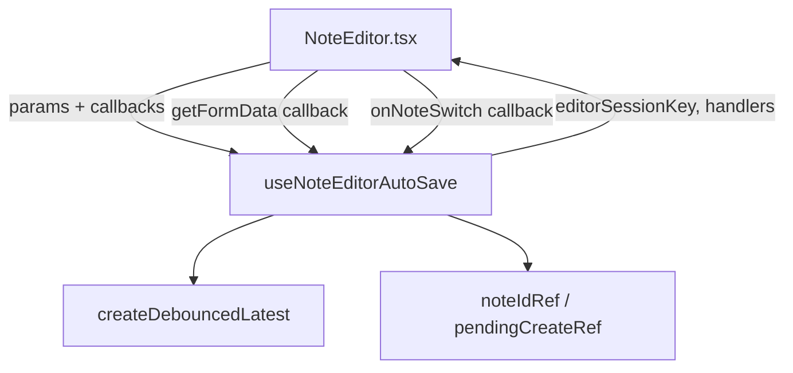

# System Design & Architecture

## Architecture Overview



## Hook API

### Parameters

```typescript
type UseNoteEditorAutoSaveParams = {
  noteId?: string
  initialTitle: string
  initialDescription: string
  initialTags: string
  autosaveDelayMs: number
  onAutoSave?: (data: NoteAutoSavePayload) => Promise<void> | void
  getFormData: () => { title: string; description: string; tags: string }
  cancelDebouncedTagQuery: () => void   // hook calls this on note switch
  onNoteSwitch?: () => void              // NoteEditor resets tag/query state here
}
```

### Returns

```typescript
type UseNoteEditorAutoSaveResult = {
  editorSessionKey: number               // key prop for editor/input remount
  handleContentChange: () => void        // onChange for title input + editor
  scheduleAutoSave: (overrides?: Partial<NoteAutoSavePayload>) => void  // for tag changes
  cancelAutoSave: () => void             // for manual Save/Read
  flushPendingSave: () => Promise<void>  // for useImperativeHandle
}
```

### Internals (not exposed)

- `noteIdRef` — kept in sync with `noteId` prop
- `lastResetNoteIdRef` — tracks last note id that triggered a session reset
- `pendingCreateRef` — marks in-flight autosave creates; `scheduleAutoSave` sets it automatically

## Design Decisions

| Decision | Rationale |
|---|---|
| `getFormData` passed as callback | DOM refs (`titleInputRef`, `editorRef`) live in NoteEditor; hook reads current values via callback |
| `onNoteSwitch` callback | Hook detects the switch; NoteEditor owns its own tag/query state reset |
| `scheduleAutoSave` hides `pendingCreateRef` | Callers (addTags, removeTag) don't need to know about the pending-create pattern |
| `buildTagString(parseTagString(initialTags))` in debouncedAutoSave.reset | Normalizes tags on note switch, same as original behavior |
