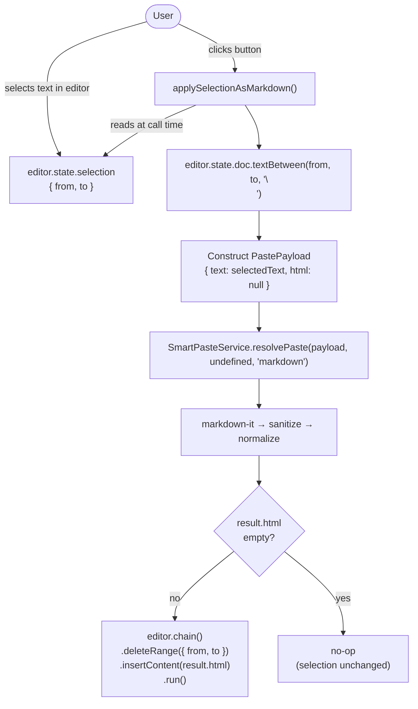

# System Design & Architecture — Force Paste Format

## Architecture Overview
**What is the high-level system structure?**



**Key design principle:** This is a **stateless imperative action**, not a mode or toggle. There is no persistent state — the button triggers a one-shot transformation of the current selection.

**Key components:**
- `SmartPasteService` (core service) — receives `forcedType = 'markdown'`, skips detection, runs existing markdown pipeline.
- `RichTextEditor` (existing) — adds `applySelectionAsMarkdown` handler + `hasSelection` state + button inlined in `MenuBar`.
- `RichTextEditorWebView` (existing) — adds `applySelectionAsMarkdown` (dispatched via `runCommand`); emits `onSelectionChange`.
- `app/editor-webview/page.tsx` (Next.js bridge page) — forwards `onSelectionChange` to native via `SELECTION_CHANGE` postMessage.
- `EditorWebView` (native wrapper) — handles `SELECTION_CHANGE` message, calls `onSelectionChange` prop.
- `EditorToolbar` (mobile, existing) — renders the new button, receives `hasSelection` from native screen.

## Data Models
**What data do we need to manage?**

No new state or data models. The action is fully stateless:

```
Input:  editor selection (from, to) + selected plain text
Output: parsed HTML → inserted back into editor at same position
```

### Mobile WebView bridge

`RichTextEditorWebView` (web component, runs inside a WebView on mobile) exposes a typed ref handle:

```typescript
type RichTextEditorWebViewHandle = {
  getHTML: () => string
  setContent: (html: string) => void
  runCommand: (command: string, ...args: unknown[]) => void
}
```

The native `EditorToolbar` already drives formatting actions by calling `ref.current.runCommand('toggleBold')` etc. The new action fits the same pattern:

```typescript
// Native toolbar button press:
ref.current.runCommand('applySelectionAsMarkdown')
```

Inside `RichTextEditorWebView`, `runCommand` dispatches to TipTap's `editor.chain().focus()[command](...args).run()`. The `applySelectionAsMarkdown` action is registered as a custom TipTap command so it is reachable via `runCommand`.

**`hasSelection` on mobile — full bridge chain:**

```
RichTextEditorWebView (web, onSelectionUpdate)
  → onSelectionChange(bool) prop
  → app/editor-webview/page.tsx: postMessage({ type: 'SELECTION_CHANGE', payload: bool })
  → EditorWebView.tsx handleMessage: case 'SELECTION_CHANGE' → onSelectionChange?.(bool)
  → ui/mobile/app/note/[id].tsx: setHasSelection(bool) → <EditorToolbar hasSelection={hasSelection} />
```

On editor blur, `hasSelection` is reset to `false` to ensure the button is disabled when the editor is not active.

### SmartPasteService interface extension

```typescript
// BEFORE (existing)
resolvePaste(payload: PastePayload, options?: SmartPasteOptions): PasteResult

// AFTER (extended — backwards compatible)
resolvePaste(
  payload: PastePayload,
  options?: SmartPasteOptions,
  forcedType?: PasteType,   // NEW optional parameter
): PasteResult
```

When `forcedType = 'markdown'`: skip `detectPasteType()`, construct synthetic detection, run existing markdown pipeline.

## API Design
**How do components communicate?**

### SmartPasteService change (`core/services/smartPaste.ts`)

```typescript
static resolvePaste(
  payload: PastePayload,
  options: SmartPasteOptions = {},
  forcedType?: PasteType,
): PasteResult {
  const detection: PasteDetection = forcedType
    ? { type: forcedType, confidence: 1.0, reasons: ['forced-by-user'], warnings: [] }
    : SmartPasteService.detectPasteType(payload, options)

  return SmartPasteService._resolve(payload, detection, options)
}

// The existing pipeline body is extracted into a private helper
// to avoid duplicating the html/markdown/plain branches + fallback logic.
```

### `applySelectionAsMarkdown` handler (editor components)

```typescript
const applySelectionAsMarkdown = useCallback(() => {
  const { from, to } = editor.state.selection
  if (from === to) return // empty selection — button should be disabled anyway

  const selectedText = editor.state.doc.textBetween(from, to, '\n')
  const payload: PastePayload = { text: selectedText, html: null, types: ['text/plain'] }
  const result = SmartPasteService.resolvePaste(payload, undefined, 'markdown')

  editor.chain().focus().deleteRange({ from, to }).insertContent(result.html).run()
  onContentChange?.()
}, [editor, onContentChange])
```

The parent editor component tracks whether the selection is non-empty via `onSelectionUpdate`. TipTap fires it on every selection change. The button is inlined in `MenuBar` (web) and `EditorToolbar` (mobile) — no separate component file.

## Component Breakdown
**What are the major building blocks?**

### New components

None — the button is inlined in the existing `MenuBar` component inside `RichTextEditor`.

### Modified components

| Component | File | Change |
|-----------|------|--------|
| `SmartPasteService` | `core/services/smartPaste.ts` | Add optional `forcedType` to `resolvePaste`; extract pipeline into module-level helper |
| `RichTextEditor` | `ui/web/components/RichTextEditor.tsx` | Add `applySelectionAsMarkdown` handler + `hasSelection` state + button inlined in `MenuBar` |
| `RichTextEditorWebView` | `ui/web/components/RichTextEditorWebView.tsx` | Add `applySelectionAsMarkdown` (dispatched via `runCommand` early-return); add `onSelectionChange` prop |
| `app/editor-webview/page.tsx` | `app/editor-webview/page.tsx` | Forward `onSelectionChange` to native via `SELECTION_CHANGE` postMessage |
| `EditorWebView` | `ui/mobile/components/EditorWebView.tsx` | Add `onSelectionChange` prop; handle `SELECTION_CHANGE` message |
| `ui/mobile/app/note/[id].tsx` | `ui/mobile/app/note/[id].tsx` | Add `hasSelection` state; wire `onSelectionChange`; pass `hasSelection` to `EditorToolbar` |
| `EditorToolbar` | `ui/mobile/components/EditorToolbar.tsx` | Add `hasSelection` prop + MD button with disabled state |
| `EditorToolbar` | `ui/mobile/components/EditorToolbar.tsx` | Add button with `disabled` prop wired to `hasSelection` from native screen |

## Design Decisions
**Why did we choose this approach?**

| Decision | Choice | Rationale |
|----------|--------|-----------|
| Stateless action vs. toggle mode | Stateless one-shot action | The feature is a corrective tool used occasionally — a persistent mode adds complexity with no benefit |
| Selection responsibility | User is responsible for what they select | No defensive logic for mixed-formatting selections; keeps the implementation clean |
| Text extraction method | `textBetween(from, to, '\n')` | Standard TipTap API; returns raw text content of selection, which is exactly what markdown-it needs |
| Service API change | Optional `forcedType` 3rd parameter | Backwards-compatible; zero changes to existing callers |
| Button disabled state | Driven by `hasSelection` in editor | Prevents accidental action and provides clear UX affordance |

**Alternatives considered:**
- **Toggle-before-paste mode** — rejected: requires persistent state, less intuitive for an occasional fix-up action.
- **Context menu on right-click** — harder to discover; toolbar is preferred.
- **Separate `applyAsMarkdown(text)` service method** — creates API duplication; optional parameter on `resolvePaste` is cleaner.

## Non-Functional Requirements
**How should the system perform?**

- **Performance:** No measurable impact — one-shot action on selected text.
- **Accessibility:** Button must have `aria-label="Apply as Markdown"` and respect `disabled` state (`aria-disabled`).
- **Security:** Forced markdown path still runs through `sanitizePasteHtml()` — no new XSS surface.
- **Backwards compatibility:** Existing `handlePaste` behaviour is 100% unchanged — `forcedType` is only used from the new button handler.
- **Empty result guard:** If `result.html` is empty after markdown parsing (e.g. empty selection text), the handler performs a no-op — `deleteRange` is not called. This prevents accidentally deleting selected content when there is nothing to replace it with.
