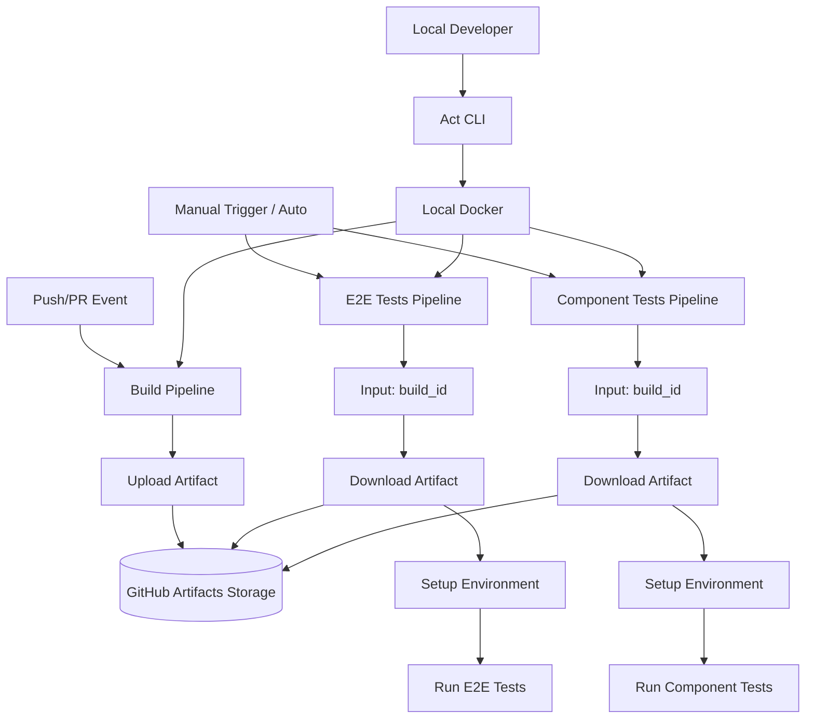

# System Design & Architecture

## Architecture Overview
**What is the high-level system structure?**



### Key Components
1. **Build Pipeline** (`build.yml`): Creates production build, uploads artifact with unique ID
2. **E2E Test Pipeline** (`e2e-tests.yml`): Downloads build artifact, sets up Supabase, runs E2E tests
3. **Component Test Pipeline** (`component-tests.yml`): Downloads build artifact, sets up environment, runs component tests
4. **Act Configuration** (`.actrc`, `.github/workflows/*.yml`): Enables local pipeline execution with identical behavior

### Technology Stack
- **GitHub Actions**: CI/CD orchestration
- **Act**: Local GitHub Actions runner (nektos/act)
- **Docker**: Container runtime for Act
- **Node.js**: Build and test runtime
- **Supabase**: Database for tests

## Data Models
**What data do we need to manage?**

### Artifact Metadata
```yaml
artifact_name: build-{run_id}  # e.g., build-123456789
artifact_path: ./out           # Next.js static export output
retention_days: 90             # GitHub default
```

### Pipeline Inputs
```yaml
# E2E Tests Input
build_id:
  description: 'Build artifact ID to test'
  required: true
  type: string
  
# Component Tests Input  
build_id:
  description: 'Build artifact ID to test'
  required: true
  type: string
```

### Environment Variables
```yaml
NEXT_PUBLIC_SUPABASE_URL: ${{ secrets.SUPABASE_URL }}
NEXT_PUBLIC_SUPABASE_ANON_KEY: ${{ secrets.SUPABASE_ANON_KEY }}
SUPABASE_SERVICE_ROLE_KEY: ${{ secrets.SUPABASE_SERVICE_ROLE_KEY }}
```

## API Design
**How do components communicate?**

### GitHub Actions Workflow Dispatch API
```yaml
# Trigger test pipeline with specific build
workflow_dispatch:
  inputs:
    build_id:
      description: 'Build artifact ID'
      required: true
      type: string
```

### Artifact Upload/Download
```yaml
# Upload
- uses: actions/upload-artifact@v4
  with:
    name: build-${{ github.run_id }}
    path: ./out
    retention-days: 90

# Download
- uses: actions/download-artifact@v4
  with:
    name: ${{ inputs.build_id }}
    path: ./out
```

## Component Breakdown
**What are the major building blocks?**

### 1. Build Pipeline (`.github/workflows/build.yml`)
**Responsibilities:**
- Checkout code
- Install dependencies
- Run production build (`npm run build`)
- Upload build artifact with unique ID
- Output artifact ID for downstream use

**Triggers:**
- Push to main/develop branches
- Pull request events
- Manual workflow dispatch

### 2. E2E Tests Pipeline (`.github/workflows/e2e-tests.yml`)
**Responsibilities:**
- Accept `build_id` input
- Download specified build artifact
- Setup Supabase (start local instance, run migrations)
- Start Next.js server with downloaded build
- Run Cypress E2E tests
- Upload test results and screenshots

**Steps:**
- **Setup Environment** (can be cached/reused)
  - Download artifact
  - Install dependencies
  - Start Supabase
  - Start server
- **Run Tests** (can be re-run independently)
  - Execute Cypress E2E tests
  - Generate reports

### 3. Component Tests Pipeline (`.github/workflows/component-tests.yml`)
**Responsibilities:**
- Accept `build_id` input
- Download specified build artifact
- Setup test environment
- Run Cypress component tests
- Upload test results

**Steps:**
- **Setup Environment**
  - Download artifact
  - Install dependencies
- **Run Tests**
  - Execute Cypress component tests
  - Generate reports

### 4. Act Configuration
**Files:**
- `.actrc`: Act CLI configuration (Docker image, secrets, etc.)
- `.github/act-secrets`: Local secrets for Act (gitignored)
- `package.json`: Scripts for running Act locally

**Responsibilities:**
- Define Docker images matching GitHub Actions runners
- Configure secrets for local testing
- Provide npm scripts for common Act commands

## Design Decisions
**Why did we choose this approach?**

### Decision 1: Use `github.run_id` for Artifact Naming
**Rationale:** 
- Guaranteed unique across all workflow runs
- Easy to correlate with GitHub Actions UI
- No collision risk with parallel runs

**Alternatives Considered:**
- Commit SHA: Not unique if multiple workflows run on same commit
- Timestamp: Harder to correlate with workflow runs
- Custom UUID: Requires additional generation logic

### Decision 2: Separate Setup and Test Steps
**Rationale:**
- Enables re-running only tests without environment setup
- Faster iteration when debugging test failures
- Clear separation of concerns

**Trade-offs:**
- Slightly more complex YAML configuration
- Need to ensure environment state persists between steps

### Decision 3: Use workflow_dispatch for Manual Triggers
**Rationale:**
- Allows testing specific build artifacts on demand
- Supports debugging and investigation workflows
- Standard GitHub Actions pattern

### Decision 4: Use Official GitHub Actions Runner Images in Act
**Rationale:**
- Maximum compatibility with GitHub Actions
- Reduces "works in CI but not locally" issues
- Well-maintained and documented

**Alternatives Considered:**
- Custom Docker images: More maintenance overhead
- Act's default images: Less compatible with GitHub Actions

## Non-Functional Requirements
**How should the system perform?**

### Performance Targets
- Build pipeline: < 5 minutes
- Test pipelines: < 10 minutes each
- Artifact upload/download: < 1 minute
- Local Act execution: Within 20% of GitHub Actions time

### Scalability Considerations
- Artifact storage: Limited by GitHub's retention policy (90 days)
- Parallel test execution: Test pipelines can run concurrently
- Build caching: Use GitHub Actions cache for node_modules

### Security Requirements
- Secrets must not be exposed in logs
- Artifacts should not contain sensitive data
- Local Act secrets must be gitignored
- Use least-privilege service accounts for Supabase

### Reliability/Availability Needs
- Pipelines should handle transient failures (retry logic)
- Clear error messages when artifacts not found
- Graceful degradation if Supabase unavailable
- Act should work offline after initial image pull

