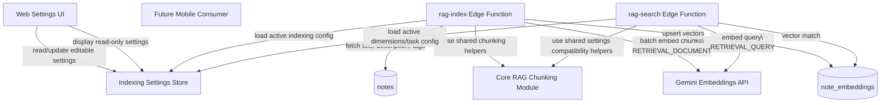

# System Design & Architecture

## Decision Update - 2026-03-17

The chunk assembly design has been refined after review. These rules are the latest source of truth and should take precedence over earlier generic phrases such as "accumulate toward target size" when they conflict.

- Chunk assembly is `paragraph-first`, not `target-first`.
- `min_chunk_size` is the primary threshold for merging neighboring small paragraphs.
- Once `min_chunk_size` is reached, the assembler may add another whole paragraph only if doing so still fits naturally and moves the chunk closer to `target_chunk_size`.
- A whole next paragraph must not be added if it would overshoot `target_chunk_size`, even when it would still fit in `max_chunk_size`.
- If the current chunk is still below `min_chunk_size` and the next whole paragraph would exceed `max_chunk_size`, the next paragraph may be split internally to complete a minimally valid chunk.
- Oversized paragraphs (> `max_chunk_size`) are split at `max_chunk_size` boundaries (minimal cuts), not at `target_chunk_size`. If the last piece after splitting is below `min_chunk_size`, it is merged back into the previous piece. This conscious compromise bounds the effective maximum at `max_chunk_size + min_chunk_size - 1`.
- Final trailing undersized chunks should try backward merge first; if that fails because of `max_chunk_size`, they remain undersized.
- Overlap is intentionally one-directional: `chunk[i + 1] = suffix(chunk[i]) + new_content`.
- Overlap must not cross a section boundary and should prefer natural stop points such as sentence-ending period or text boundary.

## Architecture Overview



- The application owns chunk construction end-to-end.
- Gemini is used only for embeddings and receives already-constructed chunk text.
- Indexing behavior is driven by persisted settings instead of hard-coded constants.
- Search remains functionally unchanged in this feature, but query-side embedding compatibility stays explicit.
- Reusable indexing logic lives in `core` and is shared across web, mobile, and Edge Function integration paths.
- `core` is the source of truth for indexing behavior; platform-specific layers are adapters, not owners of chunking rules.
- In this feature, only the web app gets a settings UI; mobile is intentionally out of scope at the UI layer.

## Data Models

### Indexing settings

The system uses a dedicated per-user table for indexing settings rather than storing them inside `user_api_keys`. This keeps API secrets and indexing behavior separate while still allowing the web UI to present both under the Google API settings tab.

Representative model:

```sql
user_rag_index_settings (
  user_id uuid primary key references auth.users(id) on delete cascade,
  small_note_threshold integer not null default 400,
  target_chunk_size integer not null default 500,
  min_chunk_size integer not null default 200,
  max_chunk_size integer not null default 1500,
  overlap integer not null default 100,
  use_title boolean not null default true,
  use_section_headings boolean not null default true,
  use_tags boolean not null default true,
  updated_at timestamptz not null default now()
)
```

The effective settings object exposed to the UI and indexing paths must support:

```ts
type RagIndexingSettings = {
  small_note_threshold: number
  target_chunk_size: number
  min_chunk_size: number
  max_chunk_size: number
  overlap: number
  use_title: boolean
  use_section_headings: boolean
  use_tags: boolean

  // Read-only/system-defined
  output_dimensionality: number
  task_type_document: "RETRIEVAL_DOCUMENT"
  task_type_query: "RETRIEVAL_QUERY"
  split_strategy: "hierarchical"
  fallback_split_order: ["sections", "paragraphs", "sentences", "tokens_or_characters"]
  chunk_accumulation_rule: string
  small_chunk_merge_rule: string
  chunk_template: string
}
```

### Chunk assembly model

Internal chunk assembly should preserve enough metadata to support stable writes and future debugging:

```ts
type PendingChunk = {
  sectionHeading: string | null
  content: string
  startOffset: number
  endOffset: number
}

type FinalChunk = {
  chunkIndex: number
  charOffset: number
  title: string | null
  text: string
}
```

### Existing embeddings storage

The feature continues to write final chunks into `note_embeddings`, but the embedding vector dimension must stay aligned with `output_dimensionality`:

```sql
note_embeddings (
  note_id      uuid,
  user_id      uuid,
  chunk_index  int,
  char_offset  int,
  content      text,
  embedding    vector(...),
  indexed_at   timestamptz
)
```

## API Design

### Settings UI contract

The UI must be able to:

- read the current indexing settings
- update editable settings without redeploy
- display read-only system settings in the same screen
- expose these settings in the user's Google API settings tab
- resolve and save settings for the authenticated user only

Representative payload:

```json
{
  "small_note_threshold": 400,
  "target_chunk_size": 500,
  "min_chunk_size": 200,
  "max_chunk_size": 1500,
  "overlap": 100,
  "use_title": true,
  "use_section_headings": true,
  "use_tags": true,
  "output_dimensionality": 1536,
  "task_type_document": "RETRIEVAL_DOCUMENT",
  "task_type_query": "RETRIEVAL_QUERY",
  "split_strategy": "hierarchical",
  "fallback_split_order": ["sections", "paragraphs", "sentences", "tokens_or_characters"],
  "chunk_accumulation_rule": "Paragraph-first: accumulate whole paragraphs until min_chunk_size is reached, then optionally extend toward target_chunk_size only if the next whole paragraph fits without exceeding it. Oversized paragraphs are split at max_chunk_size boundaries; if the remainder is below min_chunk_size it is merged back into the previous piece.",
  "small_chunk_merge_rule": "Merge undersized final chunks with adjacent chunks when possible without violating max_chunk_size.",
  "chunk_template": "Section: {section_heading}\\nTags: {tag1}, {tag2}, {tag3}\\n\\n{chunk_content}"
}
```

### `rag-index` behavior

`rag-index` must:

1. load active indexing settings
2. fetch note title, content, and tags
3. derive content structure into sections, paragraphs, sentences, then token/character fallback
4. choose whole-note indexing when note size is below `small_note_threshold`
5. build final chunks using accumulation and merge rules
6. construct final chunk text from `Section`, `Tags`, and content according to enabled flags
7. send title separately via Gemini `title`
8. call Gemini embeddings with `taskType = RETRIEVAL_DOCUMENT`
9. persist vectors into `note_embeddings`

### `rag-search` compatibility

This feature does not alter search ranking logic, but the design must preserve:

- `taskType = RETRIEVAL_QUERY` for query embeddings
- the same `output_dimensionality` for query and document vectors

## Component Breakdown

### Settings UI

- A web settings surface for indexing parameters
- Placement is in the user's Google API settings tab
- Mobile can reuse the same shared settings contract later, but no mobile settings UI is added in this feature
- Editable controls for chunk sizes and content inclusion flags
- Read-only presentation for `output_dimensionality`, task types, split strategy, fallback order, chunk template, and chunking rules

### Settings access layer

- Fetches persisted indexing settings for UI display
- Validates and saves editable settings
- Exposes a single resolved settings object to indexing/search services
- Enforces numeric bounds of `50..5000` for editable numeric settings
- Enforces ordering invariants such as `min_chunk_size <= target_chunk_size <= max_chunk_size`

### Chunking module

- Implemented in shared `core` code with no dependency on `ui/web` or `ui/mobile`
- Parses note content into hierarchical structural units
- Derives sections only from real heading tags `h1` through `h6`
- Accumulates small sibling paragraphs paragraph-first, reaching `min_chunk_size` before considering optional extension toward `target_chunk_size`
- Splits oversized paragraphs into sentences, then token/character-based subparts
- Applies overlap only after final chunks are formed
- Merges undersized final chunks with neighbors when allowed

### Embedding integration

- Reuses Gemini embedding integration pattern already present in `rag-index` and `rag-search`
- Passes note title via Gemini `title`
- Sends chunk text body without duplicating title text inside the chunk content

### Client integration layer

- Web is the only UI consumer in scope for this feature
- Mobile remains a future consumer of shared `core` indexing logic and shared settings contracts
- Platform-specific UI code should only handle presentation, input controls, and transport to backend/settings APIs
- No platform-specific folder should carry its own chunking algorithm or settings-validation fork

## Design Decisions

### Hierarchical splitting before fixed-size fallback

**Decision:** Split by sections, then paragraphs, then sentences, then token/character fallback.

**Why:** This maximizes semantic coherence and makes retrieved chunks easier to interpret than naive fixed-window slicing.

### Section detection only from `h1-h6`

**Decision:** Section boundaries are derived only from actual heading tags `h1` through `h6`.

**Why:** This keeps the behavior deterministic and avoids heuristic heading detection drift across platforms or note formats.

### Overlap applies to final chunks only

**Decision:** `overlap` means repeated boundary content between adjacent final chunks, not intermediate parser overlap.

**Why:** This keeps chunk generation predictable and aligns the setting with user expectations in the UI.

**Clarification:** overlap is one-directional. The next chunk repeats a suffix of the previous chunk at its beginning; chunks do not embed "future context" from the next chunk into their own tail.

### Paragraph-first accumulation

**Decision:** paragraph boundaries are the default chunk assembly boundary, and `min_chunk_size` is the first assembly target.

**Why:** This preserves natural note structure better than greedily filling chunks toward `target_chunk_size`.

**Consequence:** `target_chunk_size` remains useful, but only after `min_chunk_size` has already been reached and only when adding another whole paragraph still makes the resulting chunk a better fit.

### Title is metadata, not chunk body

**Decision:** Title is sent in the Gemini API `title` field and excluded from chunk text.

**Why:** Title still informs embeddings without being redundantly repeated across every chunk body.

### Config-driven indexing

**Decision:** Indexing parameters move into runtime configuration visible in UI.

**Why:** Operators can tune indexing behavior without code edits or redeploys, and the system becomes auditable.

### Dedicated settings table

**Decision:** Store per-user indexing settings in a dedicated table instead of extending `user_api_keys`.

**Why:** API credentials and indexing behavior are separate concerns with different evolution paths, validation rules, and read/write patterns.

### Shared `core` ownership

**Decision:** Chunking, chunk formatting, and settings validation belong in `core`, not web/mobile feature folders.

**Why:** The behavior is domain logic, not presentation logic, and needs to remain reusable across web, mobile, and server-side indexing paths.

**Consequence:** Any platform-specific code should wrap or call the shared `core` logic. If runtime constraints require a thin adapter, that adapter must remain minimal and keep `core` as the canonical ruleset.

### Read-only system parameters stay visible

**Decision:** Task types and chunking rules remain non-editable but are shown in UI.

**Why:** They are operationally important and should be transparent even when intentionally fixed.

## Non-Functional Requirements

- **Consistency:** the same active settings must be used by all indexing runs in a given environment.
- **Scope:** indexing settings are per-user rather than global/shared across all users.
- **Performance:** hierarchical parsing should not create materially slower indexing for ordinary note sizes compared with current fixed-window indexing.
- **Reliability:** invalid settings must be rejected before they can break indexing runs.
- **Compatibility:** `output_dimensionality` changes must not leave document/query vectors mismatched.
- **Security:** each authenticated user can read and edit only their own indexing settings.
- **Observability:** indexing logs should include effective settings identifiers or summaries without logging sensitive note content.

## Open Design Items

- Start defaults are:
  - `small_note_threshold = 400`
  - `target_chunk_size = 500`
  - `min_chunk_size = 200`
  - `max_chunk_size = 1500`
  - `overlap = 100`
- Validation ranges for editable numeric settings are:
  - `small_note_threshold`: `50..5000`
  - `target_chunk_size`: `50..5000`
  - `min_chunk_size`: `50..5000`
  - `max_chunk_size`: `50..5000`
  - `overlap`: `50..5000`
