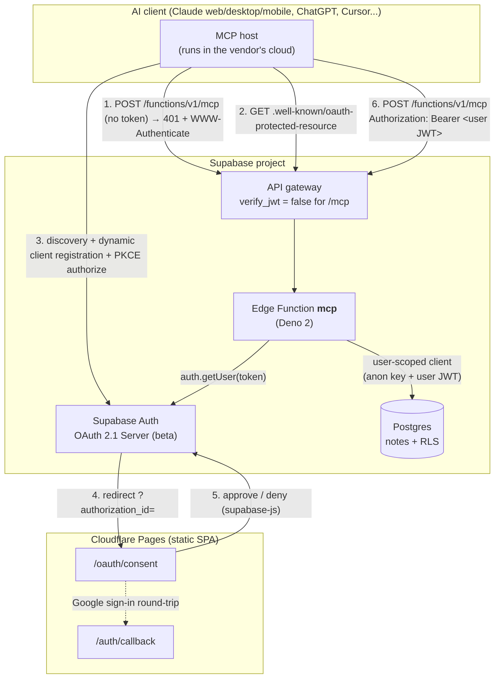
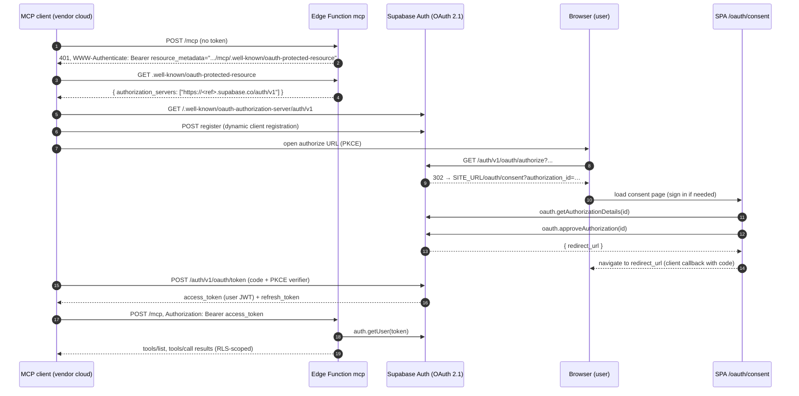

# System Design & Architecture

## Architecture Overview

The notebook is exposed as a **remote MCP server** (Streamable HTTP) running as the Supabase Edge Function `mcp`. Authorization follows the MCP specification: the MCP server is an OAuth *resource server*, Supabase Auth is the *authorization server*, and the EverFreeNote SPA hosts the *consent page* that Supabase's headless OAuth 2.1 server redirects to.



### Key components

| Component | Location | Responsibility |
|-----------|----------|----------------|
| Tool logic | `core/mcp/notebookServer.ts` | Builds an `McpServer` with `list_notes`, `get_note`, `create_note`, `update_note`. Runtime-agnostic, depends only on a `NotebookRepository`. |
| Data access | `core/mcp/supabaseNotebookRepository.ts` | Implements `NotebookRepository` on a Supabase client that carries the user's token, so RLS applies. |
| OAuth resource helpers | `core/mcp/oauthResource.ts` | Pure functions: protected-resource metadata, `WWW-Authenticate` header, bearer extraction, route classification, public origin resolution. |
| Content helpers | `core/mcp/noteContent.ts` | Markup → plain text and excerpts for list results. |
| Write sanitization | `core/mcp/noteHtml.ts` | Allowlist sanitizer (`sanitize-html`) applied to every body an agent sends. |
| HTTP adapter | `supabase/functions/mcp/index.ts` | CORS, routing, token validation, wiring repository + server + `WebStandardStreamableHTTPServerTransport` (stateless, JSON responses). |
| Consent page | `app/oauth/consent/page.tsx`, `ui/web/components/features/oauth/*` | Shows the requesting client, approves or denies via `supabase.auth.oauth.*`, redirects back. Handles the signed-out case inline. |
| Consent return bridge | `ui/web/lib/oauthConsentNavigationState.ts`, `app/auth/callback/page.tsx` | Remembers the pending `authorization_id` across the Google sign-in redirect. |
| Config | `supabase/config.toml` | `[auth.oauth_server]` enabled with dynamic registration; `[functions.mcp] verify_jwt = false`. |

### Technology choices

- **Official MCP TypeScript SDK 1.30** (`@modelcontextprotocol/sdk`) — provides `McpServer`, the Web-standard Streamable HTTP transport that runs on Deno, and `InMemoryTransport` + `Client` for protocol-level Jest tests. Installed in the root workspace for Node; consumed in Deno via `npm:` specifiers in the function's import map.
- **Supabase Auth OAuth 2.1 Server** instead of a hand-rolled OAuth layer or the community `chumbo` wrapper: PKCE, discovery (`/.well-known/oauth-authorization-server/auth/v1`) and dynamic client registration are built in, and issued tokens are ordinary Supabase user JWTs that RLS already understands.
- **Zod 4** (already a project dependency) for tool input/output schemas.

## Data Models

No schema changes. The server reads and writes `public.notes` (`id`, `user_id`, `title`, `description` HTML, `tags text[]`, `created_at`, `updated_at`) through existing RLS policies ("Users can view/insert/update own notes").

Tool-facing shapes (`core/mcp/types.ts`):

```ts
type NoteRecord = { id; title; contentHtml; tags; created_at; updated_at }  // DB column: description
type NoteSummary = { id; title; tags; created_at; updated_at; excerpt }          // list_notes
type NoteDetail  = { id; title; tags; created_at; updated_at; content_html; content_text } // get_note, create_note, update_note
```

## API Design

### MCP endpoint

| Method & path (after `/functions/v1`) | Auth | Behaviour |
|---|---|---|
| `OPTIONS /mcp` | – | CORS preflight. |
| `GET /mcp/.well-known/oauth-protected-resource` | – | RFC 9728 document: `{ resource, authorization_servers: ["<origin>/auth/v1"], bearer_methods_supported: ["header"], resource_name }`. |
| `POST /mcp` without/with invalid token | – | `401`, `WWW-Authenticate: Bearer resource_metadata="<origin>/functions/v1/mcp/.well-known/oauth-protected-resource"[, error="invalid_token", …]`. |
| `POST /mcp` with valid token | Bearer user JWT | Streamable HTTP JSON-RPC (initialize, tools/list, tools/call). Stateless: no `Mcp-Session-Id`; `GET`/`DELETE` are answered by the transport (405 in stateless mode). |

The public origin used in the metadata is resolved in order: `MCP_PUBLIC_ORIGIN` env → `X-Forwarded-Proto`/`X-Forwarded-Host` → `SUPABASE_URL` env → request URL. The issuer can be overridden with `MCP_AUTH_ISSUER`.

Token validation: `supabase.auth.getUser(token)` on a client created with the anon key and `Authorization: Bearer <token>`; the same client is then used for data access so Postgres evaluates RLS as that user. The service-role key is never read by this function. RFC 8707 `resource` binding is not enforced because Supabase tokens carry `aud: "authenticated"`; the risk is accepted since tokens are only accepted from the project's own issuer.

### Tools

| Tool | Input | Output (`structuredContent`) | Annotations |
|------|-------|------------------------------|-------------|
| `list_notes` | `query?` (substring match on title/body, ILIKE), `tag?`, `limit` 1–100 (default 20), `offset` ≥ 0 | `{ notes: NoteSummary[], total, has_more }` | read-only, idempotent |
| `get_note` | `id` (UUID) | `NoteDetail` | read-only, idempotent |
| `create_note` | `title` (1–1000 chars), `content_html?` (default `""`), `tags?` (≤ 50, trimmed, de-duplicated) | `NoteDetail` | non-destructive |
| `update_note` | `id`, at least one of `title`, `content_html`, `tags` | `NoteDetail` | destructive (replaces fields), idempotent |

Every tool returns both `content: [{ type: "text", text: JSON }]` and `structuredContent`. Expected failures (`not found`, no fields to update, database errors) are returned as `isError: true` results with a short message; existence of other users' notes is never revealed (RLS yields "not found").

Body format: `content_html` is the editor's HTML (paragraphs, headings, lists, emphasis, links, code, blockquotes, images, marks). The tool description tells agents to convert Markdown to this HTML.

**Write-side sanitization.** Agents are untrusted input, so `create_note` and `update_note` run every body through `sanitizeNoteHtml()` before it reaches the database: unknown elements, event handlers and script-bearing URLs are discarded, using an allowlist that mirrors the render-side DOMPurify profile in `core/services/sanitizer.ts`. Render paths keep sanitizing as before; this is the second layer, and it matters because notes are also served to third parties through public share links.

### OAuth flow (sequence)



## Component Breakdown

### Backend (Deno)
- `supabase/functions/mcp/index.ts` — request handler (`Deno.serve`).
- `supabase/functions/mcp/deno.json` + `import_map.json` — maps `@core/`, `@supabase/supabase-js` (esm.sh, same pin as sibling functions), `@modelcontextprotocol/sdk/` (`npm:`), `zod` (`npm:`).

### Shared core (Node + Deno)
- `core/mcp/types.ts`, `noteContent.ts`, `oauthResource.ts`, `supabaseNotebookRepository.ts`, `notebookServer.ts`.
- Constraint: relative imports with explicit `.ts` extensions and no `@/` path aliases (the same rule `core/rag/*` follows), so Deno can resolve them.

### Frontend (Next.js static export)
- `app/oauth/consent/page.tsx` — route with `Suspense` (required for `useSearchParams` in static export).
- `ui/web/components/features/oauth/OAuthConsentPageClient.tsx` — state machine: missing id → signed-out → loading details → ready (approve/deny) → redirecting; error states.
- `ui/web/lib/oauthConsentNavigationState.ts` — sessionStorage bridge; `app/auth/callback/page.tsx` consumes it and returns to the consent page instead of `/`.

## Design Decisions

- **Edge Function, not a separate service**: the SPA is static; Supabase already hosts the project's server code; the function shares the gateway origin with Auth, which keeps discovery URLs simple.
- **Stateless transport with JSON responses**: Edge Functions are short-lived and multi-instance; sessions and SSE resumption would need shared storage. Each JSON-RPC call is one request, which every MCP client supports.
- **Repository interface between tools and Supabase**: makes the tool layer testable with a fake repository through a real MCP client, and isolates the only Deno/Node-sensitive dependency (supabase-js) in one file.
- **User-scoped client instead of service role + manual `user_id` filters** (the pattern of the older REST functions): defence in depth — RLS is the boundary even if a query forgets a filter.
- **Metadata served under the function path**: the function cannot serve `/.well-known/...` at the project root. The MCP spec allows the resource server to name the metadata URL in `WWW-Authenticate`, which all current clients honour.
- **No delete tool** — owner's explicit decision for v1; RLS delete policy stays untouched.
- **Rejected alternatives**: personal access token in a query string (leaks into logs, not spec-compliant); `chumbo` community wrapper (extra dependency for what Supabase now provides natively); Cloudflare Worker (second runtime and deployment pipeline).

## Non-Functional Requirements

- **Static analysis note**: the Codacy pattern `ESLint8_xss_no-mixed-html` was removed from `.codacy/codacy.config.json`. It infers "this value is HTML" from identifier names, so in this module it fired on every wire-format ↔ column mapping and even on `const char = html[index]`, and it cannot be suppressed per file: `eslint-plugin-xss` is ESLint 8-only and crashes under the project's ESLint 9. XSS coverage stays with CodeQL, Semgrep, SonarQube, DOMPurify on render and `sanitizeNoteHtml()` on write.
- **Security**: OAuth 2.1 + PKCE; tokens validated on every request; RLS-scoped data access; no service-role key; CORS exposes only MCP headers; `WWW-Authenticate` never echoes the token.
- **Performance**: one Supabase round-trip for auth plus one for data per tool call; `list_notes` bounded to 100 rows and uses the existing `notes_user_id_idx` / `notes_updated_at_idx`.
- **Reliability**: no in-memory state, safe under cold starts and multiple instances; expected errors are surfaced as MCP tool errors, never as 500s.
- **Compatibility**: MCP protocol negotiation handled by the SDK; JSON responses satisfy clients that accept `application/json, text/event-stream`.
- **Observability**: function logs (`console.error`) on configuration and unexpected errors; Supabase dashboard shows OAuth clients and grants.
