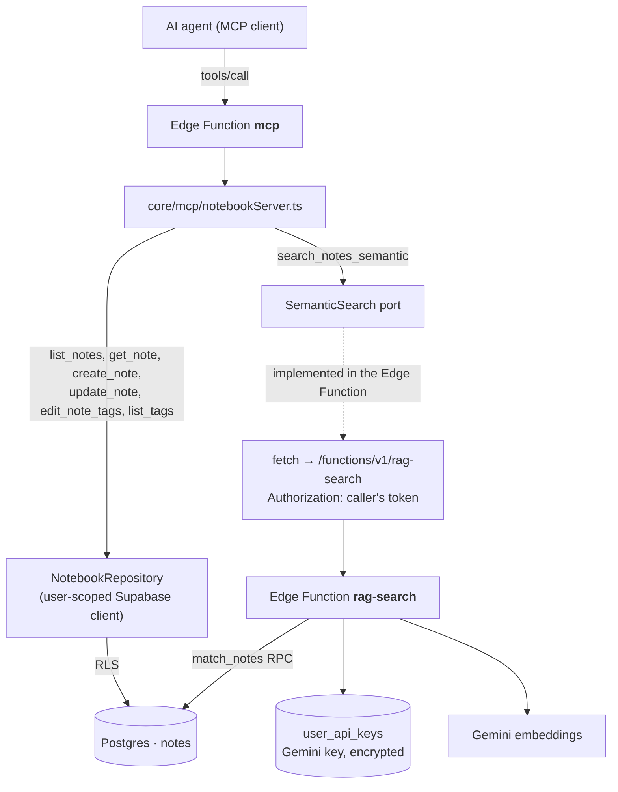

# System Design & Architecture

## Architecture Overview

Two additions to the existing MCP server. Tag work stays inside the current data path (user-scoped Supabase client under RLS). Semantic search delegates to the `rag-search` Edge Function, which already owns the Gemini key handling.



The `SemanticSearch` port mirrors the existing `NotebookRepository` pattern: `core/mcp` stays runtime-agnostic and testable with a fake, while the network call lives in the Edge Function adapter.

## Tools

| Tool | Status | Input | Output |
|------|--------|-------|--------|
| `list_tags` | **new** | `query?` (substring), `limit` 1–500 (default 100) | `{ tags: [{name, count}], total, truncated }` |
| `list_notes` | changed | `tags?: string[]` and `tag_match?: 'all' \| 'any'` replace the single `tag` | unchanged |
| `edit_note_tags` | **new** | `id`, `add?: string[]`, `remove?: string[]` | the updated note |
| `search_notes_semantic` | **new** | `query`, `limit` 1–50 (default 10), `min_similarity?`, `tag?` | `{ notes: [{id, title, tags, similarity, excerpts[]}], total }` |
| `get_note`, `create_note`, `update_note` | unchanged | | |

### `list_tags`

There is no RPC for the tag vocabulary, so the repository selects only the `tags` column for the user's notes (capped at `TAG_SCAN_NOTE_LIMIT = 5000`) and aggregates in memory. Counting is case-insensitive; the spelling reported is the first one seen, which matches `getTagsWithCounts` in the web app. Sorted by count descending, then by name. `truncated` tells the agent the cap was hit so it does not present the list as exhaustive.

### `list_notes` tag filter

`tags` is an array; `tag_match` chooses the operator:

| `tag_match` | PostgREST | SQL | Uses `idx_notes_tags` (GIN) |
|---|---|---|---|
| `all` (default) | `.contains('tags', [...])` | `tags @> ARRAY[...]` | yes |
| `any` | `.overlaps('tags', [...])` | `tags && ARRAY[...]` | yes |

`all` is the default because "notes tagged X and Y" is the ordinary reading of several tags. For one tag the two are identical.

Tag values are matched exactly, as the column stores them — the same behaviour the single-tag filter had. `list_tags` is how an agent learns the exact spelling.

### `edit_note_tags`

Read-modify-write inside the repository, on the user-scoped client:

1. Read the note's current tags (returns "not found" when RLS yields nothing).
2. Remove every tag whose lowercase form appears in `remove`.
3. Append every tag in `add` whose lowercase form is not already present, preserving the caller's spelling for genuinely new tags.
4. Write the result back and return the note.

Adding a tag that already exists, or removing an absent one, is a no-op that still succeeds — agents retry, and a retry must not be an error. At least one of `add`/`remove` must be non-empty.

This is not atomic against a concurrent writer, but it is strictly better than `update_note`'s blind replacement: the window is one round trip instead of the agent's entire reasoning turn.

### `search_notes_semantic`

The port:

```ts
type SemanticSearchParams = { query: string; limit: number; minSimilarity: number | null; tag: string | null }
type SemanticSearchOutcome =
  | { status: 'ok'; notes: SemanticNoteHit[] }
  | { status: 'unavailable'; reason: 'missing_api_key' | 'model_mismatch' | 'not_configured'; message: string }
```

The Edge Function implementation POSTs to `/functions/v1/rag-search` with the caller's `Authorization` header and `{ query, topK, threshold, filterTag }`, then maps the response:

| `rag-search` result | Tool result |
|---|---|
| 200 with chunks | grouped by note, one entry each, `similarity` = best chunk, `excerpts` = that note's chunk texts |
| 200 with no chunks | `ok` with an empty list and a note that nothing passed the threshold |
| 400 "Gemini API key not configured…" | `unavailable` / `missing_api_key` — tells the user to add the key in Settings |
| 409 embedding-model mismatch | `unavailable` / `model_mismatch` — tells the user to re-index |
| anything else | tool error with the upstream message |

Defaults come from the shared RAG settings so MCP behaves like the app: `topK` 15 capped to the requested `limit`, `threshold` 0.55 unless `min_similarity` is given.

Grouping by note is deliberate: the agent gets a shortlist to open with `get_note`, matching how the rest of the toolset works, and avoids flooding the context with chunk text.

## Component Breakdown

| File | Change |
|---|---|
| `core/mcp/types.ts` | `listTags`, `editNoteTags` on `NotebookRepository`; `SemanticSearch` port and its types |
| `core/mcp/tagVocabulary.ts` | **new** — case-insensitive aggregation and the add/remove merge, both pure |
| `core/mcp/supabaseNotebookRepository.ts` | implement `listTags` and `editNoteTags`; widen the list filter to `tags` + `tagMatch` |
| `core/mcp/notebookServer.ts` | register the three tools, widen `list_notes`, accept an optional `SemanticSearch` |
| `core/mcp/semanticSearch.ts` | **new** — response mapping and grouping, pure |
| `supabase/functions/mcp/index.ts` | build the `SemanticSearch` implementation from the request origin and token |

## Design Decisions

- **Reuse `rag-search` over reimplementing.** The alternative is to duplicate Gemini embedding, AES-GCM key decryption and the `match_notes` call inside `core/mcp`. That would put the decryption secret in a second place and double the surface to keep in step with the app's RAG settings. One internal HTTP hop is a small price.
- **A port, not a direct fetch in the tool layer.** Keeps `core/mcp` free of network concerns and keeps the protocol tests hermetic.
- **Aggregate tags in the function rather than add an RPC.** Avoids a migration on two Supabase projects for a personal-scale notebook. The cap and the `truncated` flag make the limit visible rather than silent.
- **Incremental tag editing as its own tool** rather than new modes on `update_note`, so the destructive and non-destructive operations are distinguishable in the tool list and through annotations.
- **`unavailable` as a normal result, not an error.** A missing Gemini key is a setup fact the agent should relay, not a failure it should retry.

## Non-Functional Requirements

- **Security** — unchanged: same bearer token, same RLS, no service-role key, no new secret. The forwarded token reaches only the project's own `rag-search`.
- **Performance** — tag filters use the existing GIN index. `list_tags` reads one array column for up to 5000 notes. Semantic search adds one internal hop on top of the existing embedding round-trip.
- **Cost** — every semantic search spends Gemini embedding quota on the user's own key, exactly as the app's AI search does. The tool description says so.
