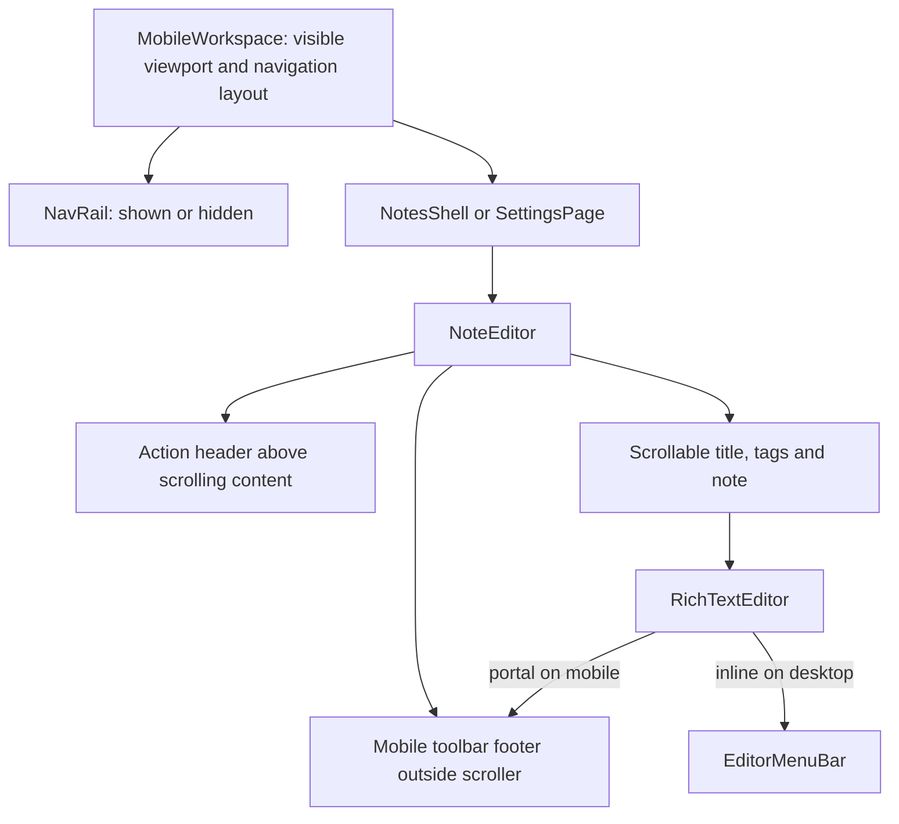

# Mobile editor layout design

## Architecture Overview

## Components
MobileWorkspace owns mobile chrome geometry and captures descendant vertical scrolls. A context exposes navigation visibility to NavRail. It reserves navigation height, hides it after downward movement, restores it upward, and ignores horizontal/popup scrolls. VisualViewport resize/scroll keeps the workspace within the visible keyboard viewport; zoom does not count as a keyboard.
NoteEditor isolates its scroll layer below the action header. A mobile-only footer hosts the existing editor toolbar outside scrolling content via a portal, reserving its actual layout height without guessed content padding.
EditorMenuBar preserves desktop controls; mobile groups paragraph/headings, inline formats, lists and alignment using existing Radix menus. Inline formats use checkbox items so marks remain independently combinable; exclusive choices use radio items. The mobile order is text style, inline formats, lists, alignment, history, then secondary tools. Font family uses an Aa icon and keeps the current choice visible inside its menu; font size stays numeric. Buttons remain horizontally scrollable with 44px touch targets. Menus open upward and commands keep the Tiptap selection. A formatting-only useEditorState subscription keeps labels and checked states current without rerendering the whole note on each transaction.

## Data Models
Transient UI state only: scroll direction anchor per scroller, navigation hidden state, visible viewport geometry, footer DOM target. Mobile editor expansion is cleared on real note switches and editor unmount, while first-save note ID assignment preserves it. No saved-note or workspace-tab schema changes.

## API Design
Internal React props/context and a toolbar portal target only. Existing editor commands and autosave contracts remain unchanged.

Drag handling observes pointer movement at the document boundary, leaves touch scrolling native, supports mouse dragging and suppresses clicks after movement. Radix compound triggers defer opening from pointerdown to click; keyboard activation remains available.

## Design Decisions
Reserve actual toolbar space outside the scroll container to guarantee the last paragraph is reachable. Scope stacking to the scroll surface to keep tags and suggestions behind the action header. Reuse the same formatting component and commands on both breakpoints. Navigation space is released when hidden, with reduced-motion support for its slide animation.

## Non-functional Requirements
No new dependencies or backend requests. Scroll processing updates React only at visibility transitions. Accessible group names, active states, keyboard focus and hidden-navigation inertness. Native keyboard testing remains a separate validation receipt.

## Design Review
Each of the six acceptance criteria maps to a component responsibility and browser regression. Implementation order: reproduce, workspace/footer geometry, groups, regression/viewport checks, final review.

## Fullscreen editing
MobileWorkspace exposes transient expansion state to NoteEditor, owned by the editing session. Expanded mobile chrome is hidden with display:none while the existing editor and metadata stay mounted. The footer reserves a fixed 44px toggle beside its independently scrollable formatting area. Expansion changes layout only; it does not invoke the browser Fullscreen API or recreate Tiptap.
