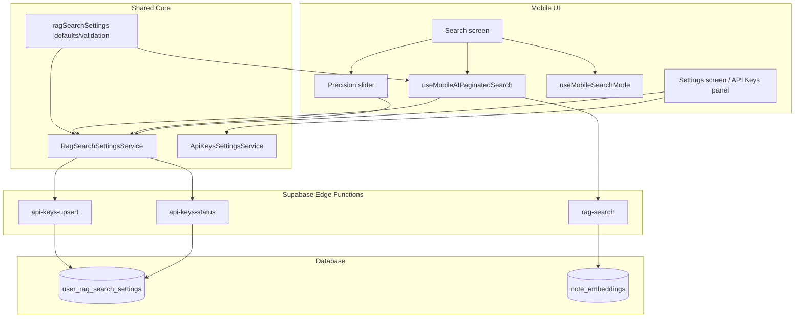

# System Design & Architecture

## Architecture Overview
**What is the high-level system structure?**



- Mobile UI gets retrieval settings from the same shared `core` service contract as web.
- Mobile search still owns its own React Native interaction layer, but no longer owns retrieval presets as product logic.
- Backend remains unchanged in principle; the mobile task is mostly wiring and UX parity.

## Data Models
**What data do we need to manage?**

### Persisted retrieval settings
Use the shared `core/rag/searchSettings` model:

```typescript
interface RagSearchEditableSettings {
  top_k: number
  similarity_threshold: number
}

interface RagSearchReadonlySettings {
  output_dimensionality: number
  task_type_document: "RETRIEVAL_DOCUMENT"
  task_type_query: "RETRIEVAL_QUERY"
  load_more_overfetch: 1
  max_top_k: 100
  offset_delta_threshold: number
}
```

### Mobile local state
```typescript
interface MobileSearchModeState {
  isAIEnabled: boolean
  viewMode: "note" | "chunk"
}

interface MobilePrecisionState {
  draftThreshold: number
  committedThreshold: number
}
```

- `preset` is removed from mobile local state.
- Retrieval settings are sourced from the server-backed shared model instead.

## API Design
**How do components communicate?**

### Existing backend contracts to reuse
- `api-keys-status`
  - already returns `gemini` and `ragSearch`
- `api-keys-upsert`
  - already persists retrieval settings
- `rag-search`
  - already accepts numeric `topK` and `threshold`
  - already returns `chunks` plus `hasMore`

### Mobile service usage
- `ApiKeysSettingsService`
  - remains responsible for Gemini key status/save/remove
- `RagSearchSettingsService`
  - new mobile consumer for retrieval settings loading/updating

### Mobile search request model
```typescript
{
  query: string
  topK: ragSearchSettings.top_k
  threshold: committedThreshold
  filterTag?: string | null
}
```

## Component Breakdown
**What are the major building blocks?**

### Mobile settings
- Extend `ui/mobile/components/settings/ApiKeysSettingsPanel.tsx`
  - keep Gemini key management
  - add retrieval settings section(s)
  - show editable `topK`
  - show read-only retrieval metadata

### Mobile search controls
- Update `ui/mobile/components/search/SearchControls.tsx`
  - remove `AiSearchPresetSelector`
  - add a mobile-friendly precision slider
- Update `ui/mobile/hooks/useMobileSearchMode.ts`
  - remove persisted preset
  - keep AI enabled flag and `Notes/Chunks` view mode

### Mobile AI search hook
- Update `ui/mobile/hooks/useMobileAIPaginatedSearch.ts`
  - consume persisted retrieval settings instead of `SEARCH_PRESETS`
  - use backend `hasMore`
  - align pagination behavior with web where appropriate

### Mobile results list
- Update `ui/mobile/components/search/SearchResultsList.tsx`
  - if needed, adapt chunk rendering and counts to the newer retrieval behavior
  - preserve mobile-native list performance and gestures

## Design Decisions
**Why did we choose this approach?**

### 1. Reuse shared retrieval settings contract
- Reason: web already validated the model and backend contract.
- Benefit: consistent behavior across platforms and less drift.

### 2. Keep mobile-specific UI while matching web product semantics
- Reason: React Native interaction patterns differ, but product meaning should stay the same.
- Benefit: mobile feels native without inventing a second retrieval model.

### 3. Remove preset-based product logic from mobile
- Reason: presets are now legacy product UX superseded by persisted settings + precision slider.
- Benefit: web/mobile parity and simpler reasoning about search quality.

### 4. Extend existing API key panel instead of adding a new tab
- Reason: mobile settings currently consolidate external integrations in one place, and this feature is a continuation of Gemini/RAG configuration.
- Benefit: smaller UX surface and lower navigation churn.

## Non-Functional Requirements
**How should the system perform?**

- Performance:
  - slider interactions must remain smooth
  - search refetch only on slider commit/release
  - list rendering should stay FlashList-friendly
- Reliability:
  - fallback defaults must appear when retrieval settings fail to load
  - Gemini key flow must not regress
- Maintainability:
  - retrieval settings logic stays in shared core
  - mobile-specific presentation stays in mobile components/hooks
- Consistency:
  - mobile and web should apply the same persisted retrieval settings for the same user
