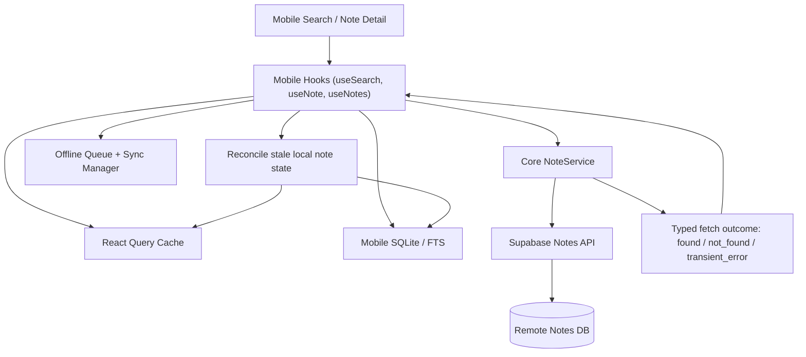

# System Design & Architecture

## Architecture Overview
**What is the high-level system structure?**

- `core/services/notes.ts` becomes the canonical place that classifies note-read outcomes from Supabase.
- `ui/mobile/hooks/useNote.ts` applies fallback policy based on that classification instead of treating every exception the same way.
- `ui/mobile/hooks/useSearch.ts` and related search screen behavior keep the user in the same search context while stale results are reconciled away.
- The feature intentionally relies on explicit refresh boundaries instead of background realtime convergence. In v1, the confirmed refresh boundaries are manual refresh, full app close and reopen, and repeated search execution.
- Mobile SQLite remains the local fallback store, but remote deletion reconciliation becomes an explicit part of lifecycle management.
- Existing offline queue and sync manager remain in place for local writes and deferred cloud sync.

## Data Models
**What data do we need to manage?**

- Existing entities remain:
  - Remote note record in Supabase.
  - Local note row in mobile SQLite with `is_deleted` and `is_synced`.
  - React Query cache entries for note list, note detail, and search results.
  - Offline mutation queue items for `create`, `update`, and `delete`.
- New logical model:
  - `RemoteNoteLookupResult`
    - `status: 'found' | 'not_found' | 'transient_error'`
    - `note?: Note`
    - `error?: Error`
- Reconciliation outcome:
  - When `status === 'not_found'` and the app is online, the local note is marked deleted or removed from local caches and SQLite so it no longer appears in local list/search fallback.
- Conflict state:
  - Existing pending local edits remain governed by the current project conflict policy.
  - Remote deletion must not silently discard queued local edits; the queue and resolution path remain authoritative for deciding whether a later local write wins.

## API Design
**How do components communicate?**

- `NoteService.getNote(id)`:
  - Current behavior throws generic errors.
  - Proposed behavior returns a typed outcome or throws only for truly unexpected states.
  - A server-side missing row becomes `not_found`, not a generic exception.
- `useNote(id)`:
  - If offline or the remote lookup result is `transient_error`, local fallback is allowed.
  - If the remote lookup result is `not_found` while online, local fallback is not treated as a normal open path.
  - In `not_found`, the hook triggers reconciliation of local caches/storage, shows deleted-note feedback, and returns the user to the notes list or search context they came from.
- Search/list reconciliation:
  - Active search/list queries are invalidated or refetched at the confirmed lifecycle points for this feature:
    - manual refresh
    - full app close and reopen
    - repeated search execution
  - Removed note IDs are pruned from React Query search/list/detail caches.
- Cross-platform behavior:
  - Web and mobile should follow the same product rule set: refreshed or repeated-search data should stop surfacing remotely deleted notes, and stale open attempts should resolve into deleted-note handling rather than a normal open experience.
- Local storage integration:
  - Existing `databaseService.markDeleted(noteId, userId)` or equivalent cleanup path becomes the main mobile-side remote-delete reconciliation primitive.

## Component Breakdown
**What are the major building blocks?**

- Core services:
  - `core/services/notes.ts`
    - classify Supabase note fetch outcomes
    - centralize "not found" versus retryable failure semantics
- Mobile hooks:
  - `ui/mobile/hooks/useNotes.ts`
    - adjust single-note fallback behavior
    - optionally strengthen list refresh behavior after screen return or reconciliation
  - `ui/mobile/hooks/useSearch.ts`
    - keep regular search aligned with current remote truth when online
  - `ui/mobile/hooks/useNotesMutations.ts`
    - reuse existing cache invalidation and local deletion primitives where relevant
- Mobile storage:
  - `ui/mobile/services/database.ts`
    - mark stale remotely deleted notes as deleted locally
    - ensure local FTS/list queries exclude reconciled rows
- Mobile screens/components:
  - `ui/mobile/app/(tabs)/search.tsx`
  - `ui/mobile/app/note/[id].tsx`
    - surface user-facing deleted-note messaging and avoid misleading open flows

## Design Decisions
**Why did we choose this approach?**

- Classify remote outcomes in `core`, not only in mobile UI:
  - This keeps network semantics reusable and avoids scattering Supabase-specific error parsing across hooks.
- Keep offline fallback, but only for retryable or offline conditions:
  - This preserves the value of local caching without lying about remote truth.
- Treat online `not_found` as authoritative for normal read flows:
  - If the server is reachable and says the note is gone, the app should reconcile to that state.
- Use explicit refresh boundaries in v1 instead of background screen-focus or foreground sync triggers:
  - This matches the confirmed UX and keeps the first implementation simpler.
- Reuse existing SQLite `is_deleted` and cache invalidation patterns:
  - This minimizes schema churn and fits the current mobile stack.
- Preserve existing conflict policy rather than inventing a new one inside this feature:
  - The feature should integrate with current sync/conflict behavior, not replace it.
- For remote deletion versus unsynced local edits, the expected resolution is restoration from the local edited version through the existing conflict policy:
  - This avoids introducing new conflict-specific UI in this feature.
- Avoid full realtime or tombstone architecture in the first pass:
  - Reconciliation at lifecycle boundaries is sufficient for the stated problem and matches the medium priority.

## Non-Functional Requirements
**How should the system perform?**

- Performance:
  - Remote outcome classification must add negligible overhead to note opening.
  - Search reconciliation should not reset the user's query or tag filter.
- Reliability:
  - Local fallback must continue working for genuine transient errors and offline mode.
  - Reconciliation must reliably remove stale notes from React Query caches and SQLite-backed queries.
  - Deleted-note open attempts must reliably navigate the user back to the prior context after feedback is shown.
- Security:
  - Continue using authenticated Supabase access patterns.
  - Do not expose additional note data in deleted-state messaging.
- Maintainability:
  - The distinction between `not_found` and `transient_error` should be implemented once and reused.
  - Mobile UI should consume a stable semantic result instead of interpreting raw transport errors.
