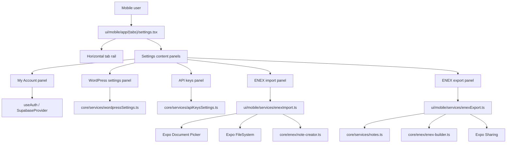

# System Design & Architecture

## Architecture Overview
**What is the high-level system structure?**

- Key components and responsibilities
  - `settings.tsx`
    - Owns selected tab state and page-level styling.
    - Hosts the horizontal scrollable tab bar and shared page shell.
  - `My Account panel`
    - Shows authenticated email.
    - Handles sign out, theme mode, and destructive account deletion confirmation.
    - Preserves existing settings responsibilities that currently live on the screen outside the requested tab redesign.
  - `ENEX import panel`
    - Launches native file picker.
    - Reads `.enex` content from device storage.
    - Parses notes into a RN-safe structure and writes them using existing note creation logic.
  - `ENEX export panel`
    - Loads notes for the signed-in user.
    - Builds `.enex` XML using the shared builder.
    - Persists to a temporary file and opens native share/save flow.
  - `WordPress settings panel`
    - Reuses `WordPressSettingsService`.
    - Mirrors existing validation and success/error behavior from web.
  - `API keys panel`
    - Reuses `ApiKeysSettingsService`.
    - Mirrors existing validation and success/error behavior from web.

## Data Models
**What data do we need to manage?**

- Core UI model
  - `SettingsTabKey = "account" | "import" | "export" | "wordpress" | "apiKeys"`
  - Each tab has:
    - label
    - icon
    - description
    - render function / component

- Account panel state
  - `email: string`
  - `themeMode: "system" | "light" | "dark"`
  - `confirmDelete: boolean`
  - `isDeleting: boolean`
  - `errorMessage?: string`

- Import panel state
  - `selectedFileName?: string`
  - `isImporting: boolean`
  - `importSummary?: { success: number; errors: number; message: string }`
  - `errorMessage?: string`

- Export panel state
  - `isExporting: boolean`
  - `lastExportFileName?: string`
  - `exportedNotesCount?: number`
  - `errorMessage?: string`

- WordPress/API key panel state
  - Existing status payloads from shared service classes.
  - Local form input values.
  - Loading/saving/error/success state.

- ENEX mobile import structure
  - `ParsedNote`
    - `title: string`
    - `content: string`
    - `created: Date`
    - `updated: Date`
    - `tags: string[]`
    - `resources: []`
  - Resources are not expanded in the first mobile-native implementation path; raw note HTML is preserved where possible.

- ENEX mobile export structure
  - Shared `ExportNote` from `core/enex/export-types.ts`.
  - Mobile export emits note title, HTML description, tags, timestamps, and an empty `resources` array.

## API Design
**How do components communicate?**

- Existing internal service interfaces
  - `ApiKeysSettingsService.getStatus()`
  - `ApiKeysSettingsService.upsert(geminiApiKey)`
  - `WordPressSettingsService.getStatus()`
  - `WordPressSettingsService.upsert({ siteUrl, wpUsername, applicationPassword, enabled })`
  - `AuthService.deleteAccount()` via `useAuth()`
  - `NoteService.getNotes()` / `getNotesByIds()`
  - `NoteCreator.create()`

- New mobile-only service interfaces
  - `MobileEnexImportService.importDocument(options): Promise<ImportResult>`
  - `MobileEnexExportService.exportAllNotes(userId): Promise<{ fileUri: string; fileName: string; noteCount: number }>`

- Native integration contracts
  - File import:
    - `DocumentPicker.getDocumentAsync(...)` returns a picked `.enex` file URI.
    - `FileSystem.readAsStringAsync(uri)` loads XML text.
  - File export:
    - `FileSystem.writeAsStringAsync(tempFileUri, xml)`
    - `Sharing.shareAsync(tempFileUri, { mimeType: "application/xml" })`

- Authentication/authorization approach
  - All settings and note operations continue to use the authenticated Supabase session supplied by `SupabaseProvider`.
  - Import writes and export reads operate only on the current user's notes.

## Component Breakdown
**What are the major building blocks?**

- Frontend components
  - `ui/mobile/app/(tabs)/settings.tsx`
  - `ui/mobile/components/settings/SettingsTabBar.tsx`
  - `ui/mobile/components/settings/SettingsTabButton.tsx`
  - `ui/mobile/components/settings/SettingsPanelCard.tsx`
  - `ui/mobile/components/settings/AccountSettingsPanel.tsx`
  - `ui/mobile/components/settings/EnexImportPanel.tsx`
  - `ui/mobile/components/settings/EnexExportPanel.tsx`
  - `ui/mobile/components/settings/WordPressSettingsPanel.tsx`
  - Updated `GeminiApiKeySection` or replacement inline `ApiKeysSettingsPanel.tsx`

- Services/modules
  - `ui/mobile/services/enexImport.ts`
  - `ui/mobile/services/enexExport.ts`
  - Existing shared services for account/API/WordPress.

- Third-party/native dependencies
  - Expo document picker for choosing import files.
  - Expo file system for reading and writing ENEX files.
  - Expo sharing for handing export files to the native share sheet.

## Design Decisions
**Why did we choose this approach?**

- Decision: Replace modal-first settings interactions with inline tab panels.
  - Pros: closer to the provided design, fewer context switches, easier to compare sections.
  - Cons: more state lives on the screen instead of being isolated in modals.

- Decision: Keep horizontal tabs scrollable instead of compressing labels.
  - Pros: preserves readability of long labels like `Import .enex file`.
  - Cons: requires careful spacing and active-state styling.

- Decision: Reuse backend/service contracts for WordPress and API keys.
  - Pros: consistent validation and data model between web and mobile.
  - Cons: mobile UI must mirror service error handling carefully.

- Decision: Build mobile-native ENEX import/export services instead of reusing browser-specific `core/enex` orchestrators.
  - Pros: avoids DOM/File API mismatch in React Native.
  - Cons: mobile service logic is partially duplicated around parsing/orchestration.

- Alternatives considered
  - Keep current sectioned list and only remove `Soon` badges.
  - Open separate modal screens for each setting.
  - Send import/export to an external web page instead of supporting native file actions.

## Non-Functional Requirements
**How should the system perform?**

- Performance targets
  - Tab switching should feel immediate (<100ms local state updates).
  - Settings status loads should show feedback without blocking the whole screen.
  - Export should keep the UI responsive while the archive is generated.
  - Existing sign-out and theme toggling should remain immediate local interactions.

- Security requirements
  - Do not expose stored API keys or WordPress passwords in plaintext.
  - Preserve existing encrypted-storage behavior for remote credentials.
  - Require explicit destructive confirmation before account deletion.

- Reliability/availability needs
  - Errors from remote services should render inline and preserve user input.
  - Import/export failures should produce actionable feedback instead of silent failure.
  - If native sharing is unavailable, the user should receive a clear error message.
