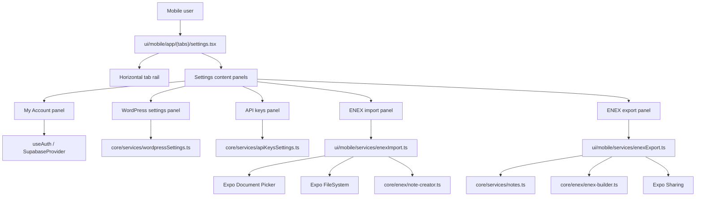

# System Design & Architecture

## Architecture Overview
**What is the high-level system structure?**

- Key components and responsibilities
  - `settings.tsx`
    - Owns selected tab state and page-level styling.
    - Hosts the horizontal scrollable tab bar and shared page shell.
  - `My Account panel`
    - Shows authenticated email.
    - Handles sign out, theme mode, and destructive account deletion confirmation.
    - Preserves existing settings responsibilities that currently live on the screen outside the requested tab redesign.
  - `ENEX import panel`
    - Launches native file picker.
    - Reads `.enex` content from device storage.
    - Parses notes into a RN-safe structure and writes them using existing note creation logic.
    - Exposes the same duplicate-handling controls as the web import dialog, backed by shared `core/enex` metadata.
  - `ENEX export panel`
    - Loads notes for the signed-in user.
    - Builds `.enex` XML using the shared builder.
    - Persists to a temporary file and opens native share/save flow.
  - `WordPress settings panel`
    - Reuses `WordPressSettingsService`.
    - Mirrors existing validation and success/error behavior from web.
  - `API keys panel`
    - Reuses `ApiKeysSettingsService`.
    - Mirrors existing validation and success/error behavior from web.

## Data Models
**What data do we need to manage?**

- Core UI model
  - `SettingsTabKey = "account" | "import" | "export" | "wordpress" | "apiKeys"`
  - `SettingsTabDefinition` currently includes:
    - `key`
    - `label`
  - Iconography, descriptions, and render/component wiring live outside `SettingsTabDefinition` in the current implementation.

- Account panel state
  - `email: string`
  - `themeMode: "system" | "light" | "dark"`
  - `confirmDelete: boolean`
  - `isDeleting: boolean`
  - `errorMessage?: string`

- Import panel state
  - `selectedFileName?: string`
  - `duplicateStrategy: "prefix" | "skip" | "replace"`
    - Default: `"prefix"` from shared `core/enex` metadata in `DEFAULT_IMPORT_SETTINGS`.
    - Maps to shared `core/enex` duplicate-handling controls and `NoteCreator.create()` behavior:
      - `"prefix"` keeps the incoming note and rewrites the imported title to `[duplicate] ${title}`.
      - `"skip"` keeps the existing note and returns no new note when the imported title matches the existing-title snapshot.
      - `"replace"` updates the existing note selected from the existing-title snapshot for that title.
    - Duplicate criteria are currently title-based only:
      - existing notes are correlated by exact `title` matches from `core/enex/import-shared.ts`;
      - notes repeated inside the same import batch are correlated by exact repeated `title` values in `seenTitlesInImport`.
      - Persistent GUIDs, timestamps, and content hashes are not currently used for duplicate detection.
  - `skipFileDuplicates: boolean`
    - Default: `false` from shared `core/enex` metadata in `DEFAULT_IMPORT_SETTINGS`.
    - Despite the UI copy `Skip duplicates inside imported file(s)`, this flag currently applies to duplicate note titles seen within the current import batch, not attachments/resources and not a global skip-all mode.
    - When enabled, `core/enex` duplicate handling records each imported note title in `seenTitlesInImport` and skips later notes in the same import session that repeat that title.
  - `isImporting: boolean`
  - `progress: ImportProgressState`
    - `null` when idle
    - `{ stage: "reading" }` while the selected `.enex` file is being loaded from disk
    - `{ stage: "importing"; processed: number; total: number }` while parsed notes are being written
    - `EnexImportPanel.tsx` uses the `stage` discriminator to decide whether to render a generic "Reading .enex file..." message or a note counter.
  - `feedback?: { variant: "error" | "success" | "info"; message: string }`
    - This runtime state replaces a separate `importSummary`/`errorMessage` split in the implementation.

- Export panel state
  - `isExporting: boolean`
  - `lastExportFileName?: string`
  - `exportedNotesCount?: number`
  - `errorMessage?: string`

- WordPress/API key panel state
  - Existing status payloads from shared service classes.
  - Local form input values.
  - Loading/saving/error/success state.

- ENEX mobile import structure
  - `ParsedNote`
    - `title: string`
    - `content: string`
    - `created: Date`
    - `updated: Date`
    - `tags: string[]`
    - `resources: []`
  - Resources are not expanded in the first mobile-native implementation path; raw note HTML is preserved where possible.

- ENEX mobile export structure
  - Shared `ExportNote` from `core/enex/export-types.ts`.
  - Mobile export emits note title, HTML description, tags, timestamps, and an empty `resources` array.

## API Design
**How do components communicate?**

- Existing internal service interfaces
  - `ApiKeysSettingsService.getStatus()`
  - `ApiKeysSettingsService.upsert(geminiApiKey)`
  - `WordPressSettingsService.getStatus()`
  - `WordPressSettingsService.upsert({ siteUrl, wpUsername, applicationPassword, enabled })`
  - `AuthService.deleteAccount()` via `useAuth()`
  - `NoteService.getNotes()` / `getNotesByIds()`
  - `NoteCreator.create()`

- New mobile-only service interfaces
  - `MobileEnexImportService.importAsset(asset, userId, settings, onProgress?): Promise<ImportResult>`
    - `onProgress?` receives `{ processed: number; total: number }`
  - `MobileEnexImportService.importXml(xml, userId, settings, onProgress?): Promise<ImportResult>`
    - `onProgress?` receives `{ processed: number; total: number }`
  - `MobileEnexExportService.exportAllNotes(userId, onProgress?): Promise<{ fileUri: string; fileName: string; noteCount: number }>`
    - `onProgress?` receives staged export updates:
      - `{ stage: "loading"; loaded: number; total: number }`
      - `{ stage: "building"; noteCount: number }`
      - `{ stage: "writing"; noteCount: number; fileName: string }`

- Native integration contracts
  - File import:
    - `DocumentPicker.getDocumentAsync(...)` returns a picked `.enex` file URI.
    - `FileSystem.readAsStringAsync(uri)` loads XML text.
  - File export:
    - `FileSystem.writeAsStringAsync(tempFileUri, xml)`
    - `Sharing.shareAsync(tempFileUri, { mimeType: "application/xml" })`

- Authentication/authorization approach
  - All settings and note operations continue to use the authenticated Supabase session supplied by `SupabaseProvider`.
  - Import writes and export reads operate only on the current user's notes.

## Component Breakdown
**What are the major building blocks?**

- Frontend components
  - `ui/mobile/app/(tabs)/settings.tsx`
  - `ui/mobile/components/settings/SettingsTabBar.tsx`
  - `ui/mobile/components/settings/SettingsTabButton.tsx`
  - `ui/mobile/components/settings/SettingsPanelCard.tsx`
  - `ui/mobile/components/settings/AccountSettingsPanel.tsx`
  - `ui/mobile/components/settings/EnexImportPanel.tsx`
  - `ui/mobile/components/settings/EnexExportPanel.tsx`
  - `ui/mobile/components/settings/WordPressSettingsPanel.tsx`
  - Updated `GeminiApiKeySection` or replacement inline `ApiKeysSettingsPanel.tsx`

- Services/modules
  - `ui/mobile/services/enexImport.ts`
  - `ui/mobile/services/enexExport.ts`
  - Existing shared services for account/API/WordPress.

- Third-party/native dependencies
  - Expo document picker for choosing import files.
  - Expo file system for reading and writing ENEX files.
  - Expo sharing for handing export files to the native share sheet.

## Design Decisions
**Why did we choose this approach?**

- Decision: Replace modal-first settings interactions with inline tab panels.
  - Pros: closer to the provided design, fewer context switches, easier to compare sections.
  - Cons: more state lives on the screen instead of being isolated in modals.

- Decision: Keep horizontal tabs scrollable instead of compressing labels.
  - Pros: preserves readability of long labels like `Import .enex file`.
  - Cons: requires careful spacing and active-state styling.

- Decision: Reuse backend/service contracts for WordPress and API keys.
  - Pros: consistent validation and data model between web and mobile.
  - Cons: mobile UI must mirror service error handling carefully.

- Decision: Build mobile-native ENEX import/export services instead of reusing browser-specific `core/enex` orchestrators.
  - Pros: avoids DOM/File API mismatch in React Native.
  - Cons: mobile service logic is partially duplicated around parsing/orchestration.

- Decision: Keep duplicate-handling controls aligned with the web import dialog and centralize their definitions in shared `core/enex` metadata.
  - The duplicate-handling controls are `duplicateStrategy` (`"prefix" | "skip" | "replace"`) plus `skipFileDuplicates`.
  - The shared `core/enex` metadata currently lives in `core/enex/import-shared.ts` and includes:
    - `DEFAULT_IMPORT_SETTINGS` for defaults;
    - `DUPLICATE_STRATEGY_OPTIONS` and `IMPORT_SETTINGS_COPY` for the visible controls/copy;
    - `fetchExistingTitles()` / `resolveExistingTitlesForImport()` for the existing-title snapshot used by both web and mobile orchestration.
  - Why these three strategies were chosen:
    - `prefix` is the safest default because it preserves imported content even when a duplicate exists or duplicate lookup is temporarily unavailable.
    - `skip` matches the intent of users who trust the current library state and want deduplication without creating new notes.
    - `replace` is the highest-risk option because it overwrites an existing note, but it is still needed for explicit parity with the web import flow and for users who intentionally want the imported version to win.
  - Duplicate criteria used today:
    - existing-note duplicates are determined by exact title match against the existing-title snapshot (`id`, `title`, `created_at`), with the newest `created_at` row winning when duplicate titles already exist in the database;
    - in-file duplicates are determined by exact repeated titles tracked in `seenTitlesInImport`;
    - persistent GUIDs, timestamps, and content hashes are not part of duplicate correlation in the current implementation.
  - Why web/mobile alignment matters:
    - users see the same duplicate-handling controls on both clients;
    - imports remain predictable when users switch devices or compare results between mobile and web;
    - shared `core/enex` metadata reduces copy drift and duplicate-strategy mismatches across clients.

- Alternatives considered
  - Keep current sectioned list and only remove `Soon` badges.
  - Open separate modal screens for each setting.
  - Send import/export to an external web page instead of supporting native file actions.

## Non-Functional Requirements
**How should the system perform?**

- Performance targets
  - Tab switching should feel immediate (<100ms local state updates).
  - Settings status loads should show feedback without blocking the whole screen.
  - Export should keep the UI responsive while the archive is generated.
  - Existing sign-out and theme toggling should remain immediate local interactions.

- Security requirements
  - Do not expose stored API keys or WordPress passwords in plaintext.
  - Preserve existing encrypted-storage behavior for remote credentials.
  - Require explicit destructive confirmation before account deletion.

- Reliability/availability needs
  - Errors from remote services should render inline and preserve user input.
  - Import/export failures should produce actionable feedback instead of silent failure.
  - If native sharing is unavailable, the user should receive a clear error message.
