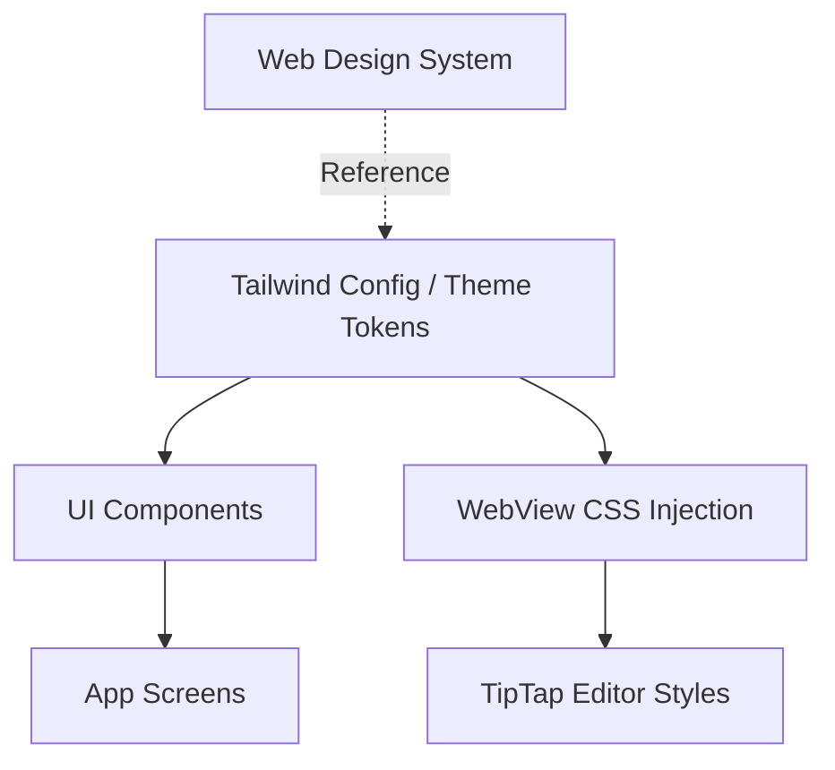

# System Design & Architecture

## Architecture Overview
**What is the high-level system structure?**

The design system will be centralized using Tailwind CSS (via NativeWind) and a core theme configuration.

## Data Models
**What data do we need to manage?**

- **Design Tokens**: 
  - Colors: Mapping web's `oklch` palette. Since React Native doesn't support `oklch` natively, we will use a conversion tool or define Hex equivalents for the mobile theme while maintaining the same visual identity.
  - Spacing: 1rem (16px) as the base unit.
  - Typography: **Inter** font family integration via `expo-font`. Custom font mapping in `tailwind.config.js`.
- **Component Variants**: 
  - Button: Primary, Secondary, Outline, Ghost.
  - Input: Focused, Error states.

## API Design
**How do components communicate?**

- **Prop-driven styles**: Components will accept variant and size props.
- **Tailwind classes**: Use `className` with NativeWind for styling.

## Component Breakdown
**What are the major building blocks?**

- **Core UI Components**:
  - `ui/Button`: Based on Radix/Shadcn approach in web.
  - `ui/Input`: Standardized styles.
  - `NoteCard`: Redesigned to match web's note card aesthetics.
  - `ScreenHeader`: Custom header component replacing default Expo stack header where needed.
- **Styles**:
  - `ui/mobile/global.css`: Base tailwind imports and custom variable definitions.

## Design Decisions
**Why did we choose this approach?**

- **NativeWind**: Allows using Tailwind classes, making it easier to copy/adapt styles from the web version.
- **Tailwind Config**: Centralizes colors and typography so they can be changed in one place.
- **WebView Style Bridge**: To ensure the TipTap editor matches the app theme, we will inject a CSS snippet or use a shared stylesheet injected via `injectedJavaScript` that mirrors the native theme's colors and fonts.
- **OKLCH to Hex**: We will pre-convert `oklch` values to Hex for the `tailwind.config.js` to ensure compatibility across all mobile devices without complex runtime polyfills.

## Non-Functional Requirements
**How should the system perform?**

- **Performance**: Styling should not impact 60 FPS scrolling in FlashList.
- **Consistency**: 100% color and font alignment with web.
