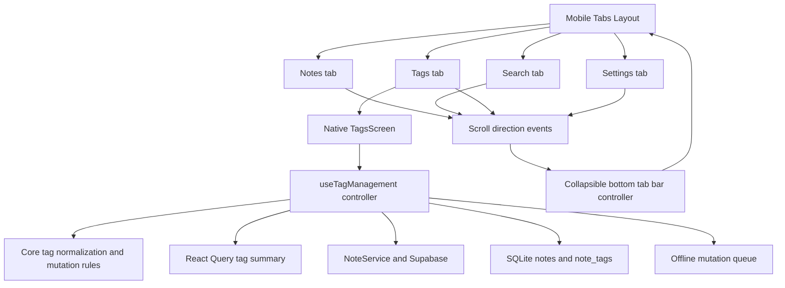

# Mobile Tag Management Design

## Architecture Overview

The feature adds a native screen and a main navigation route while reusing the existing core tag semantics, React Query cache, local SQLite cache, and offline synchronization. The web page is a behavioral reference, not a component to copy.



## Navigation

`ui/mobile/app/(tabs)/_layout.tsx` remains the owner of the main tabs. Add a `tags` route with a native `Tag` icon and the existing theme/header conventions. The route should be a sibling of Notes, Search, and Settings, not a nested Settings tab.

The Tags screen uses the existing search route for tag navigation. Selecting a tag passes the same tag parameter currently understood by mobile Search so the two screens do not develop separate filtering implementations.

## Component Boundaries

Suggested native components:

- `TagsScreen`: screen composition, loading/error/empty state, and screen-level scroll event wiring.
- `TagSearchInput`: an `Input`-based search field with a trailing clear X action when text is present.
- `AlphabeticalIndex`: horizontally scrollable native buttons. Selection is assignment (`selectedLetter = clickedLetter`), not a boolean toggle that can turn another letter off.
- `TagSectionList`: grouped list/grid of tag cards with stable keys and count labels.
- `TagCard`: native card with tag name, note count, and an accessible action trigger.
- `TagActionModal` / `RenameTagModal`: platform-neutral React Native modal for actions and text entry. Do not depend on iOS-only `Alert.prompt`.
- `useTagManagement`: query, search/group derivation, mutation orchestration, optimistic updates, invalidation, and error recovery.
- `CollapsibleTabBarController`: shared direction/threshold state used by the tabs layout and scrollable child screens.

Existing `TagChip`, `TagList`, `TagFilterBar`, `Input`, `Button`, and theme tokens should be reused where their interaction model fits. Web `TagCard`, `AlphabeticalGrid`, and dialog JSX should not be imported into mobile.

## Data Contracts

The presentation model should be independent of the web component shape:

```ts
type MobileTagSummary = {
  name: string
  count: number
  letter: string
}

type AffectedNoteTags = {
  id: string
  tags: string[]
}

type TagMutation = {
  tag: string
  replacement?: string
}
```

The existing `useAllTags` aggregate result remains available for note-editor autocomplete, but it is not the data source for this screen because it loses canonical display values and affected note records. Tag Management will use a user-scoped `['tags', 'management', userId]` query whose data is the complete note set needed to derive summaries and perform local optimistic updates. It must not update only notes in the currently loaded FlashList page.

## Concrete Service and Queue Contract

- Add `NoteService.getAllNotes(userId)` using the existing note projection and user filter. The mobile management query calls it when online, caches the result in SQLite, and falls back to local notes when the network request fails.
- Add `NoteService.renameTag(userId, sourceTag, replacementTag)` and `NoteService.deleteTag(userId, sourceTag)`. Each method loads all notes, applies the shared pure operation, updates only changed notes, and returns the changed notes. The operation is idempotent so a retry after a partial network success is safe.
- Extend `MutationOperation` with `renameTag` and `deleteTag`, and define a typed payload containing `tag`, optional `replacement`, and `user_id`. A bulk queue item uses a stable synthetic `noteId` for compaction/storage because the existing SQLite schema requires a non-null note ID.
- `MobileSyncService` replays bulk items through the service methods and persists returned changed notes locally. `compactQueue` preserves bulk tag operations and keeps their chronological order instead of treating them as ordinary note updates. The sync manager removes queue rows discarded by compaction so failed superseded operations cannot be replayed later.
- The screen's query derives `TagWithCount[]` with `getTagsWithCounts` and groups it with `groupTagsAlphabetically`, preserving web casing and locale behavior. Local fallback uses the same derivation.

## Domain Semantics

Reuse or extract the pure logic already established by the web/core tag service:

- compare tags case-insensitively after trimming;
- preserve a trimmed canonical display value consistent with first-seen web behavior;
- rename matching tags and deduplicate each note's resulting tag array;
- delete matching tags;
- remove empty/invalid duplicates before persistence where the existing service contract requires it;
- sort and group with the same locale-aware Latin/Cyrillic/`#` rules.

The domain functions should remain deterministic and independently testable. React Native components should only handle presentation and user interaction.

## Online Mutation Flow

1. Load the complete note set through the `['tags', 'management', userId]` query.
2. Compute the optimistic note set using the shared pure domain function and update the local/cache view.
3. Call `NoteService.renameTag` or `NoteService.deleteTag`, which applies the operation to every affected server note.
4. Persist returned changed notes locally and invalidate `['tags', 'management', userId]`, the legacy tag summary key, and relevant note/search queries.
5. If the online call fails before completion, enqueue the typed bulk operation and keep the optimistic local result; the sync banner/queue remains the retry signal.
6. If a non-retryable validation error occurs, restore/refetch the previous query data and show an actionable error.

## Offline Mutation Flow

The chosen strategy is a typed bulk operation. While offline, the screen applies the pure operation to cached local notes and enqueues one `renameTag` or `deleteTag` item with the normalized source tag, optional trimmed replacement, and authenticated user ID. The queue item is authoritative for the complete operation; it is not inferred that an incomplete local cache means all server notes were changed. On reconnect, sync loads the complete server note set, applies the idempotent operation, persists changed notes, and removes the queue item only after success.

When a bulk operation and a per-note update coexist, queue replay order follows `clientUpdatedAt`. Local note updates are built from the already-optimistically-updated local note, so a later note edit does not reintroduce a pre-mutation tag. Repeated bulk operations with the same synthetic key are compacted to the latest pending operation without converting them into ordinary note updates; superseded queue rows are deleted as part of the compaction pass. Replayed bulk payloads validate the source tag, user ID, and rename replacement before the operation can be removed as successful.

## Collapsible Bottom Tab Bar

The tabs layout owns one visibility state initialized to `true`. Scrollable tab screens report direction and offset through a `CollapsibleTabBarProvider` context/controller rather than directly mutating tab layout state. Notes, Search, Tags, and any vertical Settings content use the same controller; horizontal Settings tab navigation does not affect it.

Behavior:

- `offset <= 0` forces visible;
- downward movement beyond a threshold hides;
- upward movement beyond a threshold shows;
- tab focus/navigation resets visibility to visible;
- small direction changes are accumulated or throttled to prevent flicker;
- the initial implementation uses a 16 px accumulated threshold and a 180 ms native transition.

Use a native transform/animated style while retaining safe-area padding. Content must include enough bottom inset when the bar is visible and remain reachable when it is hidden. The controller should expose a pure, testable state transition function separate from animation details. Reset the controller on tab focus so a newly opened screen never inherits a hidden bar.

## Error, Loading, and Accessibility Design

- Render loading skeleton/placeholder, empty state, and error state without assuming a non-null user or query result.
- Announce destructive actions clearly and use an explicit confirmation for deletion.
- Give the clear button, alphabet letters, tag action trigger, rename input, and delete confirmation accessible labels/roles.
- Preserve minimum touch targets and avoid relying on color alone for selected alphabet state.
- Use theme colors from `ui/mobile/lib/theme.ts` and support dark mode.

## Risks and Mitigations

| Risk | Mitigation |
| --- | --- |
| Offline cache does not contain every affected note | Use a completeness-aware service/queue strategy; never report a partial bulk edit as complete |
| Rename produces casing or duplicate drift from web | Centralize pure normalization and mutation rules; add parity tests |
| Bulk updates create many queue items | Prefer an idempotent bulk queue operation where needed; otherwise batch and surface sync status |
| Scroll direction makes the tab bar flicker | Threshold, throttling/accumulation, top reset, and transition tests |
| Tab bar overlays content | Safe-area-aware insets and native layout/manual QA on both platforms |
| Concurrent edits are overwritten | Refetch/reconcile affected notes and define retry/conflict behavior in implementation |

## Design Review Outcome

The design covers every requirements goal and user story: native top-level navigation, web-compatible tag semantics, search/clear/index/card actions, complete online operations, offline queue/replay, accessible states, and shared collapsible navigation. No web component or new UI dependency is required. The remaining validation points are implementation-level: confirm Supabase response typing for the full-note projection, verify queue compaction with the new operation values, and smoke-test animated tab-bar safe-area behavior on both platforms.
