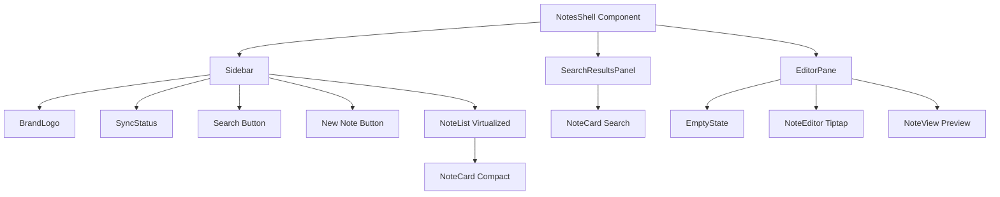

# System Design & Architecture

## Architecture Overview
The redesign focuses entirely on the frontend layout, typography, components, and CSS design system. It updates style definitions in Tailwind CSS v4 and refreshes UI structures in Next.js pages and components.

The layout consists of the main `NotesShell` which coordinates the display of `Sidebar` (including `NoteList` and `NoteCard`), the search results panel, and the `EditorPane` (containing `NoteEditor` and `NoteView`).

### Component Responsibilities:
1. **Sidebar**: Handles main navigation, search opening, settings triggering, creation of new notes, and layout wrapper for `NoteList`.
2. **NoteList**: Virtualized container displaying `NoteCard` elements.
3. **NoteCard**: Individual compact or search card representing a note.
4. **NoteView**: Displays the title, tags, and rendered content of a note in a clean, legible reading interface.
5. **NoteEditor**: Houses the interactive title inputs, tags editor, and Tiptap rich-text editor menu and workspace.

## Design Decisions & Aesthetic System
To achieve a premium, modern, and elegant feel, we will implement the following design decisions:

### 1. Typography & Grid System
- **Font Family**: Standardizing on **Inter** (imported via Google Fonts) for clean UI labels.
- **Readable Content Width**: Restrict the note content area to a max width of `3xl` or `4xl` (`max-w-3xl` / `max-w-4xl`) and center it. This prevents lines from being too long, which increases reading fatigue.
- **Margins & Spacing**: Increase whitespace in both reader and editor modes. Premium design relies on breathing room.

### 2. Styling Tokens (`app/globals.css`)
We will refine our color palette to use premium oklch coordinates:
- Softer, more modern background shades:
  - Light background: Soft off-white / light slate (`oklch(99% 0.003 256)`).
  - Dark background: Sleek charcoal-slate (`oklch(18% 0.015 256)`).
- Cards:
  - Light card: Pure white with extremely subtle shadows (`oklch(100% 0 0) shadow-sm`).
  - Dark card: Softer slate with elevated borders (`oklch(22% 0.012 256)`).
- Primary accents: Keep the Emerald theme but make it slightly more vibrant and adjusted for contrast in dark mode.
- Interactive elements: Smooth Transitions (`transition-all duration-200 ease-in-out`), hover scales (`hover:scale-[1.01]`), and clean active states.

### 3. Component Refinement
- **Sidebar**:
  - Turn the search button into a beautiful, pill-shaped trigger with transition states.
  - Simplify sync status into a small indicator light next to the app logo.
  - User profile area at the bottom: cleaner alignment, rounded avatar.
- **Note Cards**:
  - Remove harsh borders. Use a soft background color change for selection.
  - Modernize tags: rounded pills with very low opacity backgrounds matching the theme.
- **Note View / Editor**:
  - Redesign the toolbar: compact, floating style or beautifully segmented buttons.
  - Seamless inputs: note title input should have no borders, only changing focus styles gently.

## Responsive Adaptation
- **Mobile Touch Targets**: Make sure all buttons, toggles, and note card clickable surfaces have a minimum size of 44x44px.
- **Layout Toggling**: Use Tailwind classes (`hidden md:flex`) to show/hide the sidebar and editor panels contextually depending on whether a note is being viewed or edited.
