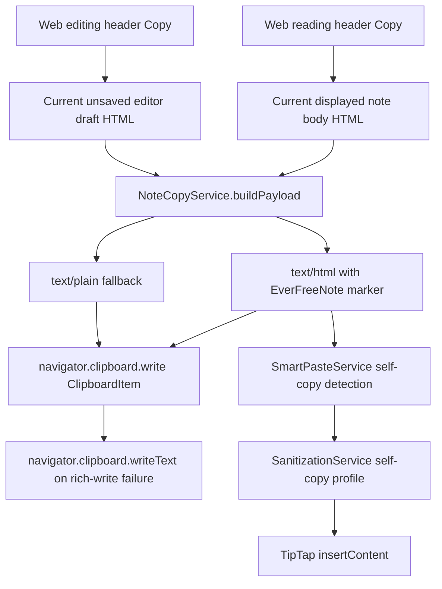

# Design

## Summary

- The feature adds note-level copy actions on web reading and editing headers.
- Copy uses a shared `NoteCopyService` to produce both rich HTML and plain text from note body HTML.
- Rich HTML is wrapped with an EverFreeNote self-copy marker before it reaches the browser clipboard.
- Smart paste detects the marker and uses a stricter internal-copy sanitizer path that preserves editor-supported formatting without weakening generic external paste behavior.
- Mobile copy support is intentionally excluded from this PR and should be revisited separately.

## Flow



## Components

- `core/services/noteCopy.ts`
  - Builds the clipboard payload.
  - Wraps copied HTML in `data-everfreenote-copy="note-body"`.
  - Produces a readable plain-text fallback.
  - Provides helper logic for extracting self-copy wrapper contents.
- `core/services/smartPaste.ts`
  - Detects EverFreeNote self-copy HTML before generic sanitization.
  - Routes self-copy payloads through the internal sanitizer profile.
  - Leaves non-EverFreeNote external paste behavior on the default path.
- `core/services/sanitizer.ts`
  - Keeps the default external-source sanitizer conservative.
  - Adds an explicit self-copy profile for editor-owned attributes and safe inline styles.
- `ui/web/lib/noteClipboard.ts`
  - Writes a dual-format `ClipboardItem` when available.
  - Falls back to `navigator.clipboard.writeText(payload.text)` if rich writes fail or are unavailable.
- `ui/web/components/features/notes/NoteView.tsx`
  - Adds reading-mode `Copy` between `Edit` and `Delete`.
- `ui/web/components/features/notes/NoteEditor.tsx`
  - Adds editing-mode `Copy` between `Read` and `Save`.
  - Copies current draft HTML from editor state.

## Clipboard Payload

The payload has two representations:

- `html`: EverFreeNote wrapper plus body HTML, intended for rich paste targets and EverFreeNote self-copy round trips.
- `text`: readable plain-text fallback, including task checkbox state where possible.

The wrapper is intentionally narrow:

```html
<div data-everfreenote-copy="note-body">...</div>
```

Only payloads carrying that marker are eligible for the self-copy sanitizer profile.

## Sanitization

Default paste behavior remains conservative. The self-copy path may preserve editor-owned attributes and safe inline styles because the payload originates from EverFreeNote and carries the self-copy marker.

Allowed self-copy fidelity includes:

- task-list metadata such as `data-type` and `data-checked`
- semantic blocks such as headings, paragraphs, lists, and blockquotes
- links and images after normal URL safety checks
- supported inline style properties such as color, background color, text alignment, font family, and font size

## UI Placement

- Reading mode order: `Edit | Copy | Delete | More`.
- Editing mode order: `Read | Copy | Save | More`.
- Button styling follows the reading-mode header actions so read/edit headers feel consistent.
- The `Copy` button includes a copy icon and visible text on desktop web.

## Error Handling

- Web copy shows success feedback when clipboard write completes.
- If rich clipboard write fails, the web helper attempts `writeText`.
- If both rich and plain-text writes fail, the caller surfaces a copy failure message.

## Testing

- Unit tests cover `NoteCopyService` payload generation and wrapper extraction.
- Unit/integration tests cover smart-paste self-copy behavior and default external paste regression behavior.
- Web component tests cover reading/editing copy button placement and clipboard invocation.
- Clipboard helper tests cover rich writes, rich-write fallback to plain text, and missing clipboard capability failures.

## Deferred Work

- Mobile copy support is deferred because the mobile app copy path and WebView/runtime behavior need a separate design and device-validation pass.
