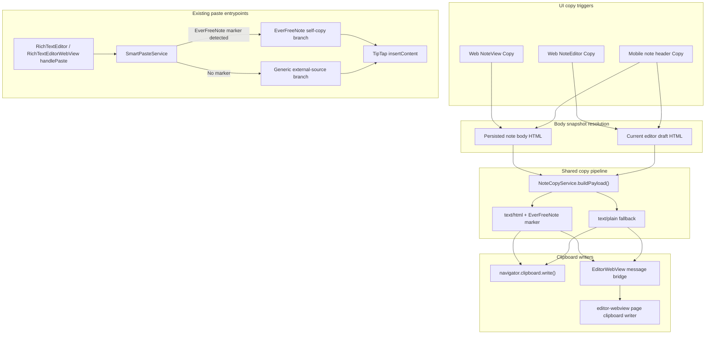

# System Design & Architecture

## Architecture Overview
**What is the high-level system structure?**

- The feature adds note-level copy actions on web and mobile and routes them through a shared copy payload builder plus a smart-paste self-copy branch.
- Web writes rich clipboard data directly from the browser context.
- Mobile triggers copy from the native header but delegates rich clipboard write to the editor WebView page so HTML-capable clipboard APIs remain available in the browser context.
- Paste detection is extended to recognize EverFreeNote-origin clipboard payloads and preserve supported internal formatting with a more permissive but still safe sanitization profile.



- Key components and responsibilities
  - `NoteCopyService`: builds note-body clipboard payloads from HTML input.
  - Web note headers: trigger copy for reading/editing modes.
  - Mobile note screen: resolves current body HTML and sends a new copy command through the existing WebView bridge.
  - `EditorWebViewPage`: writes rich clipboard data on mobile and returns success/failure state.
  - `SmartPasteService`: detects EverFreeNote self-copy payloads and preserves editor-supported formatting.

## Data Models
**What data do we need to manage?**

- New shared clipboard payload model:

```ts
type NoteCopyPayload = {
  plainText: string
  html: string
  source: 'everfreenote-note-body'
  version: 1
}
```

- HTML payload contract:
  - wraps note body HTML in a lightweight EverFreeNote marker that can be detected before sanitization.
  - example marker shape:

```html
<div data-everfreenote-copy="note-body" data-everfreenote-version="1">
  ...editor html...
</div>
```

- Message bridge payload for mobile:

```ts
type CopyNoteBridgePayload = {
  plainText: string
  html: string
  source: 'everfreenote-note-body'
  version: 1
}
```

- Paste detection extension:

```ts
type PasteSource =
  | 'everfreenote-self-copy'
  | 'external'

type PasteResolutionContext = {
  source: PasteSource
}
```

- Data flow notes:
  - editor snapshot source differs by mode, but downstream copy payload format stays identical.
  - no persistent data model or database schema changes are required.

## API Design
**How do components communicate?**

- Internal service interfaces:

```ts
type ClipboardWriteResult = {
  ok: boolean
  reason?: 'unsupported' | 'permission-denied' | 'unknown'
}

function buildNoteCopyPayload(html: string): NoteCopyPayload
function detectEverFreeNoteSelfCopy(payload: PastePayload): boolean
function resolvePaste(
  payload: PastePayload,
  options?: SmartPasteOptions,
  forcedType?: PasteType
): PasteResult
```

- Web integration:
  - Web note components call a shared copy handler.
  - The handler resolves body HTML, builds a payload, and writes `text/html` + `text/plain` via `navigator.clipboard.write()` when available, with fallback to `writeText`.

- Mobile integration:
  - `note/[id].tsx` resolves body HTML:
    - reading mode: current note description
    - editing mode: `EditorWebViewHandle.getContent()`
  - React Native sends a new `COPY_NOTE` message to `app/editor-webview/page.tsx`.
  - The page performs clipboard write and posts `COPY_NOTE_RESULT` back to native.

- Paste path:
  - existing `handlePaste` entrypoints stay the same.
  - `SmartPasteService` inspects raw HTML before sanitization.
  - if the EverFreeNote marker is present, the self-copy branch preserves editor-owned formatting and structure.

- Authentication/authorization:
  - no new auth model or backend endpoints are introduced.

## Component Breakdown
**What are the major building blocks?**

- Frontend components
  - `ui/web/components/features/notes/NoteView.tsx`
  - `ui/web/components/features/notes/NoteEditor.tsx`
  - `ui/mobile/app/note/[id].tsx`
  - `app/editor-webview/page.tsx`
  - `ui/mobile/components/EditorWebView.tsx`

- Shared/core modules
  - new `core/services/noteCopy.ts` for copy payload construction and plain-text derivation
  - updated `core/services/smartPaste.ts`
  - updated `core/services/sanitizer.ts` and/or smart-paste style filtering helpers for self-copy allowances

- Tests
  - web unit tests for copy action handlers
  - mobile bridge tests for `COPY_NOTE` / `COPY_NOTE_RESULT`
  - smart paste unit/integration coverage for self-copy detection and round-trip preservation

## Design Decisions
**Why did we choose this approach?**

- Copy note body only
  - This matches the target paste surface: the editor body.
  - Copying title/tags in the same payload would create awkward body pastes and harder round-trip semantics.

- Dedicated EverFreeNote self-copy marker
  - Generic external-source sanitization is intentionally lossy for safety and theme consistency.
  - Internal copy needs better fidelity, so self-copy must be recognized explicitly rather than inferred from generic HTML shape.

- Keep the generic smart-paste branch intact
  - External paste behavior should stay stable.
  - Self-copy fidelity should not weaken protections or formatting policies for outside sources like Google Docs or ChatGPT.

- Mobile rich clipboard write happens in the WebView page
  - React Native header UI is the right trigger location.
  - Browser-context clipboard APIs are the best place to attempt HTML clipboard writes.
  - This avoids introducing a second HTML serialization path in native code.

- Self-copy formatting allowances are selective, not unrestricted
  - Preserve editor-owned structures/styles that EverFreeNote itself emits and understands.
  - Continue stripping dangerous tags/attributes and unsafe URLs.

- Alternatives considered
  - Plain-text-only copy: rejected because it cannot satisfy EverFreeNote round-trip fidelity.
  - Reusing the generic external paste sanitizer unchanged: rejected because it strips editor-supported formatting such as alignment, font settings, and task-list semantics.
  - Moving mobile copy entirely into native clipboard APIs: rejected for the first version because plain-text native clipboard is not enough for rich round-trip fidelity.

## Non-Functional Requirements
**How should the system perform?**

- Performance targets
  - Copy action should complete quickly enough to feel immediate on web and mobile.
  - Mobile bridge should support large note bodies through chunked transport without freezing the UI.

- Security requirements
  - HTML remains sanitized before insertion.
  - Only editor-owned self-copy attributes/styles are additionally preserved.
  - Unsafe URL protocols and scriptable attributes must still be stripped.

- Reliability/availability needs
  - Web copy should fall back to plain-text clipboard when rich clipboard write is unavailable.
  - Mobile copy should surface a clear failure message if the WebView clipboard write fails.
  - Existing offline/local-bundle editor behavior must remain compatible with the copy bridge.

- Fidelity requirements for self-copy path
  - Preserve supported structure: paragraphs, headings, lists, blockquotes, links, inline emphasis, images, task lists.
  - Preserve supported editor formatting where emitted by EverFreeNote:
    - text alignment
    - font family
    - font size
    - text color / highlight when represented by the editor’s own HTML

- Compatibility expectations
  - Non-EverFreeNote destinations may still degrade formatting based on destination clipboard support.
  - EverFreeNote round-trip paste is the primary fidelity target.
