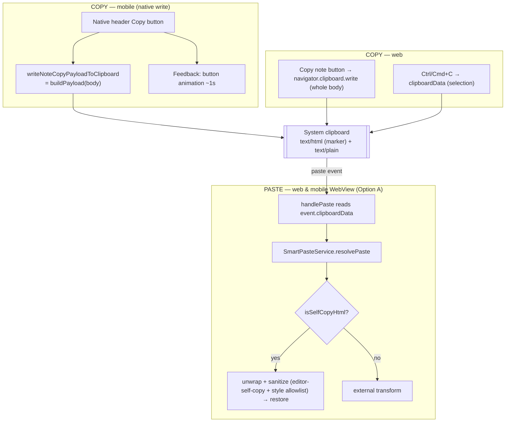

# System Design & Architecture

## Architecture Overview
**What is the high-level system structure?**

The clipboard **format contract** is shared by web and mobile via one builder
(`NoteCopyService.buildPayload`). The **mechanism** differs per side, chosen by
what each platform can actually do reliably:

- **Copy = native / gesture-backed write.** The whole-note copy is triggered by a
  button outside the editor (mobile native header button; web "Copy note"
  button). A button-triggered `postMessage` into the WebView has **no user
  activation**, so a gesture-backed in-WebView clipboard write is not reliable on
  Android. Therefore:
  - Web "Copy note" button writes the whole body via `navigator.clipboard.write`
    (real click gesture) — already works.
  - Mobile native header button writes via `expo-clipboard`
    (`writeNoteCopyPayloadToClipboard`) using the same `buildPayload`.
  - Web in-editor `Ctrl/Cmd+C` copies the **selection** via `clipboardData`
    inside the real `copy` DOM event (Option A) — already works.
- **Paste = pure Option A (inside the WebView).** Paste reads
  `event.clipboardData` in the editor's `handlePaste`; the self-copy marker is
  detected inside `SmartPasteService.resolvePaste`. We **remove the read-side
  crutch**: the in-memory `noteClipboardCache` and the native
  `CLIPBOARD_PASTE_REQUEST` read path.

What gets deleted is the actual crutch — the fuzzy in-memory read cache — not the
reliable native write. The single remaining load-bearing assumption is that the
Android WebView exposes `text/html` on the paste event.

## Data Models
**What data do we need to manage?**

- `NoteCopyPayload = { html: string; text: string }` from
  `NoteCopyService.buildPayload(rawHtml)` (`core/services/noteCopy.ts`):
  - `html`: sanitized (`editor-self-copy` profile) and wrapped with
    `
 … 
`.
  - `text`: clean plain text from the same sanitized HTML.
- Clipboard flavors: `text/html` (= `payload.html`), `text/plain` (= `payload.text`).
- **Round-trip fidelity is gated by TWO allowlists** (both may be expanded to meet
  zero-loss — see Decisions):
  1. the `editor-self-copy` sanitizer profile (tags/attributes), and
  2. `SELF_COPY_STYLE_ALLOWLIST` in `core/services/smartPaste.ts` (inline-style
     properties; currently 7: `font-weight`, `font-style`, `text-decoration`,
     `background-color`, `color`, `font-family`, `font-size`, `text-align`).

## API Design
**How do components communicate?**

- **Shared core (detection unchanged; allowlists may expand):**
  - `NoteCopyService.buildPayload(html) → NoteCopyPayload`
  - `NoteCopyService.isSelfCopyHtml(html)` / `unwrapSelfCopyHtml(html)`
  - `SmartPasteService.resolvePaste(payload)` — self-copy detection +
    sanitization live here.
- **Web copy:**
  - In-editor selection: `handleDOMEvents.copy` → `clipboardData.setData`.
  - Whole note: `NoteView.handleCopy` → `copyNotePayloadToClipboard`
    (`navigator.clipboard.write([ClipboardItem])`, fallback `writeText`).
- **Mobile copy (native):** native header button → `buildPayload(body)` →
  `writeNoteCopyPayloadToClipboard` + feedback. (No `COPY_NOTE` bridge message is
  needed — the native side writes directly.)
- **Paste (web & mobile WebView):** `handlePaste` → `SmartPasteService.buildPayload(event)`
  → `resolvePaste`. **Remove** on mobile: the `!event.clipboardData` →
  `CLIPBOARD_PASTE_REQUEST` branch, `handleClipboardPasteRequest`,
  `getMatchingMobileNoteCopyPayload`, and the `MOBILE_NOTE_COPY_PAYLOAD` cache feed.

## Component Breakdown
**What are the major building blocks?**

- `core/services/noteCopy.ts` — payload builder + marker (shared, source of truth).
- `core/services/smartPaste.ts` — paste resolution incl. self-copy detection and
  the `SELF_COPY_STYLE_ALLOWLIST` (only the allowlists may change here).
- `ui/web/components/RichTextEditorWebView.tsx` — shared editor; Option A
  copy(selection)/paste DOM handlers (runs on web and in the mobile WebView).
- `ui/web/components/features/notes/NoteView.tsx` + `ui/web/lib/noteClipboard.ts`
  — web whole-note "Copy note" button (`navigator.clipboard.write`).
- `ui/mobile/app/note/[id].tsx` — native header Copy button → native write +
  feedback (animation ~1s preferred).
- `ui/mobile/utils/writeNoteCopyPayloadToClipboard.ts` — **kept** (native copy
  write).
- **To be commented out (crutch removal):**
  - `ui/mobile/utils/noteClipboardCache.ts` (in-memory read cache)
  - native paste branch in `ui/mobile/components/EditorWebView.tsx`
    (`handleClipboardPasteRequest`, `CLIPBOARD_PASTE_REQUEST`,
    `getMatchingMobileNoteCopyPayload`, `MOBILE_NOTE_COPY_PAYLOAD` feed)

## Design Decisions
**Why did we choose this approach?**

- **Decision A: native write for copy, pure Option A for paste, remove the read
  cache.**
  - Rationale: the whole-note copy is triggered outside the editor and cannot get
    a user-activation-backed WebView clipboard write on Android (evidence: web
    whole-note copy uses `navigator.clipboard.write` under a real click; a mobile
    native-button `postMessage` has no gesture). Native write is reliable and
    uses the same `buildPayload`, preserving the contract and parity. Paste is the
    side where Option A is clean (real paste event in the WebView). Removing the
    in-memory cache eliminates the only true crutch and forces the system to use
    the real `text/html` on the clipboard — which also enables cross-device
    round-trip.
- **Decision B: zero-loss may require expanding the two allowlists.**
  - To satisfy "if we store it, we restore it", the `editor-self-copy` profile
    and `SELF_COPY_STYLE_ALLOWLIST` may be widened to cover every formatting
    feature the editor stores. This is **in scope** even though
    `SELF_COPY_STYLE_ALLOWLIST` lives in `smartPaste.ts`; the smart-paste
    detection/transformation flow itself stays unchanged.
- **Alternatives considered:**
  - Pure Option A copy (write inside WebView from `COPY_NOTE`) — rejected:
    user-activation unreliable on Android WebView.
  - Keep the in-memory cache as primary — rejected: fragile, same-device/2-min,
    no cross-device round-trip.
  - Custom clipboard MIME type for the private payload — impossible on mobile
    (`expo-clipboard` is html/plain only).

## Non-Functional Requirements
**How should the system perform?**

- **Reliability:** copy is reliable (native/gesture write); paste round-trips via
  the real system clipboard; cross-device round-trip works because real
  `text/html` is on the clipboard.
- **Single load-bearing assumption:** the Android WebView exposes `text/html` on
  the paste event. **Mitigation if it fails:** reinstate a *robust* native read
  (exact token key embedded in the payload + persistence + true fallback
  ordering), **not** the fuzzy in-memory cache.
- **Observability:** instrument the paste path — whether `event.clipboardData`
  was present, and whether `text/html` was found — so a silent gap is visible.
- **Security:** copy output sanitized (`editor-self-copy`); external paste keeps
  strict sanitization in `resolvePaste`.
- **Performance:** no added native round-trips on the paste happy path; copy is a
  single native write.
- **Platform scope:** web + Android first-class (Maestro CI on Android); iOS
  best-effort (shared code, manual/local verification).
