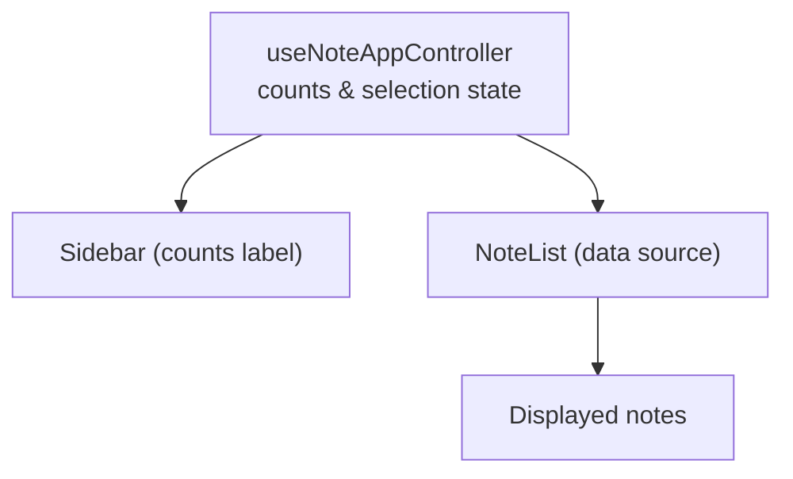

# System Design & Architecture

## Architecture Overview
**What is the high-level system structure?**

- Контроллер вычисляет: отображаемое количество (X) и общее (Y) для текущего контекста (обычный список, FTS, теги).
- Sidebar показывает метку «Notes displayed: X out of Y».
- Логика выбора/удаления не меняется: операции применяются к загруженным элементам.

## Data Models
**What data do we need to manage?**

- `visibleCount`: длина отображаемого списка (обычный `notes` или FTS-результаты).
- `totalCount`: общее число заметок в текущем контексте (из pages[0].totalCount или FTS total/accumulated length).
- Существующие: `notes`, `ftsData`, `showFTSResults`, `filtered/tagged results`.

## API Design
**How do components communicate?**

- Нет новых API-запросов.
- Контроллер возвращает в Sidebar оба числа (visible, total) для единого рендеринга.

## Component Breakdown
**What are the major building blocks?**

- `useNoteAppController`: вычислить `notesDisplayed` (X) и `notesTotal` (Y) для текущего режима; передать в props.
- `Sidebar`: показать метку «Notes displayed: X out of Y» во всех режимах.
- `NoteList`: источник данных для visible count (length текущего списка/FTS выдачи).

## Design Decisions
**Why did we choose this approach?**

- Не грузим все данные — отображаем честное число для загруженных результатов и общее число из доступных метаданных.
- Не меняем бизнес-логику массовых операций; только честное отображение, чтобы избежать ожиданий «удаляет всё».

## Non-Functional Requirements
**How should the system perform?**

- 0 дополнительных запросов.
- Корректные числа в любом режиме (поиск/теги/обычный).
- Устойчивость при отсутствии `total` в FTS — используем длину накопленных результатов без эвристик «+1».
