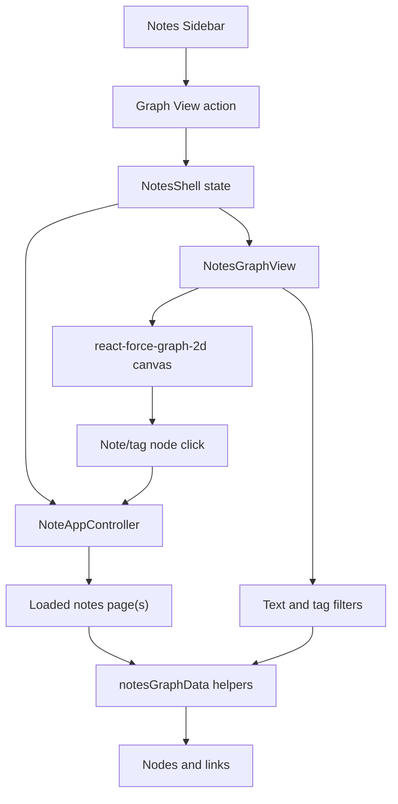

# System Design & Architecture

## Architecture Overview
**What is the high-level system structure?**



- `Sidebar` exposes the graph entry point.
- `NotesShell` owns whether search, graph, and editor panes are visible.
- `NotesGraphView` owns graph-local filters and rendering.
- `notesGraphData` owns deterministic transformation of notes into graph nodes, links, and summary data.
- `react-force-graph-2d` owns force simulation and canvas interaction.

## Data Models
**What data do we need to manage?**

### Graph node
```typescript
type NotesGraphNodeType = "note" | "tag"

interface NotesGraphNode {
  id: string
  label: string
  type: NotesGraphNodeType
  noteId?: string
  tagName?: string
  size: number
  connectionCount: number
}
```

### Graph link
```typescript
interface NotesGraphLink {
  source: string
  target: string
}
```

### Graph summary
```typescript
interface NotesGraphSummary {
  noteCount: number
  taggedNoteCount: number
  tagCount: number
  linkCount: number
  topTags: Array<{ tag: string; count: number }>
}
```

## API Design
**How do components communicate?**

No new external API is introduced.

### `NotesGraphView` props
```typescript
interface NotesGraphViewProps {
  notes: Note[]
  activeNoteId?: string | null
  notesTotal?: number
  onNodeClick?: (noteId: string) => void
  onClose?: () => void
  className?: string
}
```

### Internal behavior
- Text filter checks note title, description, and tags.
- Tag filter narrows to notes containing the selected normalized tag.
- Clicking a note node invokes `onNodeClick(noteId)`.
- Clicking a tag node toggles that tag as the graph filter.

## Component Breakdown
**What are the major building blocks?**

### `ui/web/lib/notesGraphData.ts`
- Normalizes note tags through existing tag helpers.
- Builds note nodes, tag nodes, and note-to-tag links.
- Computes summary stats and sorted top tags.
- Provides unit-testable behavior without canvas or React.

### `NotesGraphView`
- Renders header, search input, legend, loaded count, tag filters, empty states, and graph canvas.
- Uses `ResizeObserver` to size the canvas to the panel.
- Highlights the active note.
- Keeps labels hidden until zoomed enough, while always showing the active note label.

### `NotesShell`
- Adds `showGraphView` state.
- Opens graph and search as mutually exclusive primary exploration panes.
- Passes loaded notes, total count, selected note id, and close/select handlers to the graph.

### `Sidebar`
- Adds the graph action using the existing button style and lucide `Network` icon.

## Design Decisions
**Why did we choose this approach?**

### 1. Bipartite graph rather than note-to-note graph
- Reason: tags are already explicit user-maintained relationships.
- Benefit: no hidden similarity algorithm and no new backend work.
- Trade-off: a note with no tags cannot be connected and is represented only through empty-state/count context.

### 2. Client-side graph over loaded notes
- Reason: the current controller already owns pagination and loaded note state.
- Benefit: small, low-risk integration with no schema or API changes.
- Trade-off: the graph is a loaded-scope visualization, not a guaranteed full-corpus map.

### 3. Pure graph builder module
- Reason: canvas rendering is hard to assert directly, but graph data correctness is critical.
- Benefit: deterministic unit tests cover normalization, link generation, tag sizing inputs, and summary counts.

### 4. Search and graph panes are mutually exclusive
- Reason: notes search and notes graph are both exploratory middle panes.
- Benefit: avoids cramped multi-pane layouts and keeps existing editor behavior predictable.

## Non-Functional Requirements
**How should the system perform?**

- Performance:
  - graph building is O(notes + tags) for the loaded list
  - filtering is local and memoized
  - graph simulation is limited to the current loaded note scope
- Reliability:
  - empty states avoid blank canvas failures
  - graph view does not block note editing, saving, deleting, search, or settings navigation
- Accessibility:
  - graph actions have accessible labels
  - search input is keyboard reachable
  - close action is icon-based with an accessible label
- Maintainability:
  - graph construction is separate from canvas rendering
  - no unfinished Storybook setup is required for this feature

