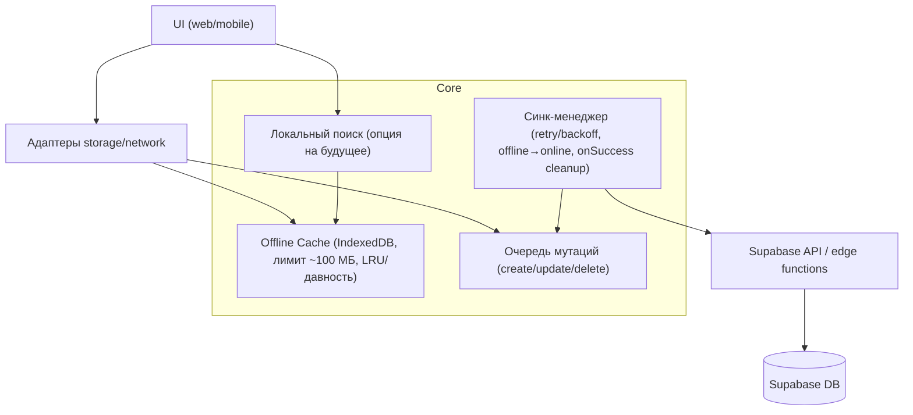

# Архитектура оффлайн-режима

## Обзор

Принципы:
- Ядро общее для web/mobile: кеш, очередь, синк-менеджер, политика конфликтов.
- Web: IndexedDB адаптер (fallback localStorage); Mobile: SQLite/AsyncStorage + NetInfo (TODO).
- Поиск пока онлайн (FTS Supabase); интерфейс LocalSearch оставлен для будущего оффлайна.
- Лимит локального хранения ~100 МБ; очистка по давности обновления (грубая оценка).
- Overlay: оффлайн заметки перекрывают серверные данные, показываются сразу и после перезапуска.
- Sync onSuccess: после успешного дренажа удаляет из кеша, обновляет overlay, пересчитывает pending/failed.

## Компоненты и роли
- Cache: хранит заметки оффлайн, overlay поверх серверных данных, контролирует лимит и очистку.
- Mutation Queue: буфер операций с tempId, статусами pending/failed/synced.
- Sync Manager: слушает online/offline, дренирует очередь батчами, retry/backoff, onSuccess → cleanup кеша/overlay.
- Local Search: интерфейс (заглушка), поиск по кешу — позже.
- Адаптеры: web (IndexedDB + статус сети), mobile (SQLite/AsyncStorage + NetInfo, ещё не сделан).
- Supabase API/edge: единственная точка общения с backend, без собственных серверных роутов.

## Технологии и обоснование
- Web: IndexedDB для устойчивого оффлайн-кеша (localStorage только как запасной вариант).
- Mobile: план SQLite/AsyncStorage; NetInfo для статуса сети.
- SPA/export без серверных роутов — работаем через Supabase/edge.
- Поиск: оставляем онлайн FTS для скорости MVP; интерфейс LocalSearch позволяет добавить оффлайн позже.
- Лимит 100 МБ: контролируем размер (JSON-оценка); LRU/давность обновления для очистки.

## Модели данных
- CachedNote: { id, title, description, tags, updatedAt, status: synced|pending|failed, pendingOps? }.
- Mutation: { id, noteId, op: create|update|delete, payload, clientUpdatedAt, status, attempts?, lastError? }.
- SyncState: { lastSyncAt?, isOnline, queueSize }.
- (Опция) LocalSearchIndex: индекс по title/description/tags (будет позже).

## Контракты/интерфейсы
- OfflineStorageAdapter: load/save/delete notes, upsert/pop queue, markSynced, markQueueItemStatus, enforceLimit, clear.
- SyncManager: enqueue/drainQueue, handleOnline/offline, onSuccess hook, backoff.
- NetworkStatusProvider: isOnline(), subscribe().
- LocalSearch: search(query) (заглушка).

## Ключевые решения и компромиссы
- Конфликты: last-write-wins по updated_at; при конфликте создаём копию заметки.
- Overlay: оффлайн правки сразу видны и после перезапуска; очищаем overlay после успешного синка.
- Хранилище web: IndexedDB как целевое, localStorage только fallback.
- Mobile хранилище ещё не реализовано — помечаем как TODO.

## Нефункциональные требования
- Производительность: операции кеша O(1)/O(log n); синк батчами, не блокирует UI.
- Надёжность: кеш/очередь переживают перезапуск; синк возобновляется при online; ошибки не ломают UI, статус visible (pending/failed).
- Безопасность: сетевые вызовы через авторизованный Supabase; локальные данные остаются на устройстве.
