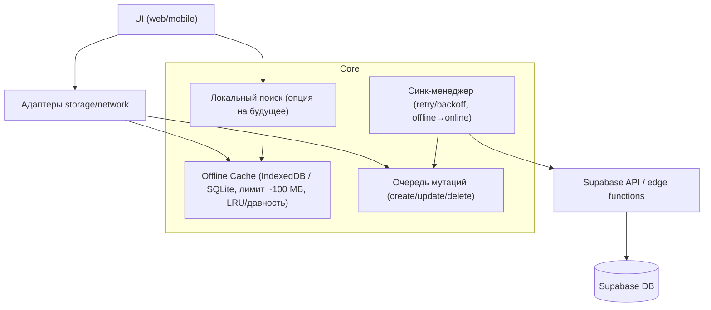

# Архитектура оффлайн-режима

## Обзор

Принципы:
- Ядро общее для web и mobile: кеш, очередь мутаций, синк-менеджер, политика конфликтов.
- Адаптеры платформы: web (IndexedDB + статус сети браузера), mobile (SQLite/AsyncStorage + NetInfo).
- Поиск пока онлайн (FTS Supabase); локальный поиск — расширение через интерфейс LocalSearch.
- Лимит локального хранилища ~100 МБ, очистка по LRU/давности обновления.
- Никаких серверных роутов/SSR: SPA/Next export, работа через Supabase/edge functions.

## Компоненты и роли
- Cache: хранит заметки оффлайн, read-through доступ, контролирует лимит и очистку.
- Mutation Queue: буфер операций create/update/delete с tempId для create и статусами pending/failed/synced.
- Sync Manager: отслеживает онлайн/офлайн, сливает очередь батчами, делает retry с backoff, останавливается при отсутствии прогресса, помечает failed.
- Local Search (позже): поиск по кешу, пока заглушка/интерфейс.
- Адаптеры хранения/сети: платформа-специфичная реализация (IndexedDB/SQLite, статус сети).
- Supabase API: единственная точка общения с backend/edge; авторизация через Supabase client.

## Технологии и обоснование
- Web: IndexedDB для структурированных данных, работа в браузере оффлайн.
- Mobile: SQLite (предпочтительно) или AsyncStorage; NetInfo для статуса сети.
- Supabase/edge: сохраняем SPA/export и не добавляем серверные роуты.
- Поиск: оставляем онлайн FTS, чтобы быстрее доставить MVP; интерфейс LocalSearch позволит добавить оффлайн позже.
- Лимит 100 МБ: контролируем размер кеша, избегаем переполнения и ударов по storage.

## Модели данных
- CachedNote: { id (server|temp), title, content, tags, updated_at, status: synced|pending|failed, pendingOps? }.
- Mutation: { tempId/realId, op: create|update|delete, payload, clientUpdatedAt, status }.
- SyncState: { lastSyncAt, isOnline, queueSize }.
- (Опция) LocalSearchIndex: упрощённый индекс по title/description/tags, включим позже.

## Контракты/интерфейсы
- StorageAdapter: saveNote, loadNotes (с пагинацией/лимитом), upsertQueueItem, popQueueBatch, markSynced, enforceLimit, clear.
- SyncManager: enqueue(op), drainQueue(batch/serial), onOnline/offline, обратная связь о failed/pending, backoff.
- LocalSearch: search(query) по кешу (пока заглушка).
- Network: Supabase JS client с авторизацией; никаких доп. серверных роутов.

## Ключевые решения и компромиссы
- Конфликты: last-write-wins по updated_at; при явном конфликте создаём копию заметки.
- Поиск: пока только онлайн FTS, оффлайн будет добавлен позже через уже описанный интерфейс.
- Лимит кеша: ~100 МБ, очистка по LRU/давности; тяжёлые вложения не храним сверх лимита.
- SPA/export: не вводим серверные эндпоинты, всё через Supabase/edge.

## Нефункциональные требования
- Производительность: операции кеша O(1)/O(log n); синк батчами, чтобы не блокировать UI.
- Надёжность: очередь и кеш переживают перезапуск; синк возобновляется при появлении сети; ошибки не ломают UI.
- Безопасность: все сетевые вызовы авторизованы через Supabase; локальные данные остаются на устройстве.
