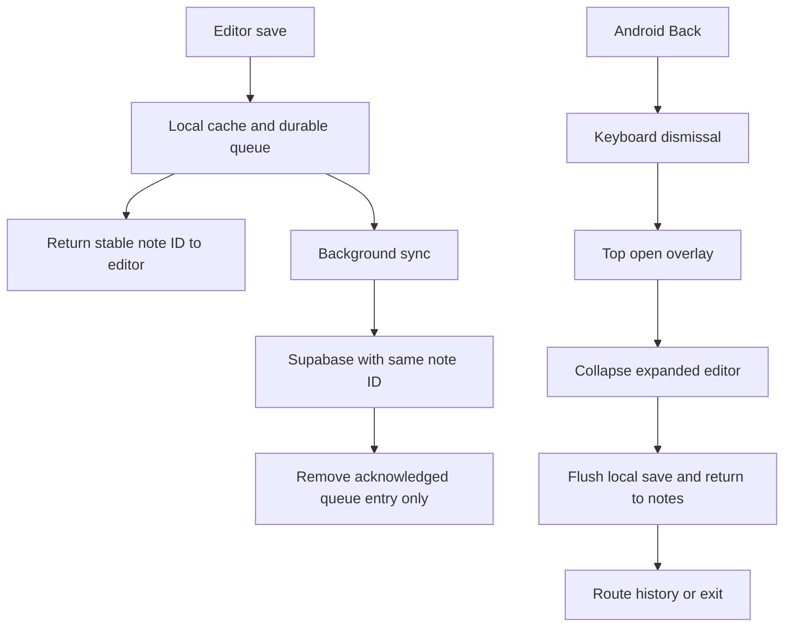

# Offline writes and native Back design

## Architecture Overview

## Components & Data Models
Reuse CachedNote and MutationQueueItem. Unify create and explicit update with the existing locally queued autosave update path. Queued server writes suppress per-attempt notifications and preserve client IDs. Check retries, restart hydration and successful cleanup against newer pending edits.
Native Back dispatch consumes one handler by priority; existing Radix Escape dismissal owns overlay semantics, including cancellation. Screen handlers register and unregister with lifecycle. The native boundary owns keyboard state and serialization; browser callers are unaffected.

## Decisions & Trade-offs
Connectivity is a hint for synchronization, never permission to persist a local edit. Visible clients retry queued synchronization every 15 seconds and on foreground restoration, because restoring transport access need not emit a WebView online event. Retain current online deletion semantics. Preserve remote-deletion recovery in the sync layer. The native callback must await editor persistence and consume a failed navigation rather than exit. No blanket Escape dispatch to a text editor when no overlay is open.

## Review
Requirements and current save/navigation paths reviewed. Test backend failures even with navigator.onLine=true. Validate installed Android separately from component/native-boundary mocks.
