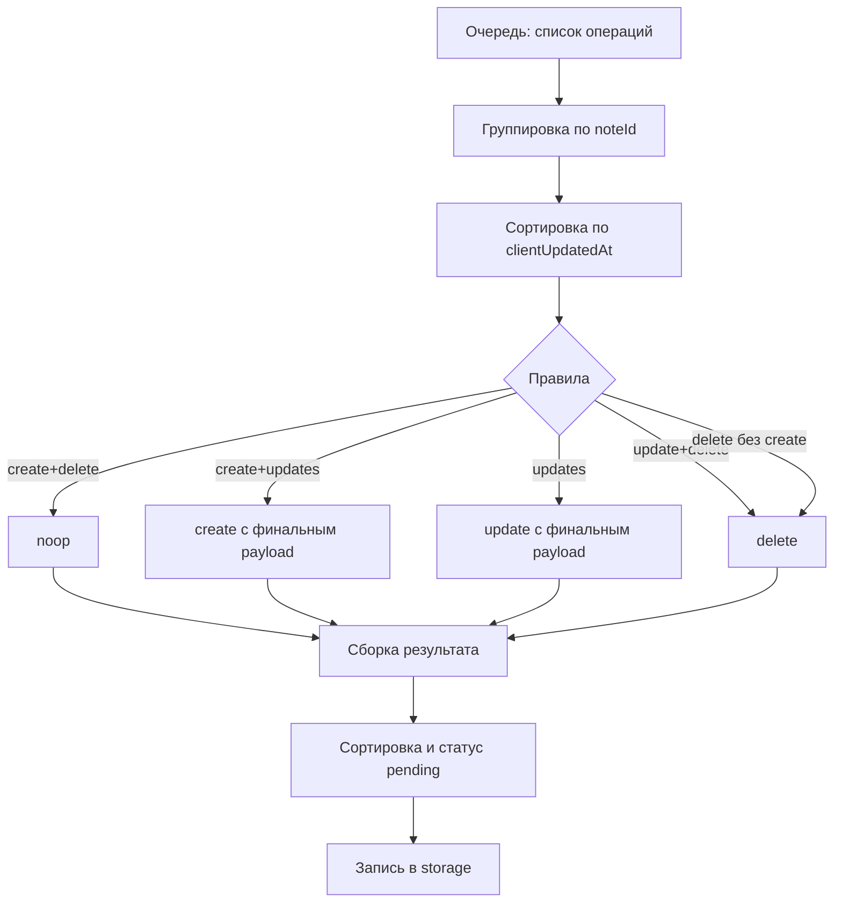

## Подход
- Добавляем чистую функцию `compactQueue(items: MutationQueueItem[]): MutationQueueItem[]` в core/utils.
- SyncManager перед обработкой пачки запрашивает всю очередь, прогоняет через compactQueue, при изменении перечня операций записывает обратно в storage.
- Все элементы на выходе получают статус `pending`, порядок сортировки — по `clientUpdatedAt` (возрастание), чтобы сохранить временную последовательность между заметками.

### Правила
1) create + delete (с любыми update между) ⇒ noop (ничего не отправляем).
2) create + update(s) ⇒ один create с payload из последнего элемента.
3) update + update(s) ⇒ один update с payload из последнего элемента.
4) update/delete без create, если последняя операция delete ⇒ один delete.
5) update без create, если последняя операция update ⇒ один update.
6) delete с tempId без create ⇒ попадает под правило 1/4 и не уходит, если create отсутствует.

### Обработка статусов
- Любые статусы во входном списке приводятся к `pending` на выходе — компактор формирует новый «чистый» набор для синка.

### Контракты
- `OfflineQueueService` добавляет метод `upsertQueue(items)` для перезаписи всей очереди после компакта.
- SyncManager: перед `getPendingBatch` вызывает компактор и сохраняет сжатую очередь.

## Диаграмма

## Выходные артефакты
- core/utils/compactQueue.ts
- Метод `upsertQueue` в OfflineQueueService.
- Вызов compactQueue в OfflineSyncManager перед дренажом очереди.
