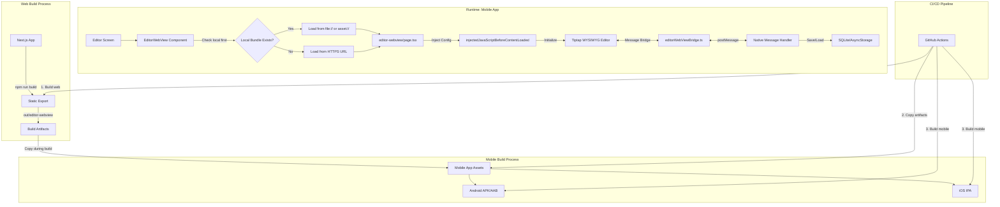

# System Design & Architecture: Offline WebView Bundle

## Architecture Overview
**What is the high-level system structure?**

### System Diagram



### Key Components and Their Responsibilities

1. **Web Static Bundle** (filtered from `out/`)
   - Static HTML export: `out/editor-webview/index.html` (~9KB)
   - Referenced JS chunks from `out/_next/static/chunks/` (~2.5MB)
   - CSS and fonts (~0.5MB)
   - Build manifests from `out/_next/static/[buildId]/`
   - **Total**: ~3MB (только используемые файлы, не весь out/)

2. **EditorWebView Component** (`ui/mobile/components/EditorWebView.tsx`)
   - Determines which URL to load (local vs remote)
   - Injects configuration before content loads
   - Handles message passing between WebView and React Native
   - Manages error handling and fallback logic

3. **Message Bridge** (`core/utils/editorWebViewBridge.ts`)
   - Chunked message protocol for large content
   - Bi-directional communication (web ↔ native)
   - Messages: `READY`, `CONTENT_CHANGED`, `CONTENT_ON_BLUR`, `SET_CONTENT`, etc.

4. **Mobile Assets Directory**
   - Platform-specific location for bundled web files
   - Android: `android/app/src/main/assets/web-editor/`
   - iOS: `ios/[AppName]/WebEditor/`

### Technology Stack

- **Web Build**: Next.js 14+ with static export (`output: 'export'`)
- **Editor**: Tiptap (ProseMirror-based WYSIWYG)
- **Mobile**: React Native with `react-native-webview`
- **Build Automation**: CI scripts (GitHub Actions or similar)
- **Version Tracking**: Git commit hash or package.json version embedded in bundle

## Data Models
**What data do we need to manage?**

### Bundle Versioning (MVP: Simplified)

**Decision**: No separate bundle-metadata.json for MVP to keep it simple.

**Version Tracking Strategy**:
- Bundle version = Mobile app version (from package.json)
- Git commit SHA logged in CI artifacts
- Build date in CI logs

**Rationale**: Bundle is always in sync with app version. Separate metadata is overengineering for v1.

**Future**: Can add metadata file in v2 if dynamic updates needed.

### WebView Configuration (Injected)

```typescript
interface EditorConfig {
  supabaseUrl: string;
  supabaseAnonKey: string;
  theme: 'light' | 'dark';
  platform: 'mobile';
  devHost?: string;         // For image URL rewriting in dev
  offlineMode: boolean;
}
```

### Message Protocol (Existing, No Changes)

```typescript
// Messages from WebView to Native
type WebToNativeMessage = 
  | { type: 'READY' }
  | { type: 'CONTENT_CHANGED', content: string }
  | { type: 'CONTENT_ON_BLUR', content: string }
  | { type: 'FOCUS' }
  | { type: 'BLUR' };

// Messages from Native to WebView
type NativeToWebMessage =
  | { type: 'SET_CONTENT', content: string }
  | { type: 'SET_THEME', theme: 'light' | 'dark' };
```

### Data Flow

1. **Editor Load**: Native → WebView (load local/remote URL)
2. **Config Injection**: Native → WebView (theme, Supabase config)
3. **Ready Signal**: WebView → Native (`READY` message)
4. **Content Load**: Native → WebView (`SET_CONTENT` with note data)
5. **Editing**: User types → Tiptap updates
6. **Autosave**: WebView → Native (`CONTENT_CHANGED` / `CONTENT_ON_BLUR`)
7. **Persistence**: Native saves to local SQLite/AsyncStorage

## API Design
**How do components communicate?**

### WebView URL Selection Logic

**Design Philosophy**: Dev и Production режимы четко разделены для простоты и предсказуемости.

```typescript
// In EditorWebView.tsx
import NetInfo from '@react-native-community/netinfo';

function getEditorUrl(): string {
  // Priority 1: Dev mode ALWAYS uses localhost (hot reload critical)
  if (__DEV__) {
    console.log('🔧 Dev mode: using localhost dev server');
    return 'http://localhost:3000/editor-webview';
  }
  
  // Priority 2: Production ALWAYS tries local bundle first (offline feature)
  const localBundlePath = Platform.select({
    android: 'file:///android_asset/web-editor/index.html',
    ios: 'web-editor/index.html', // Relative to bundle
  });
  
  if (localBundlePath && localBundleExists(localBundlePath)) {
    console.log('✅ Using local bundle:', localBundlePath);
    return localBundlePath;
  }
  
  // Priority 3: Fallback to production remote URL
  const remoteUrl = process.env.EXPO_PUBLIC_WEB_URL + '/editor-webview';
  console.warn('⚠️  Local bundle not found, using remote:', remoteUrl);
  return remoteUrl;
}
```

**Key Points**:
- No complex conditions - dev vs production behavior clear
- Logging helps debugging
- Fallback is automatic and graceful
```

### Configuration Injection

```typescript
// In EditorWebView.tsx
import NetInfo from '@react-native-community/netinfo';

const [isConnected, setIsConnected] = useState(true);

useEffect(() => {
  const unsubscribe = NetInfo.addEventListener(state => {
    setIsConnected(state.isConnected ?? true);
  });
  return unsubscribe;
}, []);

// injectedJavaScriptBeforeContentLoaded
const injectedConfig = `
  window.MOBILE_CONFIG = ${JSON.stringify({
    supabaseUrl: process.env.EXPO_PUBLIC_SUPABASE_URL,
    supabaseAnonKey: process.env.EXPO_PUBLIC_SUPABASE_ANON_KEY,
    theme: colorScheme,
    platform: 'mobile',
    offlineMode: !isConnected
  })};
  true; // Must return truthy value
`;
```

### Image URL Rewriting (Existing Logic)

```typescript
// In app/editor-webview/page.tsx
function rewriteImageUrls(html: string): string {
  return html.replace(
    /src="(\/storage\/v1\/[^"]+)"/g,
    `src="${supabaseUrl}$1"`
  ).replace(
    /src="(http:\/\/localhost:[^"]+)"/g, 
    devHost ? `src="${devHost}$1"` : '$&'
  );
}
```

## Component Breakdown
**What are the major building blocks?**

### Frontend Components (Web)

1. **`app/editor-webview/page.tsx`**
   - Entry point for editor page
   - Sets up message listeners and senders
   - Initializes Tiptap editor with mobile config
   - Sends `READY` signal when mounted
   - Handles image URL rewriting

2. **`ui/web/components/RichTextEditorWebView.tsx`**
   - Tiptap editor instance
   - Extensions configuration (Bold, Italic, Lists, Images, etc.)
   - Event handlers: `onUpdate`, `onFocus`, `onBlur`
   - Content serialization/deserialization

3. **`core/utils/editorWebViewBridge.ts`**
   - Chunked message sender and receiver
   - Handles messages larger than WebView size limits
   - Message type definitions and parsing

### Mobile Components

1. **`ui/mobile/components/EditorWebView.tsx`**
   - WebView wrapper component
   - URL selection logic (local vs remote)
   - JavaScript injection for config
   - Message handler (`onMessage`)
   - Error handling and retry logic

2. **`ui/mobile/app/note/[id].tsx`**
   - Note editor screen
   - Manages EditorWebView lifecycle
   - Handles autosave triggers
   - Coordinates with toolbar and preview

### Build & Deployment

1. **Next.js Export Configuration**
   - `next.config.js` modification to enable static export
   - Route configuration for `/editor-webview`
   - Asset optimization and minification

2. **Copy Script** (new)
   - Script to copy `out/editor-webview` to mobile assets
   - Platform-specific paths (Android/iOS)
   - Version metadata injection

3. **CI Pipeline Steps**
   - Build web (`npm run build` in root)
   - Copy artifacts (`node scripts/copy-web-bundle.js`)
   - Build mobile Android (`cd ui/mobile && eas build --platform android`)
   - Build mobile iOS (`cd ui/mobile && eas build --platform ios`)

## Design Decisions
**Why did we choose this approach?**

### Decision 1: Static Bundle Over Source Code Duplication
**Choice**: Copy build artifacts, not source code  
**Rationale**: 
- Maintains single source of truth (web codebase)
- Prevents version drift between web and mobile editors
- Reduces mobile project complexity
- Easier to update and maintain

**Alternatives Considered**:
- Duplicate Tiptap setup in React Native: Too much code duplication, hard to maintain parity
- Git submodule: Still duplicates source, adds complexity

### Decision 2: Local-First with Remote Fallback
**Choice**: Try local bundle first, fallback to remote URL if unavailable  
**Rationale**:
- Enables offline functionality without breaking online mode
- Allows flexible development (can skip bundling in dev)
- Graceful degradation for users with missing bundles

**Alternatives Considered**:
- Local-only: Breaks dev workflow and online updates
- Remote-only with service worker: Unreliable in WebView

### Decision 3: Build-Time Copy (Not Runtime Download)
**Choice**: Include bundle at build/release time  
**Rationale**:
- Reliable and predictable
- No runtime network dependency for core feature
- Simpler implementation

**Alternatives Considered**:
- Runtime download on first launch: Adds complexity, still requires network initially
- Over-the-air updates: Complex, can be added later

### Decision 4: Platform-Specific Asset Paths
**Choice**: Use native asset mechanisms (Android assets, iOS bundle)  
**Rationale**:
- Leverages platform-native capabilities
- Better performance than alternatives
- Standard approach for bundled resources

**Alternatives Considered**:
- File system storage: Complicates permissions and app lifecycle
- Embedded base64: Too large for entire bundle

### Decision 5: Preserve Existing Message Bridge
**Choice**: Keep chunked message protocol unchanged  
**Rationale**:
- Already proven to work for large content
- No need to refactor working code
- Should work identically for local files

---

### Decision 6: Smart Chunk Filtering
**Choice**: Parse index.html to copy only referenced chunks, not entire _next/ directory  
**Rationale**:
- Reduces bundle size by 29.4% (12 of 17 chunks needed)
- Faster copying and smaller APK (~2MB savings)
- HTML parsing is standard, not fragile

**Trade-offs**:
- Slightly more complex copy script (adds HTML parsing)
- Warning if chunk missing (non-fatal, logs to console)

**Alternatives Considered**:
- Copy entire _next/: Simpler but wastes ~2MB on unused code
- Manual chunk list: Fragile, breaks on every build

**Mitigation**: Comprehensive tests for copy script, validation warnings

---

### Decision 7: Accept CORS Limitation for Images (MVP)
**Choice**: Uncached external images (Supabase Storage) may not load offline  
**Rationale**:
- Core feature (text editing) works perfectly offline
- Image proxy/caching adds significant complexity
- WebView HTTP cache handles recently viewed images
- Not a blocker for 90% of offline use cases

**Trade-offs**:
- Users see broken image placeholders for uncached images offline
- Better UX would require image caching layer

**Alternatives Considered**:
- Implement image proxy in React Native: Complex, out of scope for v1
- Pre-cache images on note save: Adds storage complexity

**Mitigation**: 
- Document as known limitation
- Add to backlog for v2 if user feedback requests it
- Consider implementing if > 20% of users report issue

---

### Decision 8: Dev vs Production Mode Separation
**Choice**: Dev mode always uses localhost, production always tries local bundle  
**Rationale**:
- Simple, predictable behavior (no complex conditions)
- Hot reload essential for dev productivity
- Offline feature essential for production users
- Clear separation reduces bugs

**Trade-offs**:
- Can't test local bundle in dev mode easily

**Mitigation**: 
- Use production builds for testing offline feature
- Document testing procedure in implementation guide

## Non-Functional Requirements
**How should the system perform?**

### Performance Targets
- **Editor Load Time**: < 1 second from screen mount to `READY` (local bundle)
- **Message Bridge Latency**: < 100ms for typical messages
- **Autosave Response**: < 200ms from blur to content saved

### Scalability Considerations
- Bundle size should remain ~3MB after filtering unused files
- Support notes up to 10MB content (existing limit)
- Handle rapid typing without lag (debounced autosave)

### Security Requirements

**Baseline Security (MVP)**:
- **Content Security**: Bundle served from trusted local file system (inherently safe)
- **Data Privacy**: No external network requests in offline mode (except intentional Supabase calls)
- **Injection Safety**: Use `JSON.stringify()` for config values (prevents XSS)
- **Input Sanitization**: Existing sanitizer.ts handles HTML content (no changes needed)

**CORS Handling** (Known Limitation):
- Supabase Storage URLs from `file://` origin may be blocked by CORS
- **Accepted for MVP**: External uncached images won't load offline
- **Mitigation**: Rely on WebView HTTP cache for recently viewed images
- **Future**: Add image caching layer in v2 if needed

**Not in MVP** (Overengineering for v1):
- ❌ Custom Content Security Policy headers
- ❌ Image proxy/caching layer
- ❌ Certificate pinning

**Rationale**: file:// origin already has browser security restrictions. Additional CSP is premature optimization.

### Reliability/Availability Needs
- **Offline Availability**: 100% uptime for editor when offline (core requirement)
- **Fallback Reliability**: Remote URL must work if local bundle missing/corrupted
- **Error Recovery**: Graceful degradation (fallback to remote) + logging for debugging
- **Data Integrity**: Chunked messages must not lose data during offline operation

---

## Error Handling Strategy
**What happens when things go wrong?**

### Build-Time Errors (Fail-Fast)

**Scenario 1: Source bundle missing**
```javascript
if (!fs.existsSync(SOURCE_HTML)) {
  console.error('❌ ERROR: out/editor-webview/index.html not found');
  console.error('   Run "npm run build" first');
  process.exit(1); // Fail CI build
}
```
**Action**: Fail immediately, clear error message

**Scenario 2: Referenced chunk missing**
```javascript
if (!fs.existsSync(srcChunk)) {
  console.warn(`⚠️  WARNING: Chunk not found: ${chunk}`);
  console.warn('   This may cause runtime errors. Check build output.');
  // Continue copying other files (non-fatal)
}
```
**Action**: Warn but continue (may be optional chunk)

### Runtime Errors (Graceful Degradation)

**Scenario 3: Local bundle fails to load**
```typescript
<WebView
  source={{ uri: editorUrl }}
  onError={(syntheticEvent) => {
    const { nativeEvent } = syntheticEvent;
    console.error('❌ WebView load error:', nativeEvent);
    
    // Fallback to remote URL
    if (editorUrl.startsWith('file://')) {
      console.log('🔄 Falling back to remote URL');
      setEditorUrl(process.env.EXPO_PUBLIC_WEB_URL + '/editor-webview');
    }
  }}
/>
```
**Action**: Automatic fallback to remote URL

**Scenario 4: Message bridge timeout**
```typescript
const READY_TIMEOUT = 5000; // 5 seconds

useEffect(() => {
  const timeout = setTimeout(() => {
    if (!editorReady) {
      console.error('❌ Editor READY timeout');
      // Show user-friendly error, option to retry
      setError('Editor failed to load. Check your connection.');
    }
  }, READY_TIMEOUT);
  
  return () => clearTimeout(timeout);
}, [editorReady]);
```
**Action**: User-facing error + retry option

### Monitoring & Debugging

**Telemetry (Optional for v2)**:
- Track % of users using local vs remote bundle
- Track bundle load failures
- Track fallback activations

**Logging**:
- All URL selection decisions logged to console
- All errors logged with context
- Developers can use React Native Debugger to inspect

**Philosophy**: 
- Build time = fail fast (catch issues early)
- Runtime = graceful degradation (user sees working app)
- Logging = comprehensive (easy debugging)
