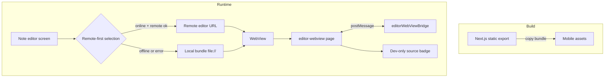

---
phase: design
title: System Design & Architecture
description: Define the technical architecture, components, and data models
---

# System Design & Architecture

Feature: offline-webview-remote-first

## Architecture Overview
**What is the high-level system structure?**

- The WebView uses a remote-first policy with a local bundle fallback for all build variants.
- Local bundle is packaged during mobile builds and used when offline or when remote fails to load.
- If connectivity drops mid-session, new editor loads use the local bundle.
- If the editor already signaled READY, connectivity changes do not force a reload.
- Dev builds show a source badge + popup for visibility.



- Key components and their responsibilities
  - EditorWebView: selects source, handles fallback, injects config, and shows dev badge.
  - Local bundle packaging: static export + copy script into mobile assets.
  - WebView page: editor logic and message bridge, unchanged behavior.
- Technology stack choices and rationale
  - Next.js static export for SPA-compatible editor bundle.
  - react-native-webview for cross-platform editor rendering.
  - Expo Constants + app.config.ts for variant-aware configuration.
  - NetInfo to detect online/offline state.

## Data Models
**What data do we need to manage?**

- Ephemeral source state for selection and debug display.

```ts
type EditorWebViewSource = {
  variant: 'dev' | 'stage' | 'prod'
  remoteUrl: string
  localUrl: string | null
  source: 'remote' | 'local'
  reason: 'online' | 'offline' | 'load-error' | 'http-error' | 'ready-timeout' | 'missing-local'
  isConnected: boolean
}
```

- No persistent storage changes are required.

## API Design
**How do components communicate?**

- External APIs: none added.
- Internal interfaces
  - `resolveEditorWebViewSource(...)` returns `{ uri, source, reason }` for initial load.
  - `onWebViewError` and `onHttpError` trigger a one-time fallback to local.
  - `onReadyTimeout` triggers a one-time fallback if READY is not received within a fixed timeout (1 second).
  - `onConnectivityChange` updates selection for future loads; if remote is not ready and offline, fallback to local.
- Request/response formats
  - WebView message protocol remains unchanged (`READY`, `SET_CONTENT`, `CONTENT_CHANGED`).
- Authentication/authorization approach
  - Unchanged; config injection still uses existing Supabase settings.

## Component Breakdown
**What are the major building blocks?**

- Frontend components
  - `ui/mobile/components/EditorWebView.tsx` (source selection, fallback, badge)
  - `app/editor-webview/page.tsx` (editor page, bridge)
  - `ui/web/components/RichTextEditorWebView.tsx` (Tiptap editor)
- Build tooling
  - `build/copy-web-bundle.js` (copy static export into mobile assets)
- Configuration
  - `ui/mobile/app.config.ts` (remote URLs per variant)
  - `EXPO_PUBLIC_EDITOR_WEBVIEW_URL` (dev-only override, full /editor-webview URL)
  - `ui/mobile/utils/localBundle.ts` (local bundle paths)

## Design Decisions
**Why did we choose this approach?**

- Remote-first + local fallback ensures online hotfixes and offline reliability.
- A single selection policy across dev/stage/prod reduces confusion and drift.
- Dev-only badge + popup provides visibility without affecting production UX.
- No compatibility handshake is required now; revisit if remote updates become risky.

## Non-Functional Requirements
**How should the system perform?**

- Performance targets
  - Local bundle load ~1s on mid-range devices.
  - Fallback from remote to local within ~1s after error.
- Scalability considerations
  - Bundle size should remain within acceptable APK/IPA growth.
- Security requirements
  - No new secrets; config injection uses existing public keys.
- Reliability/availability needs
  - Editor is usable offline for all variants.
  - Fallback is deterministic and does not loop.
